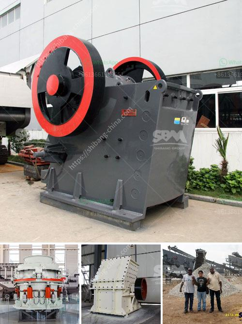

<h3>How to function the cone crusher ?</h3>
Cone crusher is a commonly used equipment in crushing production lines. It has a large crushing ratio and high efficiency. However, how to operate a cone crusher correctly? Here are some tips:

1. The material input shall be evenly distributed. Uneven feeding will cause the crusher to be overloaded. The feed rate should be kept uniform to prevent the blocking of the material in the crushing cavity.

2. The humidity of the material should be within the specified range. Excessive moisture content in the material will cause the material to stick together easily, resulting in blockage or even damage to the equipment. Therefore, before crushing the material, it is necessary to carry out moisture content detection to ensure that the moisture content meets the requirements.

3. Pay attention to the feeding size of the material. The cone crusher has strict requirements on the size of the feed. If the feed is too large or too small, it will affect the production efficiency of the equipment. Therefore, before crushing, the size of the feed should be strictly controlled within the specified range.

4. Regularly check and replace vulnerable parts. The cone crusher is composed of many parts, including the mantle, concave, bearing, and other parts that wear easily. During the daily operation of the equipment, special attention should be paid to checking and replacing worn parts in time to ensure the normal operation of the machine.

5. Properly adjust the discharge opening. The size of the discharge opening has a direct impact on the particle size of the product. When adjusting the discharge opening, the equipment should be shut down first, and then the hydraulic system should be used to adjust the discharge opening size according to the actual needs. After adjustment, it is necessary to check whether the discharge opening is too small or too large to ensure the normal operation of the equipment.

6. Pay attention to the lubrication of the equipment. The cone crusher relies on the lubricating oil to play a role in reducing friction and heat generation. Therefore, it is necessary to add lubricating oil regularly according to the requirements of the equipment manual to ensure the normal operation of the equipment.

In summary, the correct operation of the cone crusher is of great significance to ensure the efficient production of the equipment. Operators should strictly follow the above operation methods and pay attention to the maintenance and maintenance of the equipment, which can greatly improve the production efficiency and prolong the service life of the cone crusher.
<h3>Contact us</h3><ul><li><strong>Whatsapp:&nbsp;<a href="https://wa.me/8613661969651">+8613661969651</a></strong></li><li><a href="https://swt.shibang-china.com/?git&amp;zhl&amp;How to function the cone crusher "><strong>Online Service(chat now)</strong></a></li></ul><h3>Related</h3><ul><li><a href='How many tons per hour can a jaw crusher produce.md'>How many tons per hour can a jaw crusher produce?</a></li><li><a href='How to Calibrate Coal Mill Feeders.md'>How to Calibrate Coal Mill Feeders?</a></li><li><a href='How to electrify a ball mill.md'>How to electrify a ball mill?</a></li><li><a href='How to import stone crusher machine from China to Canada.md'>How to import stone crusher machine from China to Canada?</a></li><li><a href='How to remove feldspars from sand production.md'>How to remove feldspars from sand production?</a></li></ul>