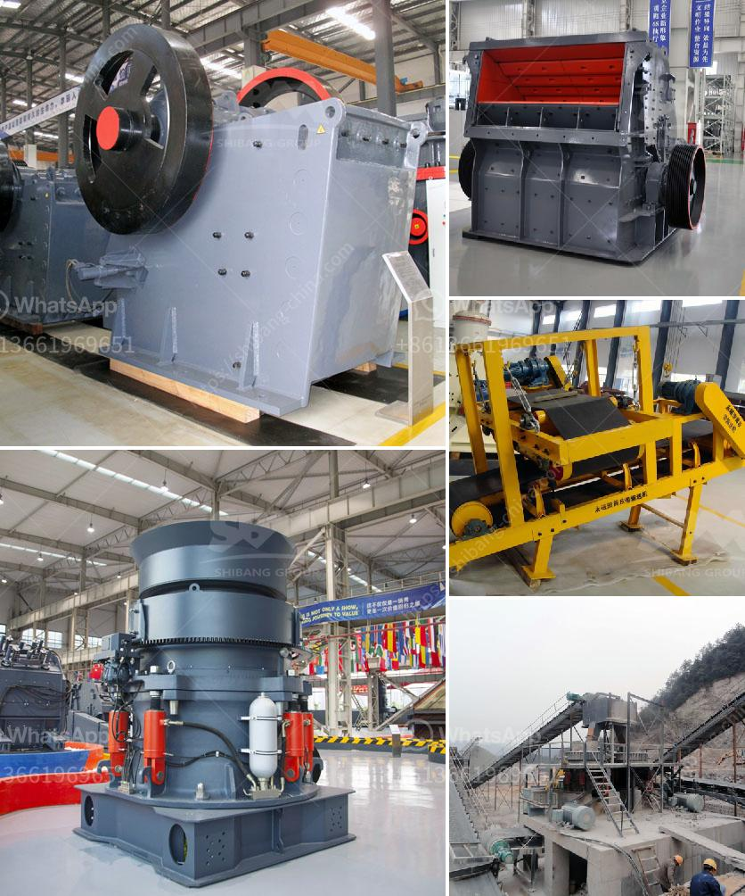

<h3>How to get a sand-making mini machine?</h3>
If you are someone who enjoys DIY projects, building a sand-making mini machine can be a fun and rewarding endeavor. It can be used for various purposes, including creating sand art, filling sandbags for construction projects, or simply for fun outdoor play. In this article, we will guide you on how to obtain a sand-making mini machine, step by step.

To begin, conduct thorough research to determine the specific type and size of sand-making mini machine you want. There are various models available on the market, each designed for different purposes. Look for the one that best suits your needs and budget. Check online platforms, such as e-commerce websites, for both new and used options. Additionally, visit local hardware stores or specialty shops that deal with construction or DIY equipment.

Once you have narrowed down your options, assess the features and specifications of the sand-making mini machines you are considering. Look for important factors such as motor power, speed, capacity, and durability. It is also essential to consider the type of sand it can handle, as different machines possess varying capabilities.

When purchasing or building a sand-making mini machine, safety should be a priority. Look for safety features like emergency stop buttons, protective covers, and proper ventilation systems. If you plan on building one yourself, ensure you have a clear understanding of the required safety measures. Consult relevant DIY guides or seek advice from experts if necessary.

Now that you have thoroughly evaluated your options, consider whether you want to buy a ready-made sand-making mini machine or build one yourself. Buying one might be a quicker and more straightforward option, as it eliminates the need for construction. However, building a sand-making mini machine from scratch can offer a rewarding experience and allow you to customize it to your liking.

If you choose to construct your sand-making mini machine, gather all the necessary materials, tools, and a well-detailed plan. Research available DIY plans online or consult books related to homemade construction equipment. Ensure you have access to a reliable power source and take all necessary precautions to avoid accidents during the construction process.

Once your sand-making mini machine is complete, it is crucial to test it out before using it extensively. Ensure that all components are working correctly and make any necessary adjustments. If you encounter any issues, refer back to the construction plan or seek assistance from professionals in the field.

Congratulations, you now have your sand-making mini machine! Utilize it for various purposes such as creating intricate sand art, filling sandbags for construction projects, or simply having fun with friends and family. Remember to always follow safety guidelines and not exceed its designated capacity.

In conclusion, acquiring a sand-making mini machine involves proper research, evaluation of features, and consideration of safety measures. Whether you choose to purchase one or build it yourself, this versatile tool will undoubtedly bring joy and creativity to your life. Enjoy the process and have fun sand-making!
<h3>Contact us</h3><ul><li><strong>Whatsapp:&nbsp;<a href="https://wa.me/8613661969651">+8613661969651</a></strong></li><li><a href="https://swt.shibang-china.com/?git&amp;zhl&amp;How to get a sandmaking mini machine"><strong>Online Service(chat now)</strong></a></li></ul><h3>Related</h3><ul><li><a href='How to install a jaw crusher.md'>How to install a jaw crusher?</a></li><li><a href='How to Install a crusher equipment ？.md'>How to Install a crusher equipment ？</a></li><li><a href='how to build marble processing mill .md'>how to build marble processing mill ?</a></li><li><a href='How to choose a cone crusher equipment manufacturer .md'>How to choose a cone crusher equipment manufacturer ?</a></li><li><a href='How to set up a mine crushing station in the Philippines ？.md'>How to set up a mine crushing station in the Philippines ？</a></li></ul>