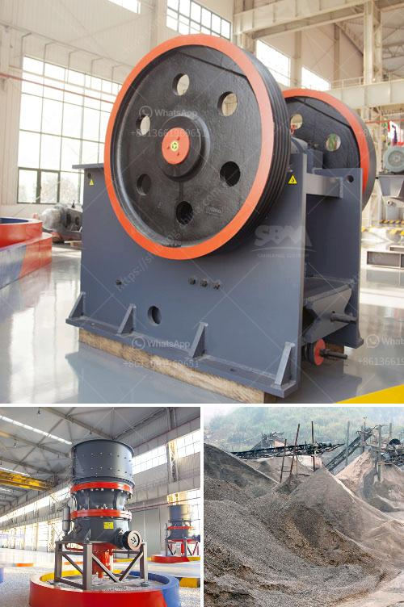

<h3>How to get gold from ore crushing?</h3>
Gold is a precious metal that has been highly valued throughout history for its beauty and rarity. The process of extracting gold from ore involves various methods such as crushing, grinding, and concentration. In this article, we will explore how to get gold from ore crushing.

Ore crushing is the initial stage of gold extraction and involves breaking the ore into smaller pieces. This process aims to release the gold from the surrounding rock, making it more accessible for further recovery methods. Crushing gold ore can be accomplished by hand using a hammer or other heavy-duty tools, or by using a crusher for larger quantities.

1. Find a suitable location: Start by identifying an area rich in gold-bearing ore. This can be done by researching geological maps or consulting with local miners or experts. Once a potential site is found, ensure that you have permission to access and extract the ore legally.

2. Gather the necessary equipment: Depending on the scale of your operation, you will need various tools and machinery. This may include a crusher, hammer, mortar and pestle, or even a larger-scale crushing machine. It is essential to have the right equipment to achieve efficient and effective ore crushing.

3. Prepare the ore: Prior to crushing, the ore needs to be prepared to maximize the extraction process. This involves removing any unwanted materials such as rocks, clay, or sand. A simple method is to use a classifier or sieve to separate the ore from the larger debris. This step ensures that only the ore is being crushed, increasing the yield of gold.

4. Crushing the ore: Once the ore is prepared, it needs to be crushed into smaller pieces. The method you choose will depend on the amount of ore and the resources available to you. For smaller quantities, hand crushing using a hammer or mortar and pestle can be effective. However, for larger quantities, a crusher is recommended. Follow the manufacturer's instructions for safe and efficient use.

5. Collecting the crushed ore: As you crush the ore, it is important to collect the crushed material in a container. This will make it easier to transport and process further. Depending on the size and quantity of the crushed ore, this may involve using a shovel, bucket, or conveyor belt system.

6. Concentration and extraction: Once the ore is crushed, it needs to be concentrated to extract the gold. The most common method is gravity concentration, which involves using water and gravity to separate the heavier gold particles from the lighter waste material. Additional techniques such as flotation or cyanidation can be employed for more complex ores.

In conclusion, extracting gold from ore requires several steps, with crushing being the initial stage. It is crucial to find a suitable location, gather the necessary equipment, and prepare the ore before crushing. By following these steps, you can increase your chances of successfully extracting gold from ore and potentially uncovering a valuable treasure. Remember to prioritize safety and environmental considerations throughout the process. Happy gold hunting!
<h3>Contact us</h3><ul><li><strong>Whatsapp:&nbsp;<a href="https://wa.me/8613661969651">+8613661969651</a></strong></li><li><a href="https://swt.shibang-china.com/?git&amp;zhl&amp;How to get gold from ore crushing"><strong>Online Service(chat now)</strong></a></li></ul><h3>Related</h3><ul><li><a href='How to build your own shaker wash plant.md'>How to build your own shaker wash plant?</a></li><li><a href='How to select a reversible hammer crusher as a coal crusher.md'>How to select a reversible hammer crusher as a coal crusher?</a></li><li><a href='How do we crush cobaltite.md'>How do we crush cobaltite?</a></li><li><a href='how does a stone crushing quarry work .md'>how does a stone crushing quarry work ?</a></li><li><a href='How to plan and develop a small mine.md'>How to plan and develop a small mine?</a></li></ul>