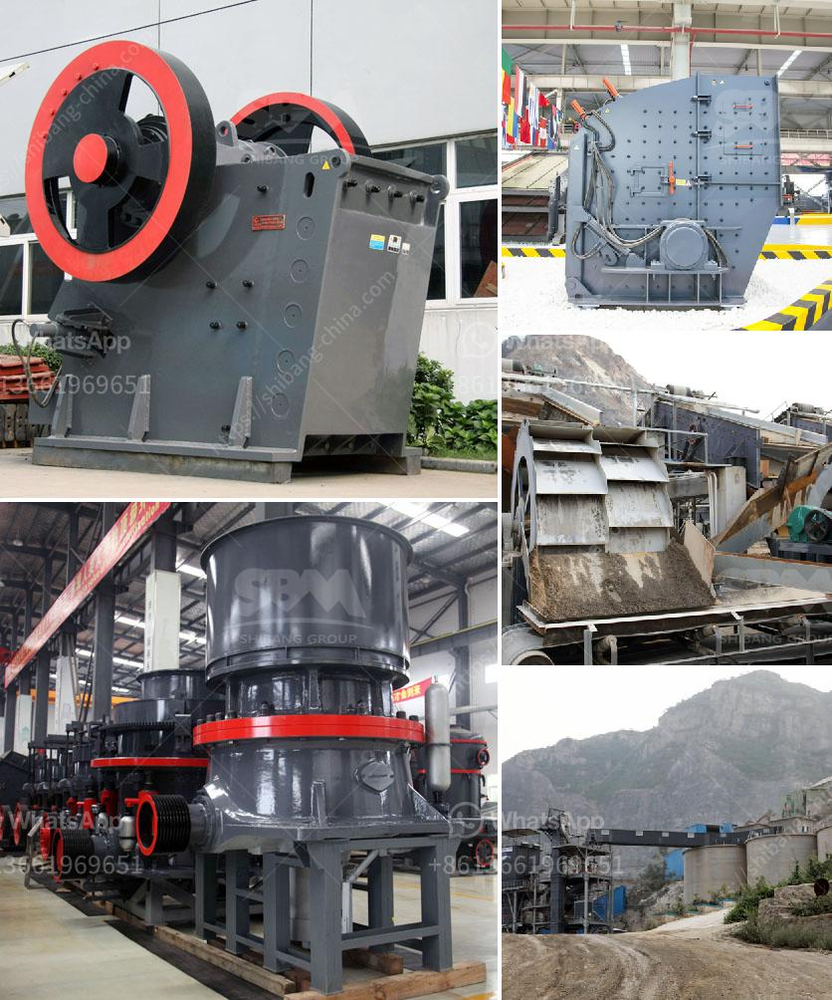

<h3>How to get the best aggregates after crushing and screening?</h3>
The process of crushing and screening is essential in the production of aggregates for construction purposes. As the demand for high-quality aggregates continues to rise, it is crucial to ensure that the end product is of the best possible quality. By following a few essential tips and guidelines, you can maximize the effectiveness of the crushing and screening process, resulting in the best aggregates.

Selecting the right equipment is crucial for obtaining high-quality aggregates. Consider factors such as the hardness and abrasiveness of the material being crushed, the required output size, and the capacity needed. Ensure that the equipment's specifications match the job requirements to achieve optimum results.

Regular maintenance of the crusher and screens is vital to ensure efficient crushing and screening operations. This includes routine inspection, lubrication, and cleaning of the equipment. Regularly check for worn-out-parts and replace them promptly to prevent breakdowns and maintain consistent productivity.

To obtain the best aggregates, it is essential to optimize the crushing process. This can be done by adjusting the crusher settings, such as the closed side setting (CSS) and the speed, to control the output size and shape of the product. Fine-tuning the process based on the characteristics of the material being crushed can significantly improve the final product quality.

Efficient screening is crucial in separating the aggregates into different sizes. Use screens with the appropriate mesh size to achieve the desired grading. Regularly clean the screens to prevent clogging and ensure optimal screening efficiency. Adjust the angle and vibration speed of the screens as needed to improve the separation process.

The size of the feed material has a direct impact on the quality of the aggregates. Ensure that a consistent feed size is maintained throughout the crushing and screening process. Oversized or irregularly shaped material should be removed before entering the crusher to prevent damage and ensure uniformity in the final product.

Dust and contaminants can negatively impact the quality of the aggregates. Implement dust suppression systems and conduct regular inspections to minimize dust emissions during the crushing and screening process. Additionally, control contamination by removing any foreign material from the input stream to maintain the aggregates' purity.

Regularly test the aggregates to ensure compliance with industry standards and project requirements. Conduct quality control tests to monitor parameters such as gradation, shape, abrasion resistance, and particle size distribution. This helps identify any issues that may need to be addressed in the crushing and screening process.

In conclusion, obtaining the best aggregates after crushing and screening requires careful attention to equipment selection, maintenance, and process optimization. By following these tips and guidelines, you can maximize the efficiency and output of your crushing and screening operations, resulting in high-quality aggregates that meet the desired specifications. Remember to prioritize regular maintenance, control dust and contaminants, and conduct rigorous quality control tests to ensure consistent excellence in your aggregate production.
<h3>Contact us</h3><ul><li><strong>Whatsapp:&nbsp;<a href="https://wa.me/8613661969651">+8613661969651</a></strong></li><li><a href="https://swt.shibang-china.com/?git&amp;zhl&amp;How to get the best aggregates after crushing and screening"><strong>Online Service(chat now)</strong></a></li></ul><h3>Related</h3><ul><li><a href='How to check the stone crusher and daily maintenance？.md'>How to check the stone crusher and daily maintenance？</a></li><li><a href='How to build a sand washing plant.md'>How to build a sand washing plant?</a></li><li><a href='How to maintain a coal crusher.md'>How to maintain a coal crusher?</a></li><li><a href='How to crush lumps of coal.md'>How to crush lumps of coal?</a></li><li><a href='How is iron ore crushed ready for processing.md'>How is iron ore crushed ready for processing?</a></li></ul>