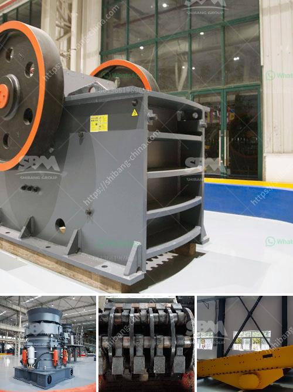

<h3>How to grind fly ash with a ball mill made in China ？</h3>
Fly ash is a byproduct of burning coal in power plants. It consists of fine particles that are carried away by the flue gases, which are then collected and stored using electrostatic precipitators or bag filters. With the increasing adoption of coal as a primary energy source in various industries, the volume of fly ash production has also grown exponentially. As a result, finding effective ways to utilize and process fly ash has become a priority.

One popular method of utilizing fly ash is through grinding it with a ball mill, which helps in converting it into powder form. The grinding process is carried out to crush the coarse particles of fly ash into a fine powder, and this powder is then used as a replacement for cement in concrete or other applications. Depending on the desired fineness of the fly ash, the grinding process can be carried out using either ball mills or vertical roller mills.

China is a country that has a large number of manufacturers of fly ash grinding equipment, and there are even prominent ball mill manufacturers in the market. In order to help customers find suitable models and understand the working principle of the equipment more quickly, we will introduce these manufacturers in detail and explain how to grind fly ash with a ball mill made in China.

Firstly, it is important to choose a reputable and reliable ball mill manufacturer in China. A trustworthy manufacturer will not only provide high-quality equipment but also offer reliable technical support and after-sales service. Some well-known ball mill manufacturers in China include Great Wall Machinery, Chengdu LVSSN, Pengfei Group, and Xinxiang Great Wall. These manufacturers have a wealth of experience in manufacturing grinding equipment and have earned a good reputation for their products.

Once you have selected a suitable ball mill manufacturer, the next step is to understand the working principle of the ball mill. The ball mill works by rotating a cylinder filled with grinding media (such as steel balls) and the feed material (fly ash). The rotating action of the cylinder causes the grinding media to impact and grind the feed material, resulting in the desired fineness.

To achieve the desired fineness of fly ash powder, it is important to control the speed and the duration of the grinding process. Typically, a ball mill operates at a speed between 70-75% of the critical speed, with a maximum grinding media load of around 50%. The grinding time can vary depending on the desired fineness, but it is generally recommended to run the mill for at least 2-3 hours to ensure thorough grinding.

In conclusion, grinding fly ash with a ball mill made in China is a cost-effective and efficient way to turn fly ash into powder. However, choosing a reliable ball mill manufacturer is crucial for ensuring the quality and productivity of the equipment. To maximize the benefits of grinding fly ash, it is important to understand the working principle of the ball mill and optimize the grinding process parameters.
<h3>Contact us</h3><ul><li><strong>Whatsapp:&nbsp;<a href="https://wa.me/8613661969651">+8613661969651</a></strong></li><li><a href="https://swt.shibang-china.com/?git&amp;zhl&amp;How to grind fly ash with a ball mill made in China ？"><strong>Online Service(chat now)</strong></a></li></ul><h3>Related</h3><ul><li><a href='How to set up a crushing production line station ？.md'>How to set up a crushing production line station ？</a></li><li><a href='How to improve the output of stone crushing plant .md'>How to improve the output of stone crushing plant ?</a></li><li><a href='how to choose a crushing machine .md'>how to choose a crushing machine ?</a></li><li><a href='how the mine crusher operate .md'>how the mine crusher operate ?</a></li><li><a href='How to build a manganese ore concentrator What crushing machinery do you need.md'>How to build a manganese ore concentrator? What crushing machinery do you need?</a></li></ul>