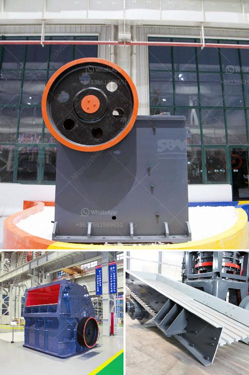

<h3>How to grind white cement clinker?</h3>
White cement clinker, also known as white Portland cement, is a type of cement which is used for aesthetic purposes due to its white color. It is created by heating limestone to high temperatures and then grinding it to a fine powder. White cement clinker is commonly used in decorative concrete applications, such as architectural precast panels, tile, terrazzo, and stucco.

Grinding white cement clinker requires a lot of energy and time. The heat generated during the grinding process can result in high temperatures that can affect the quality of the cement. To prevent this from happening, cooling is necessary. This article will provide a step-by-step guide on how to effectively grind white cement clinker.

Before grinding, it is essential to preheat the grinding mill to prevent moisture from being trapped in the clinker. This can be done by running the mill empty for a few minutes. Preheating the mill ensures that the clinker is in the appropriate temperature range for grinding.

The grinding parameters, such as the rotational speed of the mill and the grinding media load, need to be adjusted to achieve the desired fineness of the white cement clinker. It is important to experiment with different parameters to find the optimal settings for grinding. Additionally, using finer grinding media can result in a more efficient grinding process.

As mentioned earlier, maintaining a suitable temperature during grinding is crucial for the quality of the white cement clinker. To control the temperature, it is recommended to use a cooling system. This can involve using air or water cooling systems to prevent the clinker from getting too hot during grinding.

Throughout the grinding process, it is important to monitor and assess the grinding performance regularly. This can be done by analyzing the particle size distribution of the ground clinker. A high-quality white cement requires a narrow particle size distribution and a low percentage of oversized particles. By conducting regular assessments, adjustments can be made to optimize the grinding performance.

After grinding, it is essential to store the ground white cement clinker in a dry environment. Moisture can negatively impact the quality of the cement, leading to reduced strength and durability. Therefore, it is crucial to store the ground clinker in airtight containers or silos to prevent moisture intrusion.

In conclusion, grinding white cement clinker requires careful attention to detail to ensure that a high-quality product is achieved. Adequate preheating, controlling the grinding parameters, monitoring the temperature, and proper storage are all critical aspects of the grinding process. By following these steps, one can successfully grind white cement clinker and produce a superior finished product.
<h3>Contact us</h3><ul><li><strong>Whatsapp:&nbsp;<a href="https://wa.me/8613661969651">+8613661969651</a></strong></li><li><a href="https://swt.shibang-china.com/?git&amp;zhl&amp;How to grind white cement clinker"><strong>Online Service(chat now)</strong></a></li></ul><h3>Related</h3><ul><li><a href='How to set up a stone crusher plant.md'>How to set up a stone crusher plant?</a></li><li><a href='How to maintain a coal crusher.md'>How to maintain a coal crusher?</a></li><li><a href='how to load cone crusher .md'>how to load cone crusher ?</a></li><li><a href='How to determine the capacity of impact crusher？.md'>How to determine the capacity of impact crusher？</a></li><li><a href='How to remove iron from zinc ore.md'>How to remove iron from zinc ore?</a></li></ul>