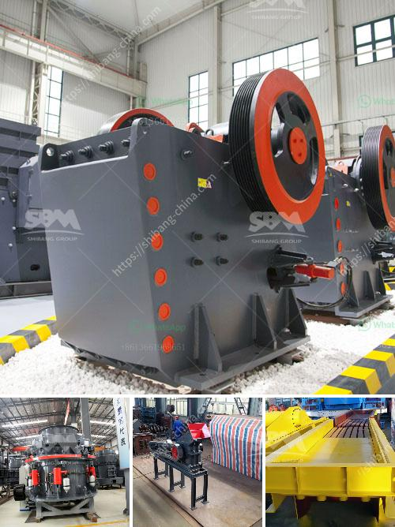

<h3>How to import stone crusher machine from China to Canada?</h3>
Are you looking to import a stone crusher machine from China to Canada? If you are then you must have some questions in your mind. To make this process easier, I have compiled a complete guide for importing stone crusher machines from China.

First and foremost, you need to think about the shipping cost of the stone crusher machine. Because the cost of transporting is not cheap, you need to ensure that the manufacturer provides reasonable shipping charges. Also, check whether they have a good track record of delivering machines on time.

The next thing you should consider is the quality of the machine. You can do this by checking the manufacturer's reputation and customer reviews on their website or other trustworthy platforms. It is essential to import a stone crusher machine that has high quality, durable components and is built to last.

Before importing any goods to Canada, you need to understand the customs duties and taxes involved. You should research and familiarize yourself with the regulations regarding the importation of stone crusher machines. This will help you avoid any unexpected costs and delays.

Finding a reliable manufacturer is crucial when importing a stone crusher machine. You can start by searching online platforms, such as Alibaba, Made-in-China, or Global Sources. These websites provide a list of manufacturers and suppliers in China, along with their contact information.

Once you have shortlisted a few manufacturers, communicate with them directly. Request product catalogs, technical specifications, and ask any questions you might have. This will give you a better understanding of the product and the company's capabilities.

When importing a stone crusher machine from China, it is essential to negotiate the terms with the supplier. The key terms should include product price, payment terms, delivery time, and quality assurance measures. Make sure to establish a clear agreement and avoid any misunderstandings.

After finalizing the terms, you need to arrange the shipping and insurance for your stone crusher machine. You can either work with a freight forwarder or shipping agent who has experience in importing machinery. They will handle all the logistics, documentation, and ensure that your machine is transported safely to Canada.

Once the machine arrives in Canada, you need to clear it through customs. You will need to provide the necessary documentation, such as the bill of lading, commercial invoice, and customs declaration form, to the customs authorities. It is advisable to work with a customs broker to navigate through the customs clearance process smoothly.

Importing a stone crusher machine from China can be a challenging task, especially if you are not well-acquainted with the rules and regulations. To ensure a smooth importation, it is crucial to do thorough research, find a reliable manufacturer, negotiate the terms carefully, and work with experienced shipping agents and customs brokers.

By following these steps and taking the necessary precautions, you can successfully import a high-quality stone crusher machine from China to Canada. Good luck with your importation journey!
<h3>Contact us</h3><ul><li><strong>Whatsapp:&nbsp;<a href="https://wa.me/8613661969651">+8613661969651</a></strong></li><li><a href="https://swt.shibang-china.com/?git&amp;zhl&amp;How to import stone crusher machine from China to Canada"><strong>Online Service(chat now)</strong></a></li></ul><h3>Related</h3><ul><li><a href='how a cone crusher works .md'>how a cone crusher works ?</a></li><li><a href='how to work cone crusher ？.md'>how to work cone crusher ？</a></li><li><a href='how to calculate stone crusher production .md'>how to calculate stone crusher production ?</a></li><li><a href='How to crush spongy limestone.md'>How to crush spongy limestone?</a></li><li><a href='How is nickel extracted from its ore.md'>How is nickel extracted from its ore?</a></li></ul>