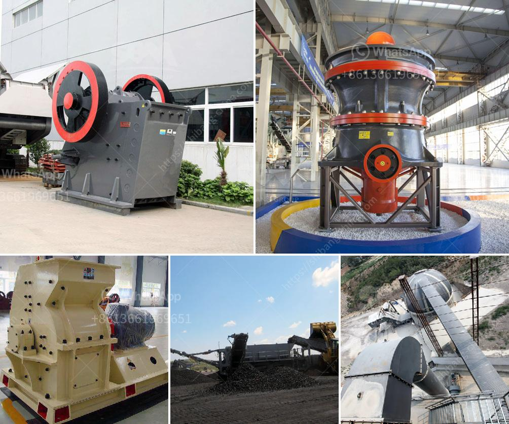

<h3>How to improve coal crusher hammer life ?</h3>
Coal Crusher Hammer plays a crucial role in crushing coal in thermal power plant. Coal is a combustible black or brownish-black sedimentary rock usually occurring in rock strata called coal beds. Before being used, we usually crush coal into particle size via coal crusher. It is necessary to select the most appropriate coal crusher in order to achieve the optimal material processing results.

1. Select the appropriate coal crushing machine bearing model. The machinery industry is constantly evolving, and new equipment is gradually introduced to the market. Therefore, when selecting a coal crusher, users should choose a reputable manufacturers, and be sure to choose a machine bearing model with a good reputation, so as to reduce the probability of equipment failure in use.

2. Choose the right material for your coal crusher hammers. Some hammers used in coal crusher are made of manganese steel, which has the advantages of good toughness and high hardness. However, the wear resistance and impact resistance of manganese steel are not ideal. When the coal is hard, some hammers with poor wear resistance and impact resistance are likely to be broken, leading to frequent replacement of hammers. As a result, it is recommended to select hammers made of chromium alloy cast iron or composite materials, as they have excellent wear resistance and impact resistance.

3. Optimize the design of the coal crusher hammers. Correctly designed and accurately struck hammers play an important role in increasing the energy utilization rate and extending the life of the coal crusher hammer. The size, shape, and material of the hammer head directly affect the output and working efficiency of the coal crusher. The operator should reasonably select the hammer head according to the actual characteristics of the coal, so as to maximize the crushing efficiency and minimize the energy consumption.

4. Regularly inspect and maintain the coal crusher hammers. Regularly inspect the coal crusher hammers for wear and tear. When found, they should be replaced immediately to avoid affecting the normal operation of the equipment. In addition, it is important to keep the coal crusher hammers clean and free of dust or other contaminants, as this can reduce wear and tear and extend the life of the hammers.

In conclusion, improving the life of coal crusher hammer is not only a matter of selection, but also involves correct use and maintenance. The above suggestions can help the user effectively improve the service life of the hammer and reduce the frequency of replacement, saving costs and improving working efficiency. In addition, it is also necessary to regularly monitor and inspect the equipment, and timely troubleshoot any problems that arise to ensure the normal operation of the coal crusher and avoid unnecessary losses.
<h3>Contact us</h3><ul><li><strong>Whatsapp:&nbsp;<a href="https://wa.me/8613661969651">+8613661969651</a></strong></li><li><a href="https://swt.shibang-china.com/?git&amp;zhl&amp;How to improve coal crusher hammer life "><strong>Online Service(chat now)</strong></a></li></ul><h3>Related</h3><ul><li><a href='How to do the maintenance of crushing screening plant.md'>How to do the maintenance of crushing screening plant?</a></li><li><a href='How to process tantalite mineral.md'>How to process tantalite mineral?</a></li><li><a href='How to calculate the cost per ton of crushing and screening stone.md'>How to calculate the cost per ton of crushing and screening stone?</a></li><li><a href='How can we increase the production of the jaw crusher.md'>How can we increase the production of the jaw crusher?</a></li><li><a href='How industry crush graphite.md'>How industry crush graphite?</a></li></ul>