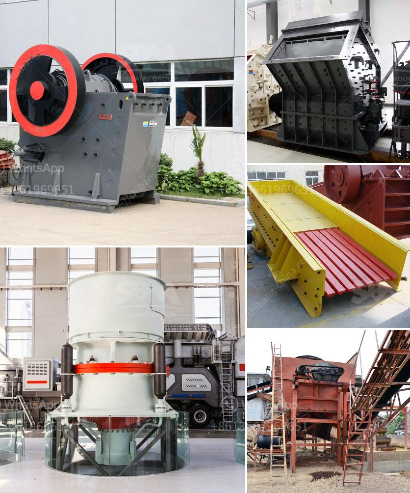

<h3>How to improve grinding efficiency of a mill?</h3>
Grinding is an essential operation in the mining industry, and it is used to reduce the size of materials for further processing. Grinding efficiency is crucial for achieving the desired particle size and product quality, as well as for reducing energy consumption and costs. In this article, we will explore some effective ways to improve the grinding efficiency of a mill.

1. Select the right grinding equipment: The choice of a grinding mill plays a significant role in achieving the desired grinding efficiency. Different mills have different capacities, power consumption rates, and particle size reduction capabilities. It is important to evaluate and select the appropriate mill based on the specific requirements of the application.

2. Optimize the operating conditions: Properly adjusting the operating conditions of a mill can have a significant impact on its grinding efficiency. Factors such as feed rate, mill speed, and feed size distribution should be carefully monitored and adjusted to ensure optimal performance. By optimizing these parameters, the mill can be operated at its best efficiency point, resulting in improved grinding efficiency.

3. Use the right grinding media: The selection of grinding media also has a considerable influence on the grinding efficiency. Different types of media, such as steel balls, ceramic beads, or cylpebs, have different grinding properties and wear rates. It is essential to choose the right media for the specific application to achieve the desired grinding efficiency.

4. Maintain and optimize mill liners: Mill liners play a crucial role in the grinding process by protecting the mill shell and promoting efficient grinding. Worn or damaged liners can negatively impact the grinding performance, leading to lower efficiency and increased operating costs. Regular inspection and maintenance of mill liners are necessary to ensure their optimal condition and maximize grinding efficiency.

5. Monitor and control the mill operation: Implementing advanced control systems can significantly enhance mill performance and grinding efficiency. Process control strategies, such as model predictive control (MPC) or advanced regulatory control (ARC), can help optimize the mill operation and maintain the desired grinding efficiency. These systems use real-time data and mathematical models to predict and adjust process variables, maximizing the mill's performance.

6. Optimize the classification system: The efficiency of the classification system, which separates the ground particles from the oversized ones, has a direct impact on the overall grinding efficiency. By optimizing the design and operation of the classification system, the mill's performance can be significantly improved. This can be accomplished by adjusting the cyclone's operating parameters, installing more efficient classifiers, or using advanced control algorithms to regulate the classification process.

In conclusion, improving the grinding efficiency of a mill is a complex task that involves careful consideration of several factors. By selecting the right equipment, optimizing operating conditions, using the right grinding media, maintaining mill liners, and implementing advanced control systems, it is possible to achieve higher grinding efficiency, reduce energy consumption, and improve the overall performance of a mill. These improvements can lead to significant cost savings and enhance the productivity and sustainability of mining operations.
<h3>Contact us</h3><ul><li><strong>Whatsapp:&nbsp;<a href="https://wa.me/8613661969651">+8613661969651</a></strong></li><li><a href="https://swt.shibang-china.com/?git&amp;zhl&amp;How to improve grinding efficiency of a mill"><strong>Online Service(chat now)</strong></a></li></ul><h3>Related</h3><ul><li><a href='How to disassemble jaw crushers.md'>How to disassemble jaw crushers?</a></li><li><a href='how to increase production capicity of ball mill.md'>how to increase production capicity of ball mill?</a></li><li><a href='How to choose a limestone hammer mill ？.md'>How to choose a limestone hammer mill ？</a></li><li><a href='how to run a quarry business ？.md'>how to run a quarry business ？</a></li><li><a href='How to make sand from stone dust.md'>How to make sand from stone dust?</a></li></ul>