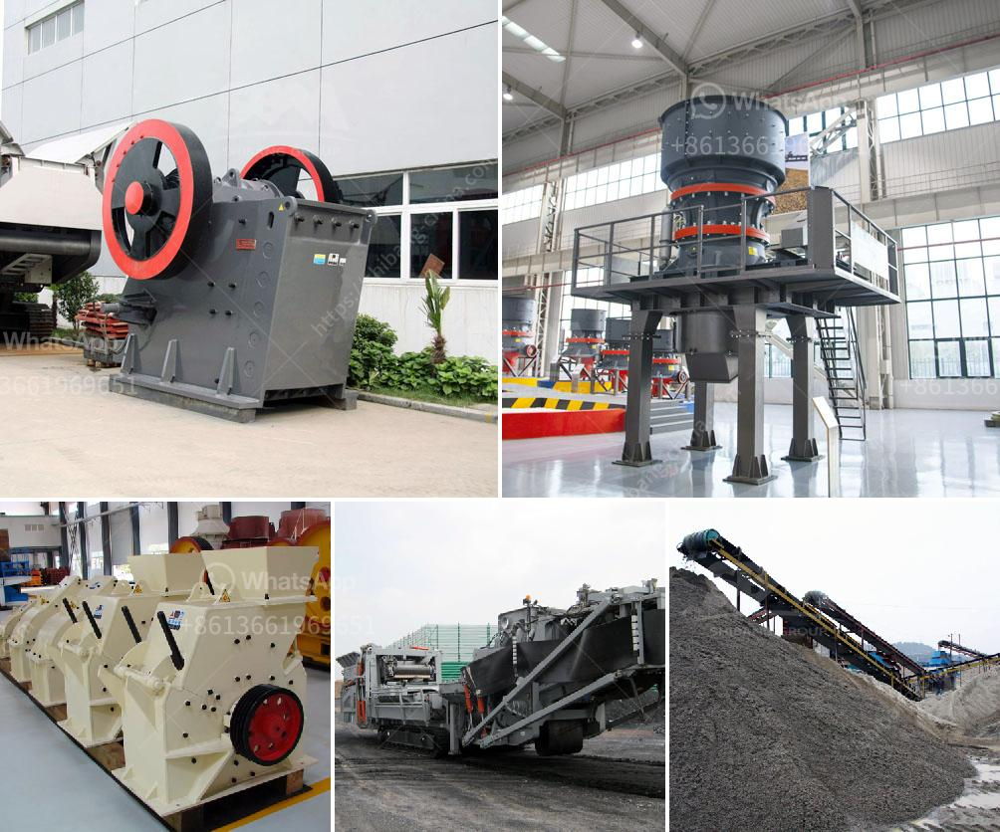

<h3>How to improve pulveriser capacity?</h3>
A pulveriser is a crucial machinery in various industrial processes, including mining, chemical manufacturing, and material handling. It is responsible for reducing large-sized materials into smaller particles, making them more manageable for further processing. However, at times, operators may encounter issues with the pulveriser's capacity, hindering the overall efficiency of the operation. In this article, we will explore some strategies to enhance the pulveriser's capacity and optimize its performance.

1. Optimize Feed Material: One of the primary factors affecting the pulveriser's capacity is the feed material. It is essential to choose the right size and consistency of the material to ensure optimal processing. Oversized materials can cause congestion and result in reduced capacity. Regular inspection and separation of oversized particles before feeding them into the pulveriser can significantly enhance its capacity.

2. Regular Maintenance and Cleaning: Pulverisers, like any other machinery, require regular maintenance to ensure their smooth functioning. This involves inspecting for wear and tear, replacing worn-out parts, lubricating moving components, and cleaning any accumulated dust or debris. Regular cleaning prevents clogging and improves the air flow inside the pulveriser, enabling higher capacity and better overall performance.

3. Balancing Airflow and Material Flow: Achieving a proper balance between airflow and material flow is crucial for improving the pulveriser's capacity. Adjusting the airflow rate can impact the efficiency of the pulveriser and optimize the particle size distribution. It is recommended to consult the manufacturer's guidelines or seek expert advice to determine the most suitable airflow rate for your specific application.

4. Upgrading Pulveriser Components: Consider upgrading the pulveriser's components to enhance its overall capacity. For instance, installing improved grinding elements or increasing the size of the grinding chamber can significantly improve the pulverising process and increase its capacity. Upgrading the motor to a higher power rating can also contribute to better performance and faster processing.

5. Utilize Pre-crushing Techniques: Pre-crushing techniques, such as using pre-crushers or crushers, can help in reducing the size of the feed material before sending it to the pulveriser. This step eliminates larger particles and makes the material more manageable for the pulveriser, ultimately improving its capacity. However, it is crucial to ensure that the pre-crushing technique employed is compatible with the pulveriser and does not affect its efficiency.

6. Optimal Pulveriser Loading: Overloading or underloading the pulveriser can adversely impact its capacity. It is crucial to maintain an optimal loading condition to achieve maximum output. Adjusting the feed rate based on the pulveriser's working capacity ensures efficient processing while preventing excessive strain on the machinery.

In conclusion, improving the capacity of a pulveriser requires a systematic approach involving optimization of feed material, regular maintenance, balancing airflow and material flow, component upgrades, pre-crushing techniques, and optimal loading. By implementing these strategies, operators can enhance the pulveriser's performance, increase productivity, and ensure a more efficient industrial operation.
<h3>Contact us</h3><ul><li><strong>Whatsapp:&nbsp;<a href="https://wa.me/8613661969651">+8613661969651</a></strong></li><li><a href="https://swt.shibang-china.com/?git&amp;zhl&amp;How to improve pulveriser capacity"><strong>Online Service(chat now)</strong></a></li></ul><h3>Related</h3><ul><li><a href='how limestone is mined in kenya.md'>how limestone is mined in kenya</a></li><li><a href='How to increase the output of stone milling machine？.md'>How to increase the output of stone milling machine？</a></li><li><a href='How to choose granite mining machinery in Nigeria ？.md'>How to choose granite mining machinery in Nigeria ？</a></li><li><a href='How to increase the output of jaw crusher ？.md'>How to increase the output of jaw crusher ？</a></li><li><a href='How to maintain a stone crusher machine.md'>How to maintain a stone crusher machine?</a></li></ul>