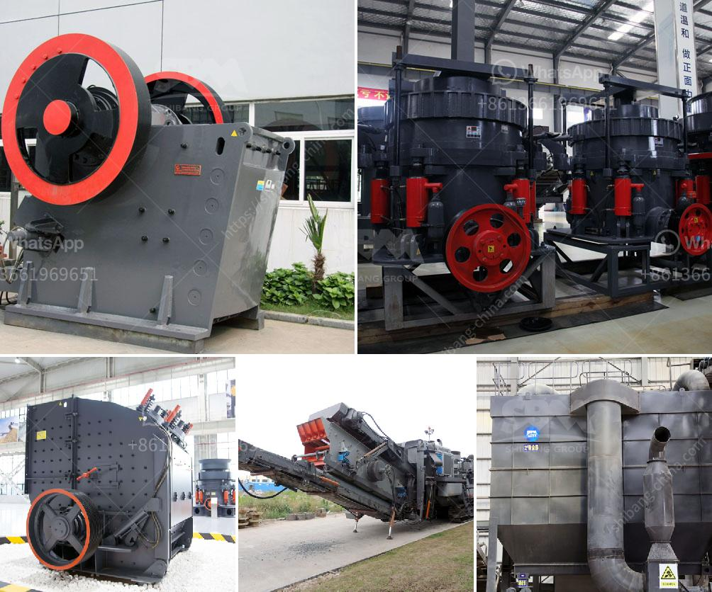

<h3>How to improve stone crusher production?</h3>
Stone crushing equipment plays a vital role in the construction industry as they provide the vital aggregates required for concrete production as well as for road construction. As a result, the stone crusher production level is increased to meet the requirements of the construction industry and deliver the appropriate solutions for infrastructure development. However, the operation of the stone crusher must always pay attention to the maintenance and timely adjustment of downtime issues.

The size of the broken material affects the productivity of the stone crusher. The more material that is crushed into smaller pieces, the higher the production capacity of the entire stone crushing plant. Furthermore, a larger crushed stone aggregate size will increase the production rate even further.

One of the primary measures to ensure the productivity of a stone crusher is to regular maintenance by a qualified professional. In addition to these'regular checks, there are additional ways to improve production capacity.

1. Optimize the design of the equipment: the cone crusher adopts an intergranular laminating crushing chamber design, which produces particles of better shape and higher crushing efficiency. It can increase the output by 20-40% compared to the traditional cone crusher.

2. Excellent wear resistance of parts: Improved crusher wear parts have a longer lifespan due to the improvement in wear resistance. Stronger wear resistance also reduces maintenance costs and downtime.

3. Adjust the tightness of the belt: If the belt is too loose, it will slip on the pulley and affect the normal drive of the crusher, reducing its production capacity. On the other hand, if the belt is too tight, it will cause excessive tension on the motor, resulting in higher energy consumption and decreased equipment life.

4. Optimize the fragmentation process: The fragmentation process is the key to determining the particle size and quality of the final product. By optimizing the fragmentation process, the stone crusher can produce particles of various sizes to meet the different needs of customers. This can be achieved by adjusting the parameters of the crusher, such as the speed of the rotor, the impact plate, and the gap between the counterattack plate and the hammer.

5. Regularly clean and lubricate the equipment: Cleanliness and lubrication play a crucial role in the normal operation and productivity of the stone crusher. Dust and dirt can accumulate, leading to increased wear and tear on the parts. Regular cleaning and lubrication of the equipment will not only improve the productivity of the stone crusher but also extend its service life.

In conclusion, improving the production capacity of stone crusher is an important issue for every user in the stone crusher production line. The first thing to consider is the nature of the material being crushed. The second cause to consider is the selection and quantity of the equipment. Finally, it is important to perform regular maintenance and timely adjustment to ensure the stability and productivity of the stone crusher. By implementing these measures, the stone crusher production capacity can be improved significantly, leading to increased productivity and better overall performance.
<h3>Contact us</h3><ul><li><strong>Whatsapp:&nbsp;<a href="https://wa.me/8613661969651">+8613661969651</a></strong></li><li><a href="https://swt.shibang-china.com/?git&amp;zhl&amp;How to improve stone crusher production"><strong>Online Service(chat now)</strong></a></li></ul><h3>Related</h3><ul><li><a href='How to set up a gold mining ball mill.md'>How to set up a gold mining ball mill?</a></li><li><a href='how to install a crusher in a quarry ？.md'>how to install a crusher in a quarry ？</a></li><li><a href='How to improve pulveriser capacity.md'>How to improve pulveriser capacity?</a></li><li><a href='How to get a sandmaking mini machine.md'>How to get a sand-making mini machine?</a></li><li><a href='How to decide on ball mill grinding media.md'>How to decide on ball mill grinding media?</a></li></ul>