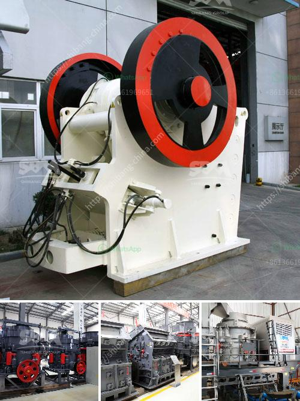

<h3>How to improve the crushing capacity of ball mill?</h3>
Ball mill is the core equipment used in ore production line. It is commonly used in grinding materials and is widely used in ceramics, glass, cement, silicate products, new building materials, refractory materials, fertilizer, metal ore and other fields. In order to ensure the efficiency of the ore crusher, it is necessary to improve the crushing capacity of the ball mill.

There are many factors that affect the crushing capacity of the ball mill, such as the nature of the material, the nature of the ore, the size of the grinding media, the size of the ore feed, the size of the discharge port, and the grinding time. Considering the factors from different aspects can effectively improve the crushing capacity.

Firstly, the nature of the material is an important factor affecting the crushing capacity of the ball mill. The hardness, toughness, brittleness and other properties of the material will affect the crushing effect. The harder the material is, the more difficult it is to crush. Therefore, when selecting the material, it is necessary to consider the nature of the material and choose the appropriate grinding media and grinding method.

Secondly, the size of the grinding media also affects the crushing capacity of the ball mill. The larger the size of the grinding media, the more crushing force it can provide, and the higher the crushing capacity. Therefore, when selecting the grinding media, it is necessary to choose the appropriate size to match the size of the ore feed and improve the crushing capacity.

Thirdly, the size of the ore feed also affects the crushing capacity of the ball mill. If the size of the ore feed is too large, it will increase the load of the ball mill, reduce the grinding efficiency, and affect the crushing capacity. Therefore, it is necessary to control the size of the ore feed within a reasonable range to ensure the normal operation of the ball mill.

Fourthly, the size of the discharge port also affects the crushing capacity of the ball mill. If the size of the discharge port is too large, it will reduce the grinding efficiency and affect the crushing capacity. Therefore, it is necessary to adjust the size of the discharge port according to the grinding requirements to ensure the normal operation of the ball mill.

Finally, the grinding time plays an important role in improving the crushing capacity of the ball mill. If the grinding time is too short, the crushing effect will be poor, and the crushing capacity will be low. Therefore, it is necessary to determine the appropriate grinding time and adjust it in time according to the actual situation to improve the crushing capacity.

In summary, in order to improve the crushing capacity of the ball mill, it is necessary to consider the factors such as the nature of the material, the size of the grinding media, the size of the ore feed, the size of the discharge port, and the grinding time. By optimizing these factors, the crushing capacity of the ball mill can be effectively improved, thereby improving the overall efficiency of the ore crusher.
<h3>Contact us</h3><ul><li><strong>Whatsapp:&nbsp;<a href="https://wa.me/8613661969651">+8613661969651</a></strong></li><li><a href="https://swt.shibang-china.com/?git&amp;zhl&amp;How to improve the crushing capacity of ball mill"><strong>Online Service(chat now)</strong></a></li></ul><h3>Related</h3><ul><li><a href='How mobile crushing plant can realize the recycling of construction waste .md'>How mobile crushing plant can realize the recycling of construction waste ?</a></li><li><a href='How to choose a limestone hammer mill ？.md'>How to choose a limestone hammer mill ？</a></li><li><a href='How to change the HP cone crusher mantle.md'>How to change the HP cone crusher mantle?</a></li><li><a href='How to determine the capacity of impact crusher？.md'>How to determine the capacity of impact crusher？</a></li><li><a href='How to improve the quality of crusher aggregates .md'>How to improve the quality of crusher aggregates ?</a></li></ul>