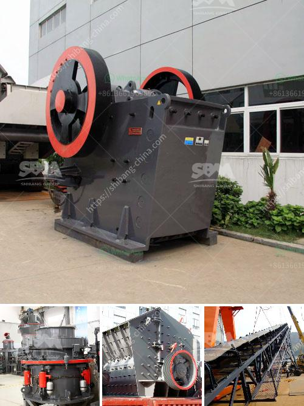

<h3>How to improve the output of stone crusher ?</h3>
Stone crushing has always been the primary source of employment opportunities for many people in rural areas of Bangladesh. However, an alarming majority of these crushers lack safety measures to protect the workers' health and the environment. With the rapidly increasing demand for stone products, the need for improving the output of these machines has become paramount. In this article, we will discuss some crucial ways to enhance the productivity of stone crushers.

A stone crusher requires regular maintenance to ensure its efficient operation. Daily inspections should be conducted to check for any loose or worn-out parts, excessive vibration, and oil leakage. These checks will help identify potential issues before they become major problems and cause downtime.

Efficient feeding is essential for the overall performance of a stone crusher. Dust suppression systems are often used to minimize dust emissions during the loading and unloading of materials. Controlling the feed rate and ensuring a steady flow of stones into the crusher will improve its crushing capacity and reduce power consumption.

The discharge opening of a stone crusher plays a significant role in determining the product size and shape. It is crucial to adjust the discharge opening regularly to achieve the desired final product. If the discharge is too small, the crushed material may accumulate and cause blockages, leading to reduced output. Conversely, a large discharge opening may result in excessive particle size and poor product quality.

Stone crushers often operate in harsh working conditions, and their productivity can be negatively impacted by factors such as extreme temperatures, excessive dust, and moisture. It is essential to optimize the equipment configuration by implementing measures like installing dust collectors, providing proper ventilation, and using heat-resistant materials.

The stone crushing industry has witnessed significant advancements in technology over the years. Upgrading to modern and efficient equipment can significantly improve the output of stone crushers. Upgraded machines with advanced technologies can complete the crushing process faster and produce more precise and uniform products.

Proper training and education of the stone crusher operators are crucial for optimizing the output. Operators should be trained to operate the machines efficiently, understand the importance of maintenance, and recognize potential hazards. Regular refresher courses can help ensure that operators are up-to-date with the latest techniques and safety practices.

Monitoring and analyzing the performance of stone crushers is vital to identify bottlenecks and areas for improvement. Regularly monitoring the output, energy consumption, and wear rates can help identify opportunities for optimizing the crushing process and adjusting operational parameters.

In conclusion, improving the output of stone crushers requires a holistic approach that encompasses regular maintenance, optimizing the feeding process, adjusting the discharge opening, upgrading technology and equipment, providing training and education, and regular monitoring of performance. By implementing these measures, the stone crushing industry can enhance productivity, reduce downtime, and ensure the safety and well-being of its workers.
<h3>Contact us</h3><ul><li><strong>Whatsapp:&nbsp;<a href="https://wa.me/8613661969651">+8613661969651</a></strong></li><li><a href="https://swt.shibang-china.com/?git&amp;zhl&amp;How to improve the output of stone crusher "><strong>Online Service(chat now)</strong></a></li></ul><h3>Related</h3><ul><li><a href='How to improve the sound of crusher machine.md'>How to improve the sound of crusher machine?</a></li><li><a href='How do I adjust a conetype crusher.md'>How do I adjust a cone-type crusher?</a></li><li><a href='How to set up a crushing plant in the Philippines.md'>How to set up a crushing plant in the Philippines?</a></li><li><a href='How is dolomite crushed for road building etc.md'>How is dolomite crushed for road building, etc.?</a></li><li><a href='How to manufacture marble powder with a mesh size of 1000.md'>How to manufacture marble powder with a mesh size of 1000?</a></li></ul>