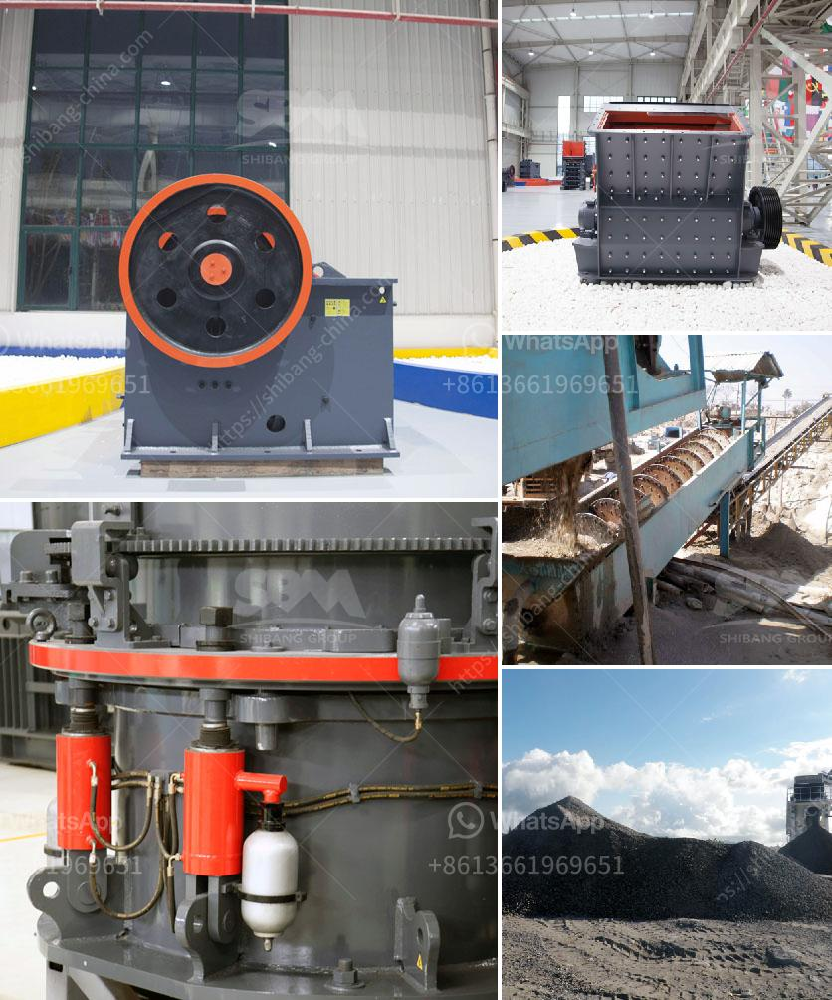

<h3>How to improve the output of stone crushing plant ?</h3>
Stone crushing plants are essential to the construction industry, as they produce the base material for road construction and concrete. Additionally, these plants can help to clear land for building projects and decrease the impact on the environment. However, achieving high output from these plants can be a challenging task. In order to ensure optimal production levels, it is crucial to implement several strategies and techniques. This article will outline some effective ways to improve the output of a stone crushing plant.

1. Select the Right Equipment: With the increasing number of crushing plants in operation, competition becomes tougher. To stand out from the crowd, it is crucial to have a well-designed and efficient crusher. Choosing the right equipment will increase the overall productivity of the plant. Consider factors such as the capacity, power consumption, noise level, and maintenance requirements of the machinery before making a purchase.

2. Regular Maintenance: Regular maintenance is essential to keep the crusher running smoothly and maximize its output. Regularly inspect all components, including belts, screens, and hammers, for signs of wear and tear. Replace or repair damaged parts promptly. In addition, lubricate all moving parts as per the manufacturer's recommendations to ensure optimal performance.

3. Optimize Crushing Process: Understanding the crushing process is crucial to improving the efficiency of the plant. Analyze the material being processed and adjust the crusher parameters accordingly. Ensure that the crushers are operating at their optimal settings to produce the desired output. Work closely with the crusher operators and provide guidance and training when needed.

4. Regularly Clean Screens: Screens are an integral part of the crushing process as they separate the crushed material into different sizes. Keeping the screens clean is essential for efficient operation. Regularly remove any clogged or blocked material from the screens to prevent bottlenecks and ensure continuous production.

5. Dust Suppression: Dust is a common problem in stone crushing plants, especially during dry weather conditions. Dust can significantly reduce the overall output of the plant and harm the health of workers. Implement effective dust suppression measures by installing dust control systems, using water sprays, and covering conveyors and stockpiles.

6. Implement Automation: Automation technology can greatly improve the efficiency and output of stone crushing plants. Automate processes such as feeding, primary crushing, and conveyor systems to minimize human intervention and increase productivity. Integrate sensors and monitors to continuously analyze the operation and identify potential issues before they cause downtime.

7. Training and Education: In order to improve the output of a stone crushing plant, it is important for the employees to have the necessary knowledge and skills. Provide comprehensive training and education programs to the personnel involved in the operation of the plant. This will ensure that they are aware of the best practices and techniques to maximize the production levels.

In conclusion, improving the output of a stone crushing plant requires a combination of strategies and techniques. By selecting the right equipment, performing regular maintenance, optimizing the crushing process, regular cleaning of screens, implementing dust suppression measures, automating processes, and providing training to employees, it is possible to significantly improve the output and efficiency of a stone crushing plant.
<h3>Contact us</h3><ul><li><strong>Whatsapp:&nbsp;<a href="https://wa.me/8613661969651">+8613661969651</a></strong></li><li><a href="https://swt.shibang-china.com/?git&amp;zhl&amp;How to improve the output of stone crushing plant "><strong>Online Service(chat now)</strong></a></li></ul><h3>Related</h3><ul><li><a href='how to calculate the processing capacity of the mill .md'>how to calculate the processing capacity of the mill ?</a></li><li><a href='How to check the stone crusher and daily maintenance？.md'>How to check the stone crusher and daily maintenance？</a></li><li><a href='How to change the blow bars on an impact crusher.md'>How to change the blow bars on an impact crusher?</a></li><li><a href='How to choose the right primary crusher for your plant.md'>How to choose the right primary crusher for your plant?</a></li><li><a href='How to operate a ore ball mill normally.md'>How to operate a ore ball mill normally?</a></li></ul>