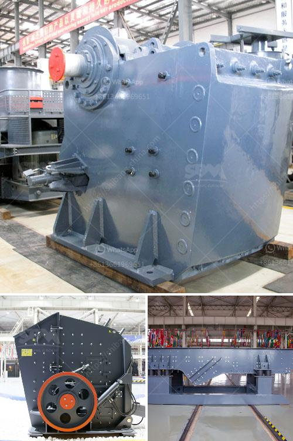

<h3>How to improve the performance of a coal crusher?</h3>
Coal crushers are important auxiliary dynamic machines in thermal power plants and coal-fired power stations. They pulverize coal between a roller and a rotating drum that contains a controlled quantity of water mixed with coal. These crushers efficiently break large chunks of coal into small fragments, resulting in an improved boiler efficiency and reduced emissions of pollutants. Through proper design and operation, it is possible to maximize the performance of a coal crusher, leading to a reduction in fuel consumption and lower maintenance costs.

1. Check the wear of the various components: The components of the coal crusher play a crucial role in the productivity and efficiency of the machine. It is advisable to regularly inspect the wear of these components and perform necessary maintenance to keep them in good working condition. If any parts are excessively worn or damaged, they should be replaced promptly to prevent a decrease in performance.

2. Optimize the feeding system: A consistent and controlled feeding of coal to the crusher is essential for proper operation. Inadequate feeding can lead to irregular wear patterns on the crushing elements, decreased throughput, and increased power consumption. It is recommended to install a feeder that evenly distributes coal across the crushing chamber and ensures a steady flow of material into the crusher.

3. Adjust the crusher settings: There are various parameters that define the efficiency of a coal crusher, such as the diameter of the roll, the number of revolutions per minute, the clearance between the roll and the drum, and the water content. These settings can be adjusted to optimize the performance of the crusher based on the specific requirements of the coal being processed.

4. Properly maintain the hammers and screens: The hammers and screens are critical components of a coal crusher that determine the final product size distribution and shape. Regularly inspecting and replacing worn-out hammers and screens can enhance the crushing efficiency and quality of the coal. Additionally, ensuring that the screens are properly tensioned and fitted with the correct opening size will contribute to improved performance.

5. Control the moisture content of the coal: The moisture content of the coal has a significant impact on the crusher performance. High moisture content can reduce the crushing capacity of the crusher and increase the power consumption. It is essential to control the moisture content of the coal entering the crusher to minimize the effects of moisture on the crushing efficiency.

In conclusion, improving the performance of a coal crusher entails regular maintenance and careful consideration of design and operating parameters. By adhering to these guidelines, power plants and coal-fired power stations can ensure efficient and reliable operation of their coal crushers, leading to a reduction in fuel consumption and environmental impact.
<h3>Contact us</h3><ul><li><strong>Whatsapp:&nbsp;<a href="https://wa.me/8613661969651">+8613661969651</a></strong></li><li><a href="https://swt.shibang-china.com/?git&amp;zhl&amp;How to improve the performance of a coal crusher"><strong>Online Service(chat now)</strong></a></li></ul><h3>Related</h3><ul><li><a href='How to crush concrete for recycling .md'>How to crush concrete for recycling ?</a></li><li><a href='How to adjust the discharge opening of an impact crusher.md'>How to adjust the discharge opening of an impact crusher?</a></li><li><a href='How to remove feldspars from sand production.md'>How to remove feldspars from sand production?</a></li><li><a href='How to choose a hightechnology and correct mine sand washing machine.md'>How to choose a high-technology and correct mine sand washing machine?</a></li><li><a href='How to set up a stone crusher plant.md'>How to set up a stone crusher plant?</a></li></ul>