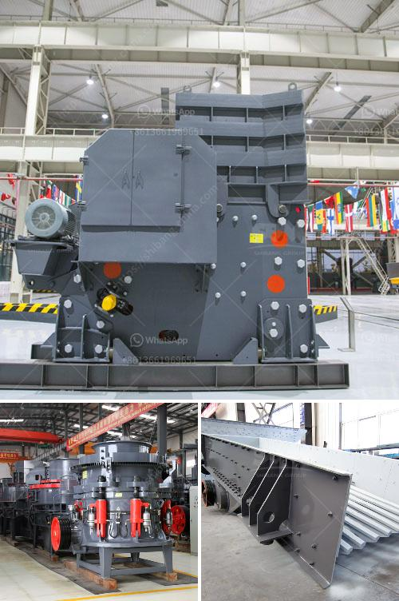

<h3>How to improve the sound of crusher machine?</h3>
Crusher machines are essential equipment in the mining and construction industries, as they are responsible for breaking down large rocks into smaller, more manageable sizes. However, one common issue with crusher machines is their loud noise levels, which can be disruptive and potentially harmful to the operators and nearby individuals.

Fortunately, there are several steps that can be taken to improve the sound of crusher machines and create a safer and more comfortable working environment. Here are a few suggestions:

One of the most effective ways to reduce noise from crushers is to incorporate soundproofing materials into their design. These materials can be used to line the walls of the machine, as well as any other openings or access points. Soundproofing materials, such as acoustic foam or damping mats, absorb and reflect sound waves, thereby minimizing the noise produced by the machine.

Regular maintenance is crucial for ensuring that crusher machines perform at their optimal level and produce minimal noise. This includes checking and tightening any loose parts, lubricating moving components, and replacing worn-out or damaged parts. By maintaining the machine properly, you can prevent vibrations and other mechanical issues that can contribute to excessive noise production.

The placement of the crusher machine can have a significant impact on its sound levels. It is essential to place the machine on a stable, level surface and away from any walls or other structures that may amplify the noise. Additionally, creating a sound barrier around the machine, such as using partitions or walls, can help contain and reduce the noise levels.

Crusher machines often generate vibrations, which can contribute to the overall noise levels. Using vibration isolation mounts or pads can help minimize the vibrations and subsequently reduce the noise produced. These mounts act as shock absorbers, isolating the machine from its surroundings, and minimizing the transmission of vibrations.

Another effective method to reduce crusher machine noise is by enclosing the machine in a soundproof enclosure or cabin. The enclosure should be made of sound-absorbing materials and have proper ventilation to prevent heat buildup. This will not only contain and dampen the noise but also offer additional protection to the machine and operators.

In addition to the above technical measures, implementing noise control policies and procedures can significantly contribute to reducing the noise levels of crusher machines. This can include limiting the duration and intensity of machine operation, providing hearing protection gear to operators, and conducting regular noise monitoring to identify potential issues.

In conclusion, improving the sound of crusher machines is crucial for creating a safe and comfortable working environment. By utilizing soundproofing materials, conducting regular maintenance, properly placing the machine, using vibration isolators, enclosing the machine, and implementing noise control policies, it is possible to significantly reduce the noise levels generated by crusher machines. These measures not only contribute to a healthier workplace but also promote better productivity and efficiency in the mining and construction industries.
<h3>Contact us</h3><ul><li><strong>Whatsapp:&nbsp;<a href="https://wa.me/8613661969651">+8613661969651</a></strong></li><li><a href="https://swt.shibang-china.com/?git&amp;zhl&amp;How to improve the sound of crusher machine"><strong>Online Service(chat now)</strong></a></li></ul><h3>Related</h3><ul><li><a href='How to manage a quarry plant 10 suggestions.md'>How to manage a quarry plant? 10 suggestions</a></li><li><a href='How is mill used in the copper ore mining process.md'>How is mill used in the copper ore mining process?</a></li><li><a href='How many kilowatts motor is equipped with jaw crusher ？.md'>How many kilowatts motor is equipped with jaw crusher ？</a></li><li><a href='how to build a concrete wash rack for heavy equipment .md'>how to build a concrete wash rack for heavy equipment ?</a></li><li><a href='How do you calculate the motor power for a vibrator screen.md'>How do you calculate the motor power for a vibrator screen?</a></li></ul>