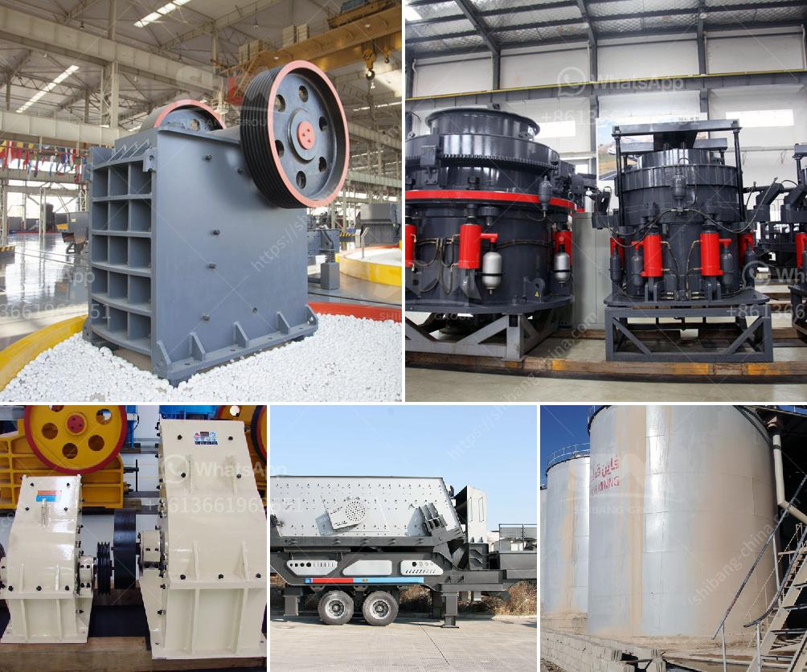

<h3>How to increase productivity in ball mill?</h3>
Ball mill is a kind of grinding equipment widely used in mineral processing. In order to improve the production efficiency of the ball mill and reduce the power consumption of the grinding process, it is necessary to use some effective measures to optimize the operation mode. The content of this article will introduce six tips for increasing the productivity of the ball mill.

1. Change the grindability of the raw ore: The hardness, toughness, dissociation and structural defects of the ore determine the difficulty of grinding. Therefore, when selecting the grinding equipment and grinding process, it is necessary to choose the appropriate ore grinding process according to the characteristics of the ore. Changing the grindability of the raw ore can reduce the difficulty of grinding, improve the productivity of the ball mill, and reduce the power consumption of the grinding process.

2. Optimize the design of the lining plate: The reasonable design of the lining plate not only can increase the volume of the ball mill cylinder, but also can reduce the wear of the lining plate, extend the service life of the lining plate, and reduce the power consumption of the grinding process. Therefore, in order to improve the productivity of the ball mill, the design of the lining plate should be optimized according to the characteristics of the ore and the grinding operation requirements.

3. Improve the grinding media filling rate: The reasonable filling rate of grinding media in the ball mill can not only improve the grinding efficiency, but also increase the production capacity of the ball mill. In order to ensure the effective grinding of the ore, the grinding media should be reasonably graded and its filling rate should be controlled within a reasonable range.

4. Control the grinding concentration: The concentration of grinding can affect the productivity of the ball mill. When the concentration is too high, the slurry viscosity is increased, causing the grinding efficiency to decrease, and the energy consumption is increased. On the contrary, when the concentration is too low, the grinding efficiency is not high. Therefore, in order to improve the productivity of the ball mill, the grinding concentration should be controlled within a reasonable range.

5. Control the grinding time and speed: The grinding time and speed of the ball mill also affect the productivity of the ball mill. If the grinding time is too long or the grinding speed is too slow, it will lead to the insufficient grinding of the ore and the reduction of the productivity of the ball mill. Therefore, in order to increase the productivity of the ball mill, the grinding time and speed should be strictly controlled.

6. Strengthen maintenance and repair: The regular maintenance and repair of the ball mill can not only ensure the normal operation of the equipment, but also effectively extend the service life of the ball mill. Regular inspection and maintenance on the ball mill can prevent the equipment from having serious problems, reduce the downtime of the ball mill, improve the productivity of the ball mill, and reduce the production cost.

In summary, improving the productivity of the ball mill is a common concern for mineral processing plants. By adopting some effective measures, such as optimizing the ore grindability, optimizing the design of the lining plate, controlling the grinding concentration, time and speed, and strengthening maintenance and repair, the productivity of the ball mill can be effectively increased, and the power consumption of the grinding process can be reduced.
<h3>Contact us</h3><ul><li><strong>Whatsapp:&nbsp;<a href="https://wa.me/8613661969651">+8613661969651</a></strong></li><li><a href="https://swt.shibang-china.com/?git&amp;zhl&amp;How to increase productivity in ball mill"><strong>Online Service(chat now)</strong></a></li></ul><h3>Related</h3><ul><li><a href='How to segregate gold ore from copper ore .md'>How to segregate gold ore from copper ore ?</a></li><li><a href='How do you calculate the motor power for a vibrator screen.md'>How do you calculate the motor power for a vibrator screen?</a></li><li><a href='how to produce alternative to river sand ？.md'>how to produce alternative to river sand ？</a></li><li><a href='How to build sand and gravel wash plant.md'>How to build sand and gravel wash plant?</a></li><li><a href='How much crushing power does a gyratory crusher have.md'>How much crushing power does a gyratory crusher have?</a></li></ul>