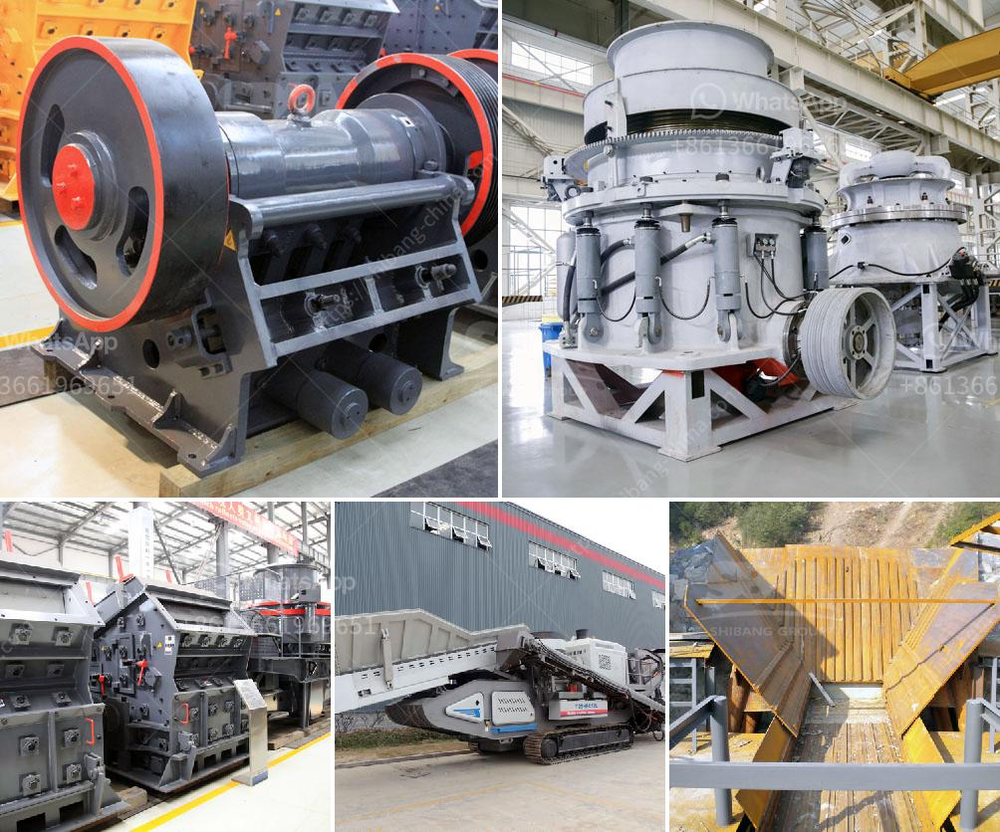

<h3>How to increase productivity of ball mill ?</h3>
Ball mill, a type of grinder, is a cylindrical device used in grinding (or mixing) materials like ores, chemicals, ceramic raw materials, and paints. In recent years, ball mills have become indispensable equipment in the mining industry, due to their ability to grind hard materials under extreme conditions. The importance of ball milling as a crucial process in various industries cannot be understated; increasing its productivity is therefore quite significant. In this article, we will discuss several ways to maximize the productivity of ball mills.

1. Improve grinding efficiency with the use of grinding aids: Adding grinding aids to the ball mill can improve the grinding efficiency by increasing the density of the grinding media inside the mill. The added benefit is that the assistance reduces the wear and tear of the mill, hence increasing its lifespan.

2. Optimize the mill's operational parameters: The key to reaching the desired production goals lies in optimizing the operational parameters of the ball mill. These include the rotation speed, quantity of grinding media, ball size, and grinding time. The optimal conditions can be obtained by conducting experiments and adjusting these parameters accordingly.

3. Regularly clean and maintain the mill: Over time, ball mills can become clogged with residual materials, which can decrease the grinding efficiency. It is essential to regularly clean the ball mill and remove any buildup of material or residue. Additionally, lubricating the gears and bearings of the mill can significantly prolong its service life and prevent unexpected breakdowns.

4. Use high-quality grinding media: The quality of the grinding media used significantly affects the efficiency of ball milling. High-quality grinding balls/grinding media not only improve grinding efficiency but also minimize the wear and tear of the mill, reducing operational costs. Selecting proper grinding media also helps avoid contamination of the final product with impurities from the grinding media.

5. Conduct regular inspections and adjust accordingly: It is essential to monitor the performance of the ball mill regularly. Conducting regular inspections allows you to identify any issues or inefficiencies that might be affecting productivity. By addressing these problems promptly, you can optimize the mill's performance and maximize its output.

6. Implement a process control system: Installing a process control system allows for real-time monitoring and feedback of various parameters affecting the ball mill's operation. This enables operators to make immediate adjustments and optimizations, thus ensuring optimal productivity.

In conclusion, increasing the productivity of a ball mill is crucial for operating a successful mining operation. Implementing the above-mentioned strategies will help maximize the efficiency and output of the mill, leading to increased profits and a reduced environmental impact. As with any industrial equipment, regular maintenance and monitoring are essential for the long-term performance and reliability of the ball mill.
<h3>Contact us</h3><ul><li><strong>Whatsapp:&nbsp;<a href="https://wa.me/8613661969651">+8613661969651</a></strong></li><li><a href="https://swt.shibang-china.com/?git&amp;zhl&amp;How to increase productivity of ball mill "><strong>Online Service(chat now)</strong></a></li></ul><h3>Related</h3><ul><li><a href='How can we solve the problem of the crusher bearing heating.md'>How can we solve the problem of the crusher bearing heating?</a></li><li><a href='how jaw crusher working .md'>how jaw crusher working ?</a></li><li><a href='How to install a sand making machine.md'>How to install a sand making machine?</a></li><li><a href='How to Artificially Make Concrete Sand？.md'>How to Artificially Make Concrete Sand？</a></li><li><a href='How to crush concrete for recycling .md'>How to crush concrete for recycling ?</a></li></ul>