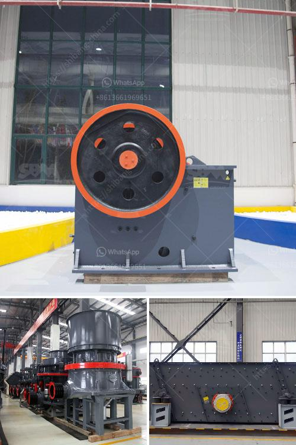

<h3>How to increase the capacity of ball mill ?</h3>
Ball mill is a key equipment for grinding materials, widely used in powder-making production line such as cement, silicate sand, new-type building material, refractory material, fertilizer, ore dressing of ferrous metal and non-ferrous metal, glass ceramics, etc. Ball mill can grind various ores and materials with dry type or wet type. 

1. Increase the rotating speed of the ball mill. As the rotational speed of the ball mill increases, the grinding capacity increases. The rotational speed should be at an optimum speed, which means it has to be neither too slow nor too fast.

2. Increase the grinding medium loading. When adding the grinding medium to the ball mill, we need to consider both the size of the grinding medium and the quantity. The proportion of the volume of the grinding medium to the working volume of the ball mill is called the filling rate, and its size is determined by the nature of the grinding material and the requirements for the grinding product.

3. Improve the grinding efficiency. The grinding efficiency is determined by the size and shape of the grinding media, the speed of rotation of the mill, the ratio of the size of the grinding media to the particles to be ground, etc. It is necessary to ensure a reasonable proportion of various grinding media, and to choose the appropriate grinding media according to the nature of the material to be ground.

4. Optimize the grinding system. Using a professional grading machine can greatly improve the grinding efficiency, and it is also conducive to the grading and backflow of the grinding medium in the mill, so that the grinding medium can fully grind the material, which can effectively reduce the over-grinding and improve the grinding efficiency.

5. Reduce the feeding particle size. By reducing the particle size of the material, the grinding efficiency can be improved. However, this method needs to be combined with other measures to ensure the balance between the grinding efficiency and the output of the ball mill.

6. Control the grindability index of the material. The grindability index reflects the hardness of the material to be ground. By controlling the grindability index, the grinding efficiency and output of the ball mill can be improved. The main factors affecting the grindability index are the composition of the material, the physical properties of the material, and the grinding process.

In conclusion, the capacity of ball mill can be effectively increased through several factors, including increasing the rotating speed of the ball mill, increasing the grinding medium loading, improving the grinding efficiency, optimizing the grinding system, reducing the feeding particle size, and controlling the grindability index of the material. These measures can effectively improve the grinding efficiency and output of the ball mill, and achieve the goal of increasing the capacity of the ball mill.
<h3>Contact us</h3><ul><li><strong>Whatsapp:&nbsp;<a href="https://wa.me/8613661969651">+8613661969651</a></strong></li><li><a href="https://swt.shibang-china.com/?git&amp;zhl&amp;How to increase the capacity of ball mill "><strong>Online Service(chat now)</strong></a></li></ul><h3>Related</h3><ul><li><a href='How to install a conveyor belt for the coal mill.md'>How to install a conveyor belt for the coal mill?</a></li><li><a href='How to set up artificial sand plant.md'>How to set up artificial sand plant?</a></li><li><a href='how to give a seminar on jaw crusher .md'>how to give a seminar on jaw crusher ?</a></li><li><a href='How to Build a Sand Washing Plant in Indonesia ？.md'>How to Build a Sand Washing Plant in Indonesia ？</a></li><li><a href='How to adjust the discharge port of stone cone crusher ？.md'>How to adjust the discharge port of stone cone crusher ？</a></li></ul>