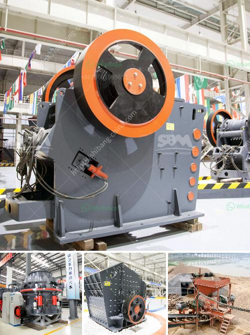

<h3>How to increase the output of ball mill?</h3>
Ball mill is a crucial equipment in the mining industry. It is utilized to grind materials and make them useful for various processes. To achieve that, manufacturers constantly strive to produce ball mills with high efficiency to evenly grind materials into the required sizes. However, increasing the output of a ball mill is not an easy task but it is not impossible either.

1. Add grinding aids: Grinding aids are materials that improve grinding efficiency. Grinding aids are increasingly used in ball mills to act as lubricants, reduce energy consumption, and improve fineness of the materials being ground. They also minimize grinding media coating and reduce ball wear. In general, grinding aids are added in a concentration of 0.01%-0.03% based on the weight of the cement. However, make sure to consult with the manufacturer for specific guidelines on dosage and compatibility.

2. Optimize mill speed: Optimizing the rotational speed of the ball mill is essential to ensure effective grinding. The optimal speed varies depending on the grinding media, the size of the material being ground, and the desired fineness. Increasing the mill speed can enhance grinding, but it should not exceed the critical speed of the mill, which is typically around 75% of the critical speed.

3. Improve grinding media: The quality and size of the grinding media play a vital role in the efficiency of the ball mill. High-quality grinding balls with uniform size and shape provide better grinding performance and reduce energy consumption. Additionally, regularly inspect and replace worn-out grinding media to maintain optimal performance.

4. Optimize mill liner design: The mill liner is crucial in maximizing grinding efficiency and protecting the mill shell from wear and tear. A well-designed liner not only enhances the grinding performance but also improves the overall mill output. Consider using rubber liners, which have been proven to increase mill productivity and reduce noise levels.

5. Control feed size and composition: The size and composition of the feed material significantly affect the efficiency of the ball mill. Ensure a consistent and appropriate feed size distribution, and avoid overly fine or coarse particles. Additionally, the feed composition should be optimized to maintain the desired chemical and physical properties.

6. Conduct regular mill maintenance: Regular maintenance is essential to ensure optimal performance and prevent unexpected downtime. Regularly inspect mechanical components, lubricate bearings, and clean the mill from buildup. Implement a preventive maintenance program to address potential issues before they become critical.

In conclusion, increasing the output of a ball mill requires careful consideration and implementation of various strategies. By adding grinding aids, optimizing mill speed, improving grinding media, optimizing mill liner design, controlling feed size and composition, and conducting regular maintenance, manufacturers can enhance the productivity and efficiency of their ball mills, ultimately leading to improved output. Remember to consult with experts and follow the manufacturer's recommendations for best results.
<h3>Contact us</h3><ul><li><strong>Whatsapp:&nbsp;<a href="https://wa.me/8613661969651">+8613661969651</a></strong></li><li><a href="https://swt.shibang-china.com/?git&amp;zhl&amp;How to increase the output of ball mill"><strong>Online Service(chat now)</strong></a></li></ul><h3>Related</h3><ul><li><a href='How to eliminate jaw crusher problems during its operation.md'>How to eliminate jaw crusher problems during its operation?</a></li><li><a href='How mobile crushing plant can realize the recycling of construction waste .md'>How mobile crushing plant can realize the recycling of construction waste ?</a></li><li><a href='how to run a quarry business ？.md'>how to run a quarry business ？</a></li><li><a href='How to install a sand making machine.md'>How to install a sand making machine?</a></li><li><a href='How to Operate a Portable Cone Crusher.md'>How to Operate a Portable Cone Crusher?</a></li></ul>