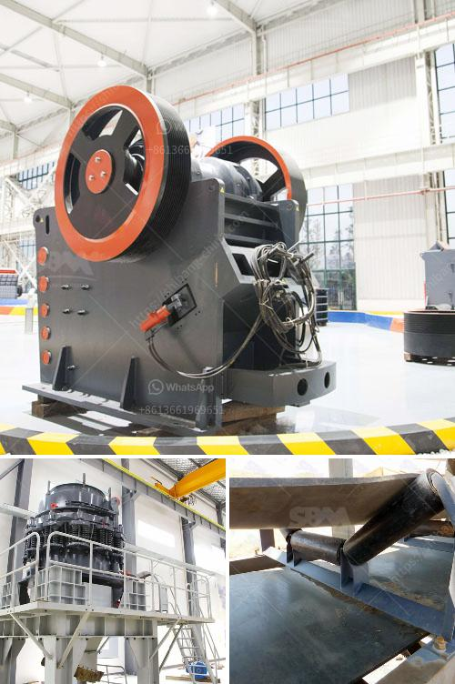

<h3>How to increase the output of jaw crusher ?</h3>
Jaw crusher is widely used in mining, building materials, metallurgy, electric power, water conservancy, transportation and many other industries, with the advantages of large crushing ratio, simple structure, reliable performance, and convenient maintenance. However, the output of jaw crusher is not as high as expected. In order to improve the production efficiency, this article will share some tips with you.

Choosing the right jaw crusher model is directly related to the production capacity. Generally speaking, the higher the production capacity requirements, the larger the equipment model. For example, if the production requirements are about 300-500 tons per hour, you should choose a large jaw crusher, such as PE-1200×1500 and PE-1500×1800. Thus, it is necessary to determine the production capacity before selecting the jaw crusher model.

The jaw crusher consists of main components, including the frame, eccentric shaft, flywheel, jaw plate, toggle plate, toggle seat, tension rod, and so on. Choosing the appropriate parts can significantly improve the working efficiency of the jaw crusher. For example, the selection of jaw plate and toggle plate should ensure the appropriate nip angle, which can not only improve the crushing efficiency but also prolong the service life of the jaw plate.

Jaw crusher has two sets of thrust plates. The lower one is fixed, while the upper one can be adjusted to control the discharge size. When the discharge size needs to be adjusted, you can adjust the upper thrust plate. In addition, by adjusting the eccentric shaft speed, you can change the size of the material entering the crushing chamber, thereby controlling the output size.

Proper operation plays a crucial role in improving the output of jaw crusher. It is necessary to operate in strict accordance with the instructions, pay attention to the regular maintenance, and replace the worn parts in time. Regular lubrication is vital for the jaw crusher. Proper lubrication not only reduces the friction between the parts but also ensures the smooth operation of the equipment, thereby improving the production efficiency.

The feeding capacity directly affects the production efficiency of jaw crusher. If the feeding capacity is too low, the crusher will not be able to process a large amount of materials, resulting in low output. Therefore, it is essential to ensure that the feeding capacity meets the production requirements. In addition, it is recommended to use a feeder to evenly distribute the materials to the crushing equipment, thereby improving the feeding efficiency.

In conclusion, increasing the output of jaw crusher requires a comprehensive approach, including selecting the appropriate model, optimizing the structure, fine-tuning the parameters, proper operation and regular maintenance, and increasing the feeding capacity. By implementing these measures, you can effectively improve the production efficiency of jaw crusher and enhance the overall crushing performance.
<h3>Contact us</h3><ul><li><strong>Whatsapp:&nbsp;<a href="https://wa.me/8613661969651">+8613661969651</a></strong></li><li><a href="https://swt.shibang-china.com/?git&amp;zhl&amp;How to increase the output of jaw crusher "><strong>Online Service(chat now)</strong></a></li></ul><h3>Related</h3><ul><li><a href='How is the cone crusher working.md'>How is the cone crusher working?</a></li><li><a href='How to process tantalite mineral.md'>How to process tantalite mineral?</a></li><li><a href='How to start a sand and gravel business.md'>How to start a sand and gravel business?</a></li><li><a href='How to adjust the eccentric spindle of a cone crusher.md'>How to adjust the eccentric spindle of a cone crusher?</a></li><li><a href='how to set up stone crusher unit ？.md'>how to set up stone crusher unit ？</a></li></ul>