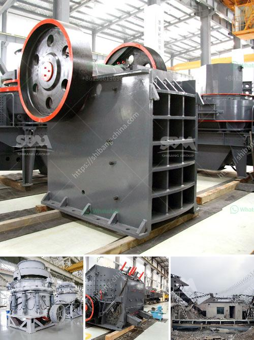

<h3>How to increase the output of jaw crusher ？</h3>
Jaw crusher is a widely used crushing equipment in the mining industry. It is characterized by simple structure, reliable performance, and easy maintenance. However, in the production process, we often encounter the phenomenon of low output and poor stability. In order to improve the productivity of the jaw crusher, we need to optimize the design, adjust the feeding mode, and find ways to prevent the blocking of the discharge port. This article will provide some practical suggestions for increasing the output of jaw crusher.

Firstly, the optimization of the design is crucial. The jaw crusher consists of a fixed jaw plate and a movable jaw plate. When the two jaw plates are in contact with each other, the material is crushed by the extrusion and bending of the jaw plates. To ensure the uniformity and stability of the crushing process, it is necessary to choose a suitable angle between the two jaw plates. Generally, a small angle is conducive to the crushing of hard materials, while a large angle is suitable for the crushing of soft materials. Therefore, operators should adjust the angle of the jaw crusher according to the nature of the materials, so as to improve the crushing efficiency.

Secondly, the feeding mode should be adjusted. The uniformity and continuity of the feeding have a significant impact on the output of the jaw crusher. If the materials are fed unevenly or intermittently, the crushing process will be interrupted, resulting in low output. Therefore, it is necessary to ensure a stable and continuous feeding. In addition, the size of the materials should be appropriate. If the size of the materials is too large, it will easily block the crushing cavity, which will also reduce the output. On the contrary, if the size of the materials is too small, the productivity will be affected. Therefore, operators should adjust the feeding size according to the characteristics of the materials, so as to achieve the best crushing effect.

Finally, it is important to prevent the blocking of the discharge port. When the jaw crusher works, the crushed materials are discharged from the lower part of the crushing cavity. If the discharge port is blocked, the materials cannot be discharged in time, which will affect the normal operation and decrease the output. To prevent the blocking of the discharge port, operators should regularly check the wear of the jaw plates and replace them in time if necessary. In addition, a suitable discharge port should be selected according to the size of the finished products. If the discharge port is too small, it will cause excessive crushing, leading to waste of energy and decreased output. Therefore, it is important to adjust the discharge port to an appropriate size.

In conclusion, increasing the output of jaw crusher requires optimizing the design, adjusting the feeding mode, and preventing the blocking of the discharge port. By doing so, the productivity and stability of the jaw crusher can be significantly improved. Operators should pay attention to the above aspects and make corresponding adjustments according to the actual situation, so as to achieve the best crushing effect and maximize the economic benefits.
<h3>Contact us</h3><ul><li><strong>Whatsapp:&nbsp;<a href="https://wa.me/8613661969651">+8613661969651</a></strong></li><li><a href="https://swt.shibang-china.com/?git&amp;zhl&amp;How to increase the output of jaw crusher ？"><strong>Online Service(chat now)</strong></a></li></ul><h3>Related</h3><ul><li><a href='How to turn off crushing and screening plant.md'>How to turn off crushing and screening plant?</a></li><li><a href='How can I get more production out of my impact crusher.md'>How can I get more production out of my impact crusher?</a></li><li><a href='How to improve the output of stone crusher .md'>How to improve the output of stone crusher ?</a></li><li><a href='How to Install a crusher equipment ？.md'>How to Install a crusher equipment ？</a></li><li><a href='how to produce alternative to river sand ？.md'>how to produce alternative to river sand ？</a></li></ul>