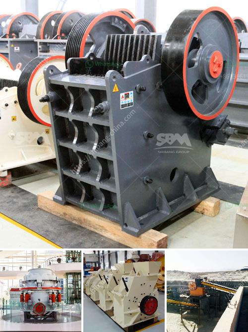

<h3>How to increase the production capacity of stone grinding machine ？</h3>
Stone grinding machines are widely used in mining, metallurgy, building materials, and other industries. With the continuous development of the economy, the demand for ore materials is increasing, and the market demand for stone grinding machines is also expanding. However, some businesses may face the problem of low production capacity when using stone grinding machines. In this article, we will explore some effective ways to increase the production capacity of stone grinding machines.

1. Regular maintenance and lubrication: Regular maintenance and lubrication are essential to ensure the normal operation and high efficiency of stone grinding machines. Conduct routine inspections on all parts of the machine, check for wear and tear, and replace damaged parts promptly. In addition, proper lubrication should be carried out to reduce friction between components and improve overall operation efficiency.

2. Optimize the grinding process: The grinding process can be optimized by adjusting the grinding parameters, such as the rotation speed, pressure, and loading capacity. Find the most suitable combination for the specific material being processed to achieve the best grinding effect and increase the production capacity.

3. Enhance equipment stability: Ensuring equipment stability is key to increasing production capacity. Install shock absorbers or vibration-proof rubber pads to reduce the impact and vibration generated during operation. This can not only reduce the damage to the machine, but also improve stability and efficiency.

4. Increase power supply and improve power utilization: Insufficient power supply is often a limiting factor for stone grinding machine production capacity. Check if the power supply meets the requirements of the equipment. If necessary, upgrade the power supply system or use additional power sources. Additionally, optimize power utilization by ensuring that all energy generated is efficiently utilized.

5. Upgrade grinding media: The quality and type of grinding media used significantly affect the grinding efficiency and production capacity of stone grinding machines. Choose high-quality, durable grinding media that is suitable for the specific material being processed. Upgrading grinding media can improve grinding efficiency and increase production capacity.

6. Automate the operation process: Manual operation has limitations and may affect production capacity. Consider automating certain processes of the stone grinding machine, such as feeding, grinding, and discharging, to reduce human errors and increase production efficiency.

7. Increase the number of grinding machines: If the demand for stone grinding exceeds the capacity of a single machine, consider increasing the number of machines. This can effectively increase overall production capacity and meet market demand.

In conclusion, increasing the production capacity of stone grinding machines requires a combination of optimizing the grinding process, enhancing equipment stability, and implementing other strategies such as regular maintenance, upgrading grinding media, and automation. By implementing these measures, businesses can effectively increase production capacity, improve efficiency, and meet the growing market demand.
<h3>Contact us</h3><ul><li><strong>Whatsapp:&nbsp;<a href="https://wa.me/8613661969651">+8613661969651</a></strong></li><li><a href="https://swt.shibang-china.com/?git&amp;zhl&amp;How to increase the production capacity of stone grinding machine ？"><strong>Online Service(chat now)</strong></a></li></ul><h3>Related</h3><ul><li><a href='How to operate ball mills.md'>How to operate ball mills?</a></li><li><a href='How to build a small limestone mill production line？.md'>How to build a small limestone mill production line？</a></li><li><a href='How to extract iron ore flow chart.md'>How to extract iron ore flow chart?</a></li><li><a href='How do I adjust a conetype crusher.md'>How do I adjust a cone-type crusher?</a></li><li><a href='how to start a mini cement mill ？.md'>how to start a mini cement mill ？</a></li></ul>