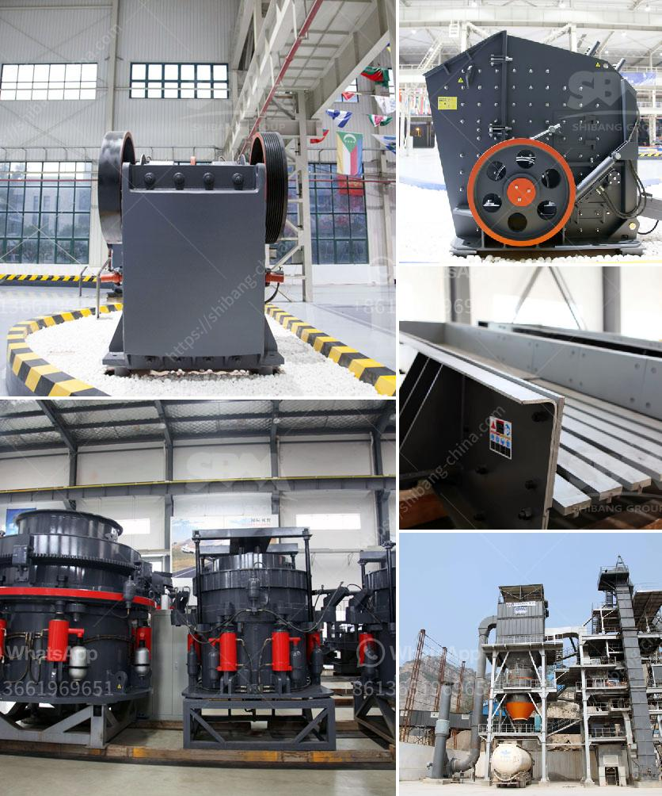

<h3>How to increase the productivity of the cone crusher ？</h3>
The cone crusher has become a vital piece of equipment in many mining and construction industries due to its ability to crush materials efficiently. However, a poorly operating cone crusher can lead to lower productivity levels, which can ultimately affect the overall efficiency and profitability of an operation. Therefore, it is crucial to understand how to maximize the productivity of the cone crusher. Here are some key factors to consider:

One of the primary reasons for low cone crusher productivity is the lack of proper training. Operators should be trained on the correct operation and maintenance of the cone crusher to ensure optimal performance. They should understand the necessary safety precautions and be aware of any potential hazards. Regular refresher training sessions should also be conducted to keep operators updated on the latest techniques and best practices.

Regular inspection and maintenance of the cone crusher are essential to maintain its performance and prevent unexpected breakdowns. Operators should regularly inspect the cone crusher for any signs of wear, damage, or loose components. It is crucial to have a comprehensive maintenance plan in place, including lubrication schedules, parts replacement, and cleaning procedures. Any necessary repairs should be promptly addressed to prevent further damage.

The feed size has a significant impact on the productivity of the cone crusher. A proper feed size ensures efficient crushing and minimizes the chances of clogging or choking the crusher. Operators should analyze the material properties and adjust the feed size accordingly. It is recommended to consult with the equipment manufacturer or a technical expert to determine the optimum feed size for the specific cone crusher model.

Maintaining a consistent feed rate is crucial for maximizing the productivity of the cone crusher. A fluctuating feed rate can cause unnecessary stress on the crusher and decrease its efficiency. Operators should monitor the feed rate regularly and make adjustments if necessary. Installing a feed-hopper with a controlled feed rate or using a conveyor belt to regulate the material flow can help maintain a consistent feed rate.

Automation and remote monitoring technologies can significantly improve the productivity of cone crushers. Advanced automation systems can optimize crusher performance by continuously adjusting settings based on real-time data. This helps to ensure consistent and efficient crushing at all times. Remote monitoring allows operators to access crucial crusher data remotely and make necessary adjustments or troubleshoot any issues promptly.

Increasing the productivity of the cone crusher is crucial for achieving efficient and profitable operations. Proper operator training, regular inspection and maintenance, optimizing the feed size, maintaining a consistent feed rate, and implementing automation and remote monitoring are key factors in maximizing cone crusher productivity. By following these guidelines, operators can enhance the performance of their cone crushers and ultimately improve overall productivity levels.
<h3>Contact us</h3><ul><li><strong>Whatsapp:&nbsp;<a href="https://wa.me/8613661969651">+8613661969651</a></strong></li><li><a href="https://swt.shibang-china.com/?git&amp;zhl&amp;How to increase the productivity of the cone crusher ？"><strong>Online Service(chat now)</strong></a></li></ul><h3>Related</h3><ul><li><a href='How to produce dolomite using a roller mill.md'>How to produce dolomite using a roller mill?</a></li><li><a href='How to improve the output of stone crushing plant .md'>How to improve the output of stone crushing plant ?</a></li><li><a href='How to build a small cement plant ？.md'>How to build a small cement plant ？</a></li><li><a href='How can we improve cement mill production.md'>How can we improve cement mill production?</a></li><li><a href='How to enter into a business of stone crusher plant in Malaysia .md'>How to enter into a business of stone crusher plant in Malaysia ?</a></li></ul>