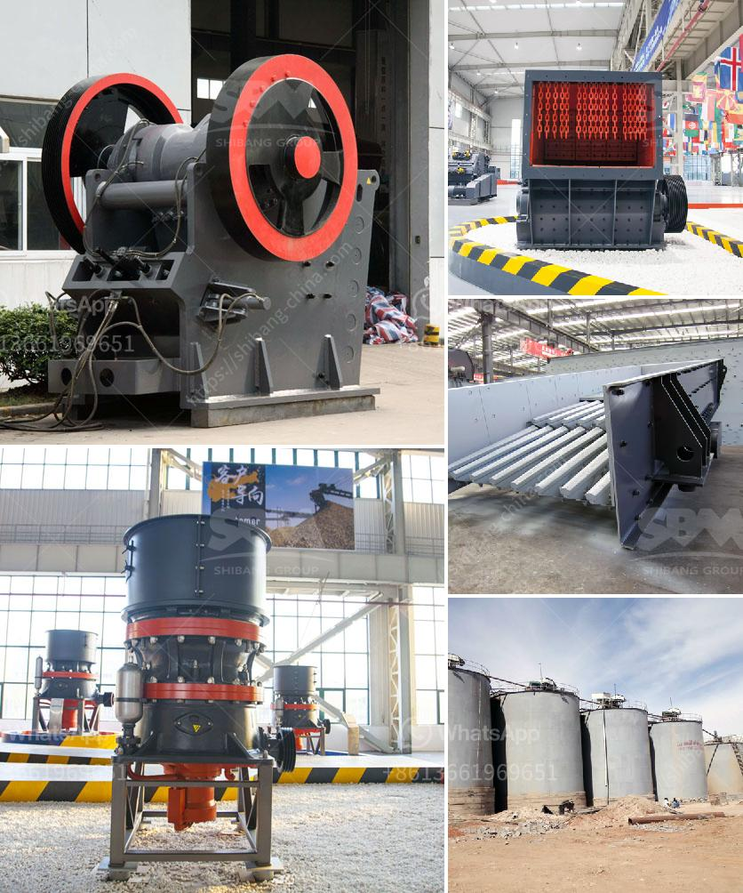

<h3>How to install a cone crusher?</h3>
Installing a cone crusher can be a challenge due to the size and weight of the machine. It requires careful planning and coordination with the ground and support equipment. In order to ensure a successful installation, there are several key steps that should be followed.

Firstly, choose the appropriate location for the installation. The floor space should be spacious enough to allow for easy movement and maintenance of the cone crusher. It is important to consider the surrounding environment, such as ventilation and accessibility for operators. Additionally, ensure that there is proper clearance for all the components of the cone crusher.

Next, prepare the foundation for the crusher. The foundation should be stable and able to support the weight of the crusher and its components. It is recommended to consult with a civil engineer to determine the appropriate foundation design for the specific site conditions. The foundation should be poured and cured before proceeding with the installation.

Once the foundation is ready, the next step is to set up the crusher frame. This involves aligning the frame with the foundation and leveling it using shims or other leveling devices. It is crucial to ensure that the frame is level and perpendicular to the ground to prevent any structural issues or misalignments later on.

After the frame is set up, attach the crusher components. This includes installing the main shaft, bowl liner, mantle, spider arm assembly, and other essential parts. It is important to follow the manufacturer's instructions and use the recommended tools and techniques to securely fasten the components. This will ensure proper operation and prevent any unnecessary wear or damage.

The next step is to connect the crusher to the power source. This involves wiring the crusher's electrical components, such as the motor, control panel, and sensors. It is important to carefully follow the electrical diagrams provided by the manufacturer to ensure correct wiring and avoid any electrical hazards. Additionally, it is crucial to check the voltage and amperage requirements to ensure that the power source meets the crusher's specifications.

Once the electrical connections are completed, the final step is to test the crusher's functionality. This involves starting the crusher and checking for any abnormal noises or vibrations. It is important to observe the crusher's operation and perform any necessary adjustments or fine-tuning. Additionally, it is recommended to regularly inspect and maintain the cone crusher to ensure optimal performance and prevent any potential issues.

In conclusion, installing a cone crusher requires careful planning and coordination. It is important to choose the appropriate location, prepare a stable foundation, and follow the manufacturer's instructions for the installation process. By following these steps and performing regular maintenance, the cone crusher will provide reliable and efficient crushing capabilities for many years to come.
<h3>Contact us</h3><ul><li><strong>Whatsapp:&nbsp;<a href="https://wa.me/8613661969651">+8613661969651</a></strong></li><li><a href="https://swt.shibang-china.com/?git&amp;zhl&amp;How to install a cone crusher"><strong>Online Service(chat now)</strong></a></li></ul><h3>Related</h3><ul><li><a href='How to build a ball mill.md'>How to build a ball mill?</a></li><li><a href='How to maintain vertical raw mill in cement plant.md'>How to maintain vertical raw mill in cement plant?</a></li><li><a href='How to install a stone crusher plant.md'>How to install a stone crusher plant?</a></li><li><a href='How to separate coal from iron ore .md'>How to separate coal from iron ore ?</a></li><li><a href='How to adjust the discharge opening of a spring cone crusher.md'>How to adjust the discharge opening of a spring cone crusher?</a></li></ul>