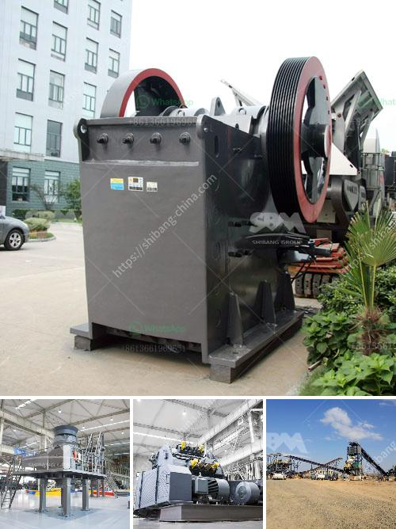

<h3>How to install a conveyor belt down a crusher?</h3>
Installing a conveyor belt down a crusher may seem like a daunting task, but it is actually a fairly simple process. Here are some steps to follow:

1. Determine the desired position of the conveyor belt. The conveyor should be positioned to carry the material from the crusher to the stockpile or to the next stage in the processing plant.

2. Measure the distance between the crusher and the stockpile or processing plant. This will determine the length of the conveyor belt needed.

3. Select the appropriate conveyor belt. Consider factors such as the weight and type of material being conveyed, the speed of the conveyor, and any special requirements for the specific application.

4. Assemble the necessary equipment and tools for the installation. This may include a crane or forklift to lift the conveyor belt into place, wrenches or screwdrivers for tightening bolts, and safety equipment such as gloves and safety glasses.

5. Prepare the crusher and surrounding area for the installation. Ensure that the crusher is turned off and that all safety protocols are followed. Clear any debris or obstacles that may interfere with the installation process.

6. Position the conveyor belt near the crusher, ensuring it is aligned with the crusher and any existing conveyors. If necessary, use a measuring tape or laser level to ensure accurate alignment.

7. Lift the conveyor belt into place, using the crane or forklift. Depending on the size and weight of the conveyor belt, multiple people may be needed to assist with this step. Carefully lower the conveyor belt onto the rollers or pulleys, ensuring it is centered and straight.

8. Secure the conveyor belt in place. Use bolts or screws to attach the conveyor belt to any supports or mounts provided by the crusher or surrounding structures. Tighten the bolts or screws using the appropriate tools.

9. Test the conveyor belt to ensure it is functioning properly. Turn on the crusher and conveyor belt, and observe the movement of the material being conveyed. Check for any slipping or misalignment of the belt, as well as any unusual noises or vibrations.

10. Once the conveyor belt is properly installed and tested, perform regular maintenance and inspections to ensure its continued safe and efficient operation. Follow the manufacturer's guidelines for maintenance, including lubrication, belt tensioning, and cleaning.

In conclusion, installing a conveyor belt down a crusher can be a straightforward process if the steps above are followed carefully. Remember to prioritize safety at all times and consult the manufacturer's guidelines for any specific requirements. By taking the necessary precautions and ensuring proper alignment and fastening, you can ensure a smooth and efficient conveyor system for your crusher.
<h3>Contact us</h3><ul><li><strong>Whatsapp:&nbsp;<a href="https://wa.me/8613661969651">+8613661969651</a></strong></li><li><a href="https://swt.shibang-china.com/?git&amp;zhl&amp;How to install a conveyor belt down a crusher"><strong>Online Service(chat now)</strong></a></li></ul><h3>Related</h3><ul><li><a href='how to cal belt conveyor length for stone crusher ？.md'>how to cal belt conveyor length for stone crusher ？</a></li><li><a href='How can I get more production out of my impact crusher.md'>How can I get more production out of my impact crusher?</a></li><li><a href='how to give a seminar on jaw crusher .md'>how to give a seminar on jaw crusher ?</a></li><li><a href='How to turn off crushing and screening plant.md'>How to turn off crushing and screening plant?</a></li><li><a href='How to build a small rock crusher.md'>How to build a small rock crusher?</a></li></ul>