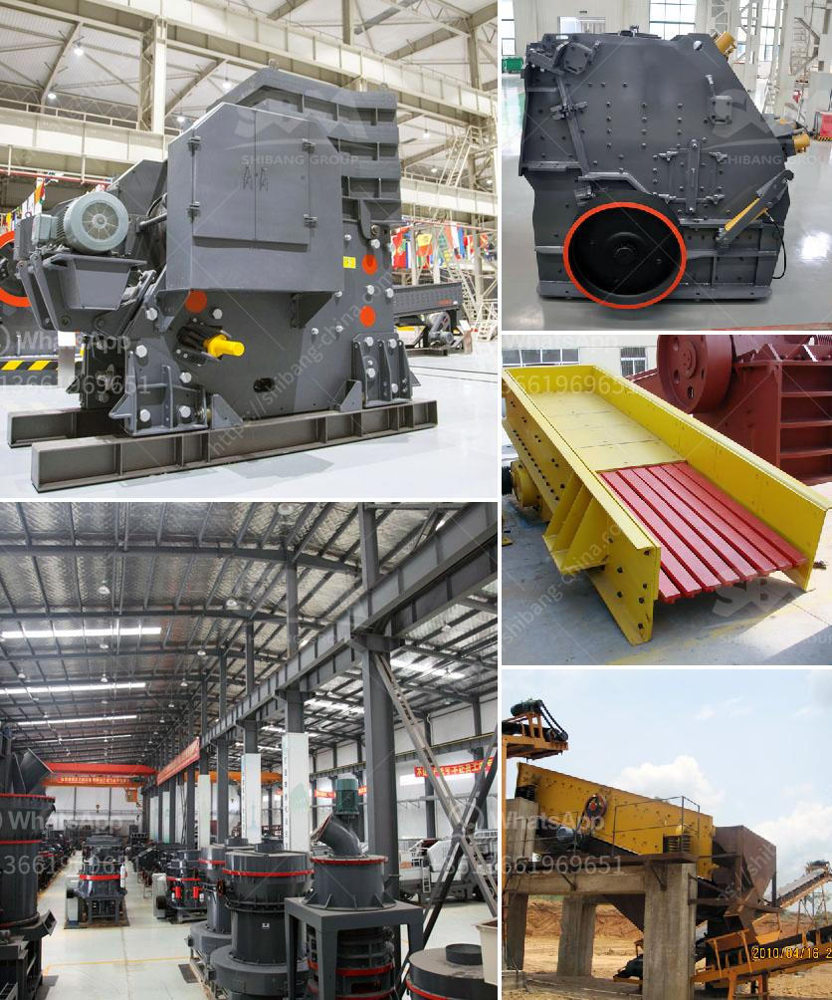

<h3>How to install a conveyor belt for the coal mill?</h3>
Installing a conveyor belt is a tedious process that requires meticulous planning and painstaking precision. The coal mill is one of the most crucial equipment in the coal-fired power generation process. Unfortunately, it is often left to the end of the installation process. This article outlines the steps involved in installing a conveyor belt for the coal mill.

The first step in installing a conveyor belt for the coal mill is to determine the proper installation location. This is important because the conveyor belt needs to run smoothly without any obstructions or interference. Additionally, the installation location needs to be easily accessible for maintenance purposes.

Once the installation location is determined, it is time to prepare the area. Start by removing any existing equipment or obstacles that may interfere with the installation process. Clean the area thoroughly to ensure there is no debris or dust that could affect the functioning of the conveyor belt.

Before starting the installation, ensure that all the necessary equipment and tools are readily available. This includes the conveyor belt itself, along with any mounting brackets, rollers, and tensioning devices. It is essential to have all the equipment on hand to avoid any unnecessary delay during the installation process.

The next step involves mounting the support structure for the conveyor belt. This structure ensures that the conveyor belt remains stable and properly aligned during operation. Carefully follow the manufacturer's instructions to ensure proper installation of the support structure. It is crucial to double-check the alignment and levelness of the structure to guarantee smooth operation of the conveyor belt.

Once the support structure is properly mounted, it is time to install the conveyor belt itself. Start by feeding one end of the conveyor belt into the coal mill, ensuring that the path aligns with any existing equipment or obstacles. Carefully maneuver the conveyor belt, avoiding any unnecessary stretching or bending.

To ensure the optimal functioning of the conveyor belt, it is crucial to properly tension it. This step involves adjusting the tensioning device to achieve the desired tension. It is essential to follow the manufacturer's recommendations to determine the correct tensioning load and procedure.

After the installation, conduct a thorough test of the conveyor belt to ensure that it is working as expected. Start by slowly running the conveyor belt without any load to verify its alignment and smooth operation. Gradually increase the load to ensure that the conveyor belt can handle the intended capacity without any issues.

In conclusion, installing a conveyor belt for the coal mill requires careful planning, precise execution, and adherence to manufacturer's guidelines. By following the outlined steps, one can ensure a smooth and efficient installation process. Remember, safety should always be the top priority when working with heavy machinery like conveyor belts.
<h3>Contact us</h3><ul><li><strong>Whatsapp:&nbsp;<a href="https://wa.me/8613661969651">+8613661969651</a></strong></li><li><a href="https://swt.shibang-china.com/?git&amp;zhl&amp;How to install a conveyor belt for the coal mill"><strong>Online Service(chat now)</strong></a></li></ul><h3>Related</h3><ul><li><a href='How the mechanism sand is produced .md'>How the mechanism sand is produced ?</a></li><li><a href='How to crush the California sandstone .md'>How to crush the California sandstone ?</a></li><li><a href='How to manage a quarry plant 10 suggestions.md'>How to manage a quarry plant? 10 suggestions</a></li><li><a href='how to size a limestone screen？.md'>how to size a limestone screen？</a></li><li><a href='how to calculate tons per hour ball mill machine .md'>how to calculate tons per hour ball mill machine ?</a></li></ul>