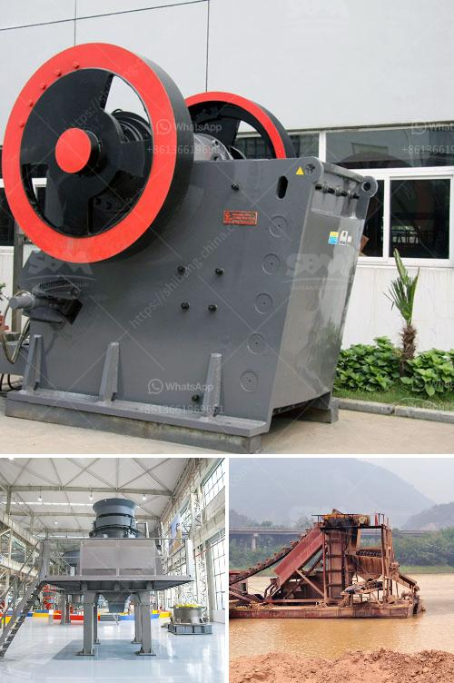

<h3>How to install a conveyor belt?</h3>
A conveyor belt is an essential piece of equipment in various industries. It is used to transport products or materials across different locations within a facility. The installation process of a conveyor belt can be complex, but with the right guidance, it can be completed efficiently and safely. In this article, we will provide a step-by-step guide on how to install a conveyor belt.

Before starting the installation process, it is crucial to collect all the required tools and equipment. Some of the items you may need include a wrench, pliers, screwdriver, measuring tape, and a level. Additionally, ensure that you have the correct conveyor belt and any accompanying components, such as idlers and rollers, ready for installation.

Clear the area where the conveyor belt will be installed. Remove any obstructions or debris that could interfere with the installation process. It is essential to have a clean, level pathway to ensure proper alignment and functioning of the conveyor belt.

Carefully unroll the conveyor belt, ensuring that it does not get damaged during the process. Inspect the belt for any defects or imperfections that may affect its performance. If you notice any issues, contact the supplier or manufacturer for further instructions.

The next step in the installation process is mounting the rollers and idlers. These components provide support and guidance to the conveyor belt. Ensure that the rollers and idlers are aligned properly and securely attached to their respective positions.

Lay the conveyor belt on the rollers and idlers, ensuring that it is centered and aligned with the pathway. Gradually unroll the belt along its length, adjusting the tension as needed. The tension should be tight enough to prevent slippage but not so tight as to strain the belt.

Depending on the type of conveyor belt, you may need to connect and adjust the drive system. This typically involves attaching the motor or drive unit and adjusting the tension or speed settings. Follow the manufacturer's instructions for your specific conveyor belt model.

After installation, it is crucial to test the conveyor belt before putting it into full operation. Start the motor or drive unit and observe the belt's movement. Check for any irregularities, noise, or slipping. Make any necessary adjustments to ensure smooth and efficient functioning of the conveyor belt.

Once the conveyor belt is installed and operational, it is essential to establish a regular maintenance schedule. Inspect the belt, rollers, and idlers regularly for wear and tear, perform necessary repairs or replacements, and keep the entire system clean to prevent debris buildup. Regular maintenance will help extend the lifespan and efficiency of your conveyor belt.

In conclusion, installing a conveyor belt requires careful planning, proper tools, and attention to detail. By following these steps, you can ensure a successful and efficient installation process. Remember to consult the manufacturer's instructions and adhere to safety guidelines to promote a safe working environment.
<h3>Contact us</h3><ul><li><strong>Whatsapp:&nbsp;<a href="https://wa.me/8613661969651">+8613661969651</a></strong></li><li><a href="https://swt.shibang-china.com/?git&amp;zhl&amp;How to install a conveyor belt"><strong>Online Service(chat now)</strong></a></li></ul><h3>Related</h3><ul><li><a href='How to crush coal in power plant.md'>How to crush coal in power plant?</a></li><li><a href='how much power does a 50 tph crusher need ？.md'>how much power does a 50 tph crusher need ？</a></li><li><a href='How to design a belt feed bin .md'>How to design a belt feed bin ?</a></li><li><a href='How to build a coal washing plant.md'>How to build a coal washing plant?</a></li><li><a href='How to adjust rotary kiln support rollers.md'>How to adjust rotary kiln support rollers?</a></li></ul>