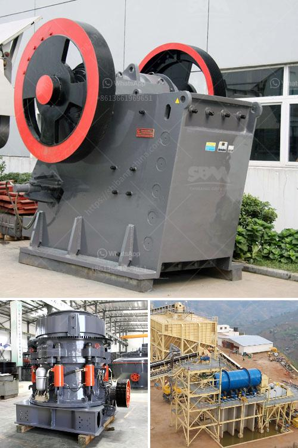

<h3>How to install a crusher for quarry operation?</h3>
A crusher is a machine used to break stones into smaller pieces. It is commonly used in the mining industry for the crushing of rocks into gravel, sand, and aggregates for different purposes. If you're looking to install a crusher for your quarry operation, this article provides step-by-step instructions on how to do so.

Before installing a crusher, it is crucial to prepare the site properly. Start by clearing the area of any vegetation, rocks, or debris that may hinder the installation process. Ensure that the site is leveled appropriately to provide a stable foundation for the crusher.

Once the site is prepared, determine the best location to install the crusher. This should be a strategic spot that allows easy access for loading and unloading materials. Additionally, consider safety measures such as keeping the crusher away from main access roads or residential areas.

Depending on your location, you may need to obtain permits or licenses before commencing operations. Check with the local authorities and ensure all necessary paperwork is completed before installing the crusher.

A solid foundation is essential to ensure the stability and durability of the crusher. Excavate the area for the foundation, ensuring it is deep enough to support the weight of the crusher and any additional equipment. Use compacted gravel or concrete to create a strong base for the crusher.

Carefully position the crusher on the prepared foundation and ensure it is level and secure. Use shims or wedges to adjust the level and stability of the crusher if needed. Seal all access points and gaps around the crusher to prevent dust and debris from entering the machinery.

Consult the manufacturer's guidelines or hire a professional electrician and mechanic to handle the electrical and mechanical connections. This includes connecting the crusher to the power source, such as a generator or main power supply, and ensuring all belts and pulleys are properly aligned.

Before putting the crusher into operation, conduct thorough testing and commissioning. This includes checking all moving parts, lubricating bearings, and verifying that the crusher is fully functional. Test the crusher with various materials to ensure it can handle the expected workload.

Ensure that all personnel involved in the operation and maintenance of the crusher receive proper training. Emphasize safety procedures and protective equipment use, such as hard hats, safety glasses, and ear protection. Regularly inspect and maintain the crusher to prevent accidents and extend its lifespan.

Installing a crusher for quarry operation requires careful planning and adherence to safety guidelines. By following these steps, you can ensure a successful installation that promotes efficient and safe quarry operations. Remember, if you are unsure about any aspect of the installation process, consult with professionals to ensure a smooth and effective installation.
<h3>Contact us</h3><ul><li><strong>Whatsapp:&nbsp;<a href="https://wa.me/8613661969651">+8613661969651</a></strong></li><li><a href="https://swt.shibang-china.com/?git&amp;zhl&amp;How to install a crusher for quarry operation"><strong>Online Service(chat now)</strong></a></li></ul><h3>Related</h3><ul><li><a href='How to Choose a Vibrating Feeder.md'>How to Choose a Vibrating Feeder?</a></li><li><a href='How do you calculate the motor power for a vibrator screen.md'>How do you calculate the motor power for a vibrator screen?</a></li><li><a href='How to service a coal crusher.md'>How to service a coal crusher?</a></li><li><a href='How to run granite quarry .md'>How to run granite quarry ?</a></li><li><a href='how to  granite rocks in double toggle jaw crusher.md'>how to  granite rocks in double toggle jaw crusher</a></li></ul>