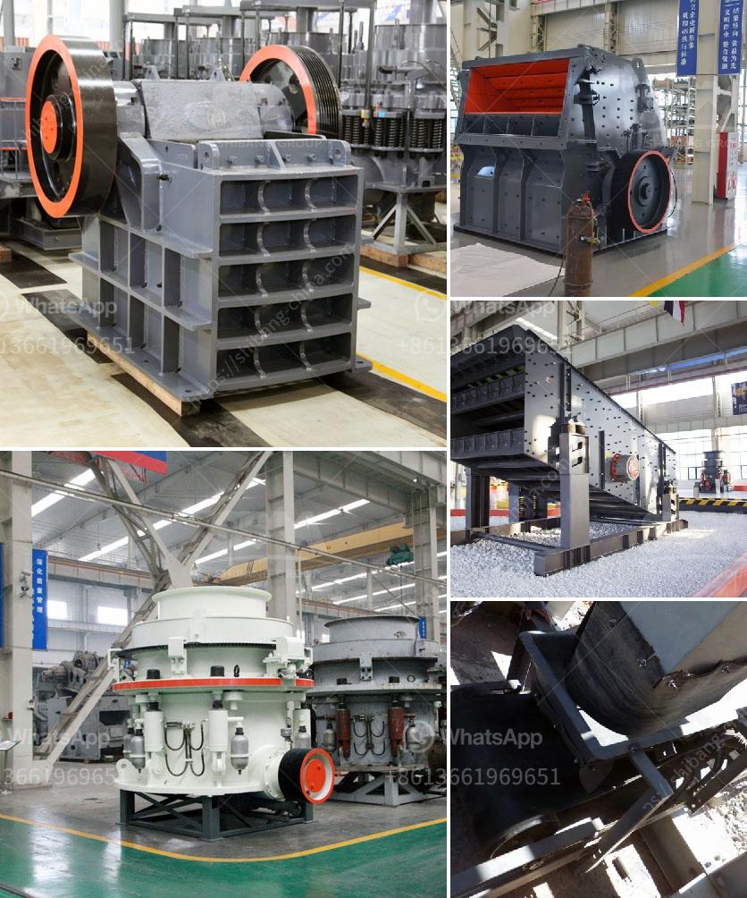

<h3>How to install a gyratory crusher? 7 steps are critical</h3>
A gyratory crusher is a significant investment for any mine, taking the necessary time to install and ensure its proper functioning is essential. Here are the seven steps for installation that are often considered critical.

Before beginning the installation process, it is crucial to understand the project's scope fully. Identify the specific requirements for the gyratory crusher, such as the desired throughput capacity, size of the feed material, and any specific features required for efficient operation. This information will help procure the right equipment and plan the installation process effectively.

Prepare the site where the gyratory crusher will be installed. Clear any debris, level the terrain, and remove any obstacles that may impede the installation process. Ensure there is ample space for the installation team to work safely and that they have access to the necessary tools and equipment.

Carefully follow the manufacturer's instructions to assemble the gyratory crusher components. This often includes the main frame, eccentric assembly, mantle, spider assembly, and other essential parts. Ensure that all components are properly aligned, secured, and in good condition before proceeding to the next step.

Determine the ideal location for the gyratory crusher and carefully position it. Take into account factors such as ease of maintenance, access for future repairs, and proximity to other equipment or structures. It is crucial to follow the manufacturer's recommendations regarding the crusher's orientation and any specific requirements for its position.

With the crusher in its desired location, erect it according to the manufacturer's instructions. This step may involve lifting heavy components, such as the main frame or mantle, using appropriate lifting equipment. Make sure to follow all safety protocols and ensure that the equipment is properly secured during installation.

Connect the necessary utilities to the gyratory crusher, such as electrical power, air supply, and water. Ensure that the connections are secure, properly grounded, and meet all safety regulations. It may be necessary to consult with relevant professionals, such as electricians or plumbers, to ensure the correct installation of these utilities.

After the installation is complete, thoroughly commission and test the gyratory crusher before putting it into operation. Verify that all components are functioning correctly and that the crusher operates smoothly and efficiently. Conduct any necessary adjustments or fine-tuning to optimize its performance.

In conclusion, the installation of a gyratory crusher requires careful planning and adherence to these critical steps. Properly outlining the project scope, preparing the site, assembling the components, positioning the crusher, erecting it safely, connecting utilities, and conducting comprehensive testing are all essential for successful installation. By following these steps, mine operators can ensure the proper functioning of the gyratory crusher, optimize its performance, and mitigate risks associated with improper installation.
<h3>Contact us</h3><ul><li><strong>Whatsapp:&nbsp;<a href="https://wa.me/8613661969651">+8613661969651</a></strong></li><li><a href="https://swt.shibang-china.com/?git&amp;zhl&amp;How to install a gyratory crusher 7 steps are critical"><strong>Online Service(chat now)</strong></a></li></ul><h3>Related</h3><ul><li><a href='How to install a stone crusher plant in Sikkim.md'>How to install a stone crusher plant in Sikkim?</a></li><li><a href='How calcite is mined and processed .md'>How calcite is mined and processed ?</a></li><li><a href='How to produce crushed sand.md'>How to produce crushed sand</a></li><li><a href='How is mill used in the copper ore mining process.md'>How is mill used in the copper ore mining process?</a></li><li><a href='How to maintenance coal mill.md'>How to maintenance coal mill?</a></li></ul>