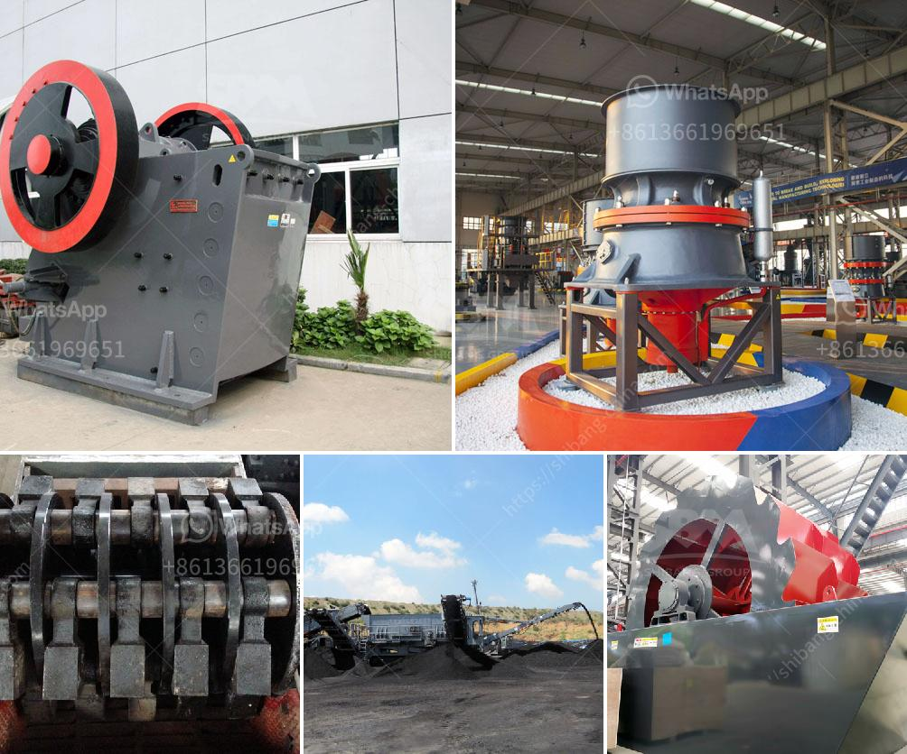

<h3>How to install a jaw crusher?</h3>
Installing a jaw crusher is not just a simple task but an important undertaking for the efficient operation of a crushing plant. This is because the jaw crusher is considered as the primary crusher of the plant as it helps in reducing the size of the large stones into smaller particles. Moreover, a high-quality jaw crusher can ensure the final product is of uniform size and fine grains. In this article, we will discuss step-by-step instructions on how to install a jaw crusher.

1. Prepare the site: It is essential to choose a solid and level ground area where the crusher can be installed. Ensure that the area has sufficient space for the crusher and other associated equipment.

2. Check the foundation: The foundation of a jaw crusher is crucial to the overall stability and performance of the machine. It should be strong enough to withstand the operational vibrations. Check for any structural issues or weaknesses in the foundation before proceeding with the installation.

1. Assemble the crusher frame: Start by assembling the frame of the jaw crusher. Ensure that all the parts are correctly aligned and firmly bolted together. This includes the side plates, flywheels, eccentric shaft, and the pitman assembly.

2. Install the jaw plate: The jaw plate is a critical component in a jaw crusher. It is the part that directly contacts the material being crushed. Carefully place the jaw plate in position and fasten it in place using the appropriate nuts and bolts. Make sure that it is securely attached and properly aligned.

3. Connect the motor: Depending on the type of crusher, connect the motor to the drive pulley or flywheel. Ensure that the motor is correctly sized and has the necessary power to drive the crusher efficiently.

4. Install the belts and guards: Install the belts onto the pulleys and adjust the tension to ensure smooth operation. Additionally, install the necessary guards to protect the operator and ensure safety during the crushing process.

1. Test the crusher: After the installation, it is crucial to thoroughly test the jaw crusher before putting it into full operation. Check for any abnormal vibrations or noises that could indicate a problem. Additionally, inspect the crusher's lubrication system and make sure that all components are properly lubricated.

2. Train the operators: It is essential to provide proper training to the operators who will be operating the jaw crusher. Make sure they are aware of the safety precautions and understand the correct operating procedures. This will help in maximizing the lifespan of the crusher and ensuring optimal performance.

In conclusion, installing a jaw crusher requires careful planning and attention to detail. Following the step-by-step instructions outlined in this article will help ensure a smooth and successful installation process. Remember to prioritize safety and quality during the installation to optimize the performance of the crusher and ensure efficient crushing operations.
<h3>Contact us</h3><ul><li><strong>Whatsapp:&nbsp;<a href="https://wa.me/8613661969651">+8613661969651</a></strong></li><li><a href="https://swt.shibang-china.com/?git&amp;zhl&amp;How to install a jaw crusher"><strong>Online Service(chat now)</strong></a></li></ul><h3>Related</h3><ul><li><a href='How to extract manganese from ore.md'>How to extract manganese from ore?</a></li><li><a href='How to find granite quarries in Salem Tamil Nadu.md'>How to find granite quarries in Salem, Tamil Nadu?</a></li><li><a href='How to operate rock crusher equipment safely .md'>How to operate rock crusher equipment safely ?</a></li><li><a href='How to adjust rotary kiln support rollers.md'>How to adjust rotary kiln support rollers?</a></li><li><a href='How to electrify a ball mill.md'>How to electrify a ball mill?</a></li></ul>