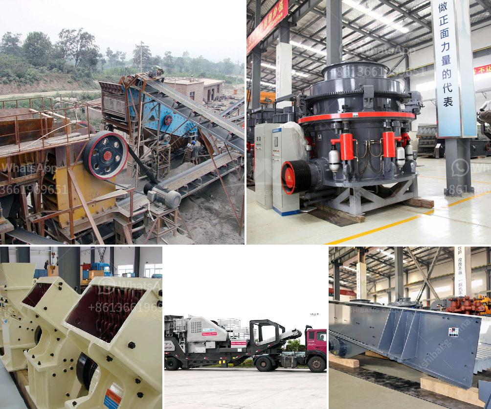

<h3>How to install a sand making machine?</h3>
A sand making machine, also known as a sand maker, is a device used to produce artificial sand. It is extensively used in industries such as mining, metallurgy, building materials, and others. Installing a sand making machine is not a complicated process, but it requires proper planning and adherence to certain guidelines. This article will provide a step-by-step guide on how to install a sand making machine.

The first and foremost step in installing a sand making machine is selecting an appropriate site. The site should have ample space to accommodate the machine and allow for its operation. It should also be close to the source of raw materials like rocks or stones. Once the site is selected, prepare the ground by leveling it and ensuring a stable foundation to prevent any vibrations during operation.

After preparing the site, start assembling the sand making machine. Follow the manufacturer's instructions carefully and ensure that all the components are correctly attached. This includes attaching the base frame, rotor, feed hopper, and the various belts and pulleys. It is essential to refer to the machine's manual to ensure that the assembly is done accurately and safely.

Once the machine is assembled, it is necessary to make electrical connections. This involves connecting the various motors, switches, and control panels. Ensure that the power supply is compatible with the sand making machine's voltage requirement. Additionally, consult an electrician to ensure the electrical connections meet the necessary safety standards.

A sand making machine typically requires a conveyor system to transport the raw materials and the finished products. Install the conveyor system adjacent to the machine and connect it securely. Test the conveyor system to ensure smooth and effective material handling.

Before operating the sand making machine, it is crucial to test and calibrate it. Test each component to ensure they are functioning correctly. Adjust the settings and calibrate the machine according to the desired specifications. Run a few test runs with varying materials to ensure the machine is producing the desired quality of artificial sand.

Lastly, ensure the installation adheres to all necessary safety measures. Install safety guards and devices to protect the operators from any potential hazards. Clearly mark any emergency stops and provide adequate training to the operators on the proper usage and maintenance of the machine.

In conclusion, installing a sand making machine involves careful site selection, proper assembly, electrical connections, installation of a conveyor system, testing and calibration, and implementation of safety measures. It is crucial to follow the manufacturer's instructions and seek professional assistance when needed. By following these steps, you can successfully install a sand making machine and begin producing high-quality artificial sand for various industrial applications.
<h3>Contact us</h3><ul><li><strong>Whatsapp:&nbsp;<a href="https://wa.me/8613661969651">+8613661969651</a></strong></li><li><a href="https://swt.shibang-china.com/?git&amp;zhl&amp;How to install a sand making machine"><strong>Online Service(chat now)</strong></a></li></ul><h3>Related</h3><ul><li><a href='how to build a concrete wash rack for heavy equipment .md'>how to build a concrete wash rack for heavy equipment ?</a></li><li><a href='How does a rock crusher work.md'>How does a rock crusher work?</a></li><li><a href='How to build a granite crushing plant？.md'>How to build a granite crushing plant？</a></li><li><a href='How to crush metallurgical coke.md'>How to crush metallurgical coke?</a></li><li><a href='How to produce crushed sand.md'>How to produce crushed sand</a></li></ul>