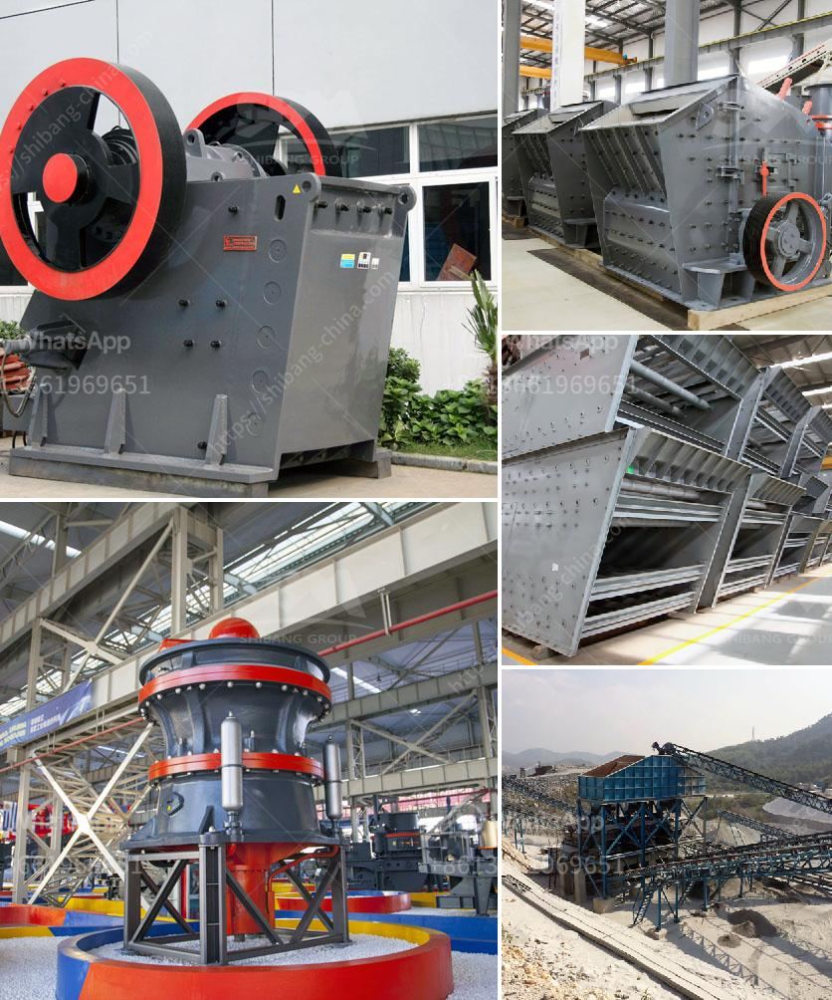

<h3>How to install a secondary crusher?</h3>
Installing a secondary crusher is not an easy task. This requires a thorough understanding of the machinery and its components, as well as a significant amount of preparation and planning. In this article, we will discuss the steps involved in installing a secondary crusher.

1. Determine the location: Before installing the secondary crusher, it is essential to determine where the machine will be placed. Factors such as availability of space, accessibility for maintenance, and safety regulations should be considered. It is generally recommended to install the crusher close to the primary crusher to minimize haulage distances.

2. Conduct a site survey: A site survey is crucial to assess the conditions and characteristics of the area where the secondary crusher will be installed. This includes evaluating the ground stability, environmental factors, and potential obstacles that may need to be addressed before installation.

3. Prepare the foundation: A solid foundation is essential to support the weight and vibrations of the secondary crusher. The foundation should be designed and constructed following the manufacturer's recommendations. This may involve excavation, pouring concrete, and curing the foundation before the installation process.

4. Assemble the crusher: Once the foundation is ready, the next step is to assemble the secondary crusher. This includes mounting the crusher components, such as the frame, crushers, and other machinery parts. Follow the manufacturer's instructions and guidelines for each specific machine.

5. Install the drive system: The drive system is an integral part of the secondary crusher. This includes the motor, couplings, belts, and pulleys that power the crusher's operation. Ensure that the drive system is properly aligned and tensioned to prevent any operational issues.

6. Connect the electrical wiring: The secondary crusher requires a reliable electrical connection to function properly. Install the necessary electrical wiring, switches, and control panels according to the crusher manufacturer's specifications. It is recommended to hire a licensed electrician to ensure proper and safe installation.

7. Test and commission the crusher: Once the installation is complete, conduct thorough testing and commissioning to ensure the secondary crusher operates as expected. Check for any operational issues, vibrations, or unusual noises and resolve them promptly. It is also crucial to train the operators on the safe and efficient use of the crusher.

8. Follow maintenance and safety procedures: Regular maintenance and adherence to safety procedures are crucial for the long-term performance of the secondary crusher. Follow the manufacturer's recommended maintenance schedule, inspect and lubricate components regularly, and keep a record of all maintenance activities.

In conclusion, installing a secondary crusher requires careful planning, preparation, and attention to detail. By following the steps discussed in this article, you can ensure a successful installation and efficient operation of the secondary crusher. Remember to always refer to the manufacturer's instructions and guidelines to ensure proper installation and use.
<h3>Contact us</h3><ul><li><strong>Whatsapp:&nbsp;<a href="https://wa.me/8613661969651">+8613661969651</a></strong></li><li><a href="https://swt.shibang-china.com/?git&amp;zhl&amp;How to install a secondary crusher"><strong>Online Service(chat now)</strong></a></li></ul><h3>Related</h3><ul><li><a href='How to find granite quarries in Salem Tamil Nadu.md'>How to find granite quarries in Salem, Tamil Nadu?</a></li><li><a href='How to improve coal crusher hammer life .md'>How to improve coal crusher hammer life ?</a></li><li><a href='How to design a ball mill for cement ？.md'>How to design a ball mill for cement ？</a></li><li><a href='How to improve the sound of crusher machine.md'>How to improve the sound of crusher machine?</a></li><li><a href='how to install stone crusher plant .md'>how to install stone crusher plant ?</a></li></ul>