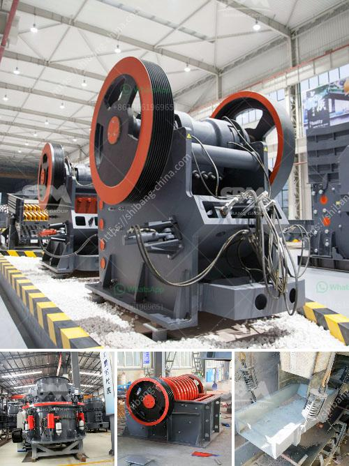

<h3>How to install a stone crusher hopper?</h3>
Installing a stone crusher hopper is not a challenging task, but it requires a strong understanding of the construction materials and techniques involved. 

To install a stone crusher hopper, you need to ensure that the hopper is directly above the crushing chamber in order to allow for proper feeding of the material. Ensure that there are no obstructions or material buildup under the crusher hopper to prevent any damage to the machine.

To begin with, you will need a sturdy foundation to support the hopper. The type of foundation required will depend on the size and weight of the hopper, as well as the type of soil you are working with. If you are unsure about the type of foundation required, consult a structural engineer to assess the site and provide recommendations.

Once the foundation has been prepared, ensure that the dimensions of the hopper are suitable for the target material. The size and capacity of the hopper depend on the type of stone crusher you will be using. For example, if you are working with a large jaw crusher, make sure the hopper is large enough to accommodate the feed material.

When installing the hopper, make sure it is securely fastened to the foundation to prevent any movement during operation. This can be achieved by using sturdy bolts or anchors that are firmly attached to the hopper and the foundation.

Next, connect the hopper to the crushing chamber using a conveyor belt or chute. The conveyor belt or chute should be properly aligned with the hopper and the crusher to ensure a steady flow of material. Make sure there are no gaps between the hopper and the crusher to prevent spillage of material.

Before operating the crusher hopper, make sure all safety precautions are in place. This includes ensuring that all guards and protective devices are properly installed and functioning correctly. In addition, make sure all electrical connections are secure and that the crusher is properly grounded.

Once the hopper is installed, it is important to regularly inspect and maintain it to ensure proper functioning. This includes checking for any signs of wear or damage, such as cracks or rust, and replacing any worn or damaged parts as necessary.

In conclusion, installing a stone crusher hopper requires careful planning and execution. It is crucial to ensure that the hopper is securely fastened to a suitable foundation and properly aligned with the crusher. Regular inspection and maintenance are also necessary to ensure the hopper functions properly. By following these steps, you can effectively install a stone crusher hopper and ensure smooth operation.
<h3>Contact us</h3><ul><li><strong>Whatsapp:&nbsp;<a href="https://wa.me/8613661969651">+8613661969651</a></strong></li><li><a href="https://swt.shibang-china.com/?git&amp;zhl&amp;How to install a stone crusher hopper"><strong>Online Service(chat now)</strong></a></li></ul><h3>Related</h3><ul><li><a href='how to remove fines from stone crush.md'>how to remove fines from stone crush?</a></li><li><a href='How to produce silica sand 7 steps.md'>How to produce silica sand? 7 steps</a></li><li><a href='How to install impact crusher .md'>How to install impact crusher ?</a></li><li><a href='How to install a stone crusher plant.md'>How to install a stone crusher plant?</a></li><li><a href='how to change hammer in rock crusher.md'>how to change hammer in rock crusher?</a></li></ul>