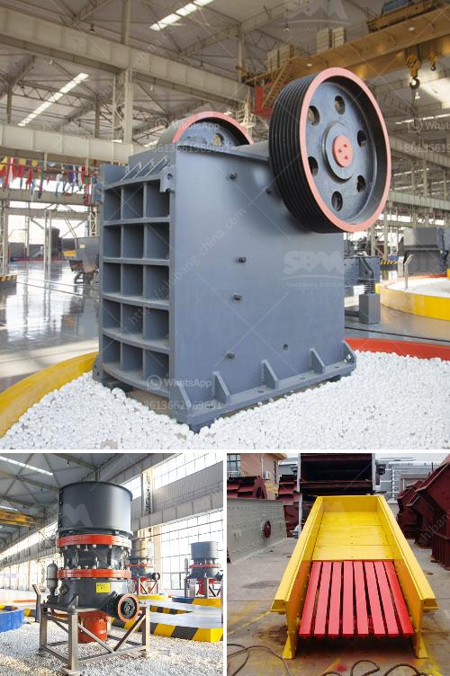

<h3>How to install a stone crusher plant in Sikkim?</h3>
Installing a stone crusher plant in Sikkim can be a challenging task for beginners due to its extensive layout and the state's rugged terrain. This article will guide you through the process of installing a stone crusher plant in Sikkim and help you minimize the risks that come along with it.

Sikkim is a northeastern state that offers scenic beauty and mesmerizing landscapes. With the increasing demand for construction materials, stone chips are essential for the construction industry. Establishing a stone crusher plant in Sikkim allows you to produce different types of crushed stones, thereby providing the required materials for various construction activities.

Choose a suitable location for the stone crusher plant. It should be far away from areas with high population density to avoid any inconvenience to the locals. Also, ensure that the site is easily accessible for transportation of raw materials and finished products.

Before starting the installation process, obtain all the required permits and licenses from the relevant authorities. These may include a pollution control clearance certificate, consent to establish, and environmental clearance, among others. Compliance with legal procedures ensures smooth operations and avoids any legal complications.

Clear the selected site by removing any vegetation, rocks, debris, or other obstructions. Level the ground as per the requirements of the stone crusher plant layout. Ensure proper drainage to prevent water stagnation, which can be detrimental to both the machinery and the environment.

Construct a strong foundation for the stone crusher plant to withstand the load exerted by its machinery. The foundation should be stable and able to withstand vibrations generated during the crushing process. Follow the engineer's instructions and use suitable construction materials to ensure durability.

Carefully install and set up the machinery according to the manufacturer's guidelines. Ensure all the components, such as the crushers, screens, feeders, and conveyors, are properly aligned and connected. Use high-quality equipment and follow safety protocols to avoid accidents and maintain operational efficiency.

Install electrical connections, wiring, and power supply to the stone crusher plant. Engage professional electricians to ensure the proper installation of electrical components and adherence to safety standards. Establish water connections and provide adequate water supply for the plant's functioning and dust suppression.

Install necessary safety measures, such as safety guards, emergency stops, and fire extinguishers, to minimize risks and adhere to safety regulations. Train the operating staff on safety protocols and provide them with the required personal protective equipment.

Before commencing full-fledged operations, conduct a thorough testing and commissioning process. Test the machinery for its efficiency, performance, and smooth functioning. Rectify any defects or malfunctions discovered during the process.

Establish operational practices that prioritize environmental sustainability. Follow proper waste management procedures, recycling techniques, and dust control measures. Regularly maintain and service the machinery to ensure its longevity and efficiency.

Installing a stone crusher plant in Sikkim requires careful planning, adherence to legal requirements, and implementation of safety measures. By following the steps mentioned above, you can minimize the risks and successfully establish a stone crusher plant in this beautiful state. Remember to consult with experts and professionals throughout the installation process to achieve optimum results.
<h3>Contact us</h3><ul><li><strong>Whatsapp:&nbsp;<a href="https://wa.me/8613661969651">+8613661969651</a></strong></li><li><a href="https://swt.shibang-china.com/?git&amp;zhl&amp;How to install a stone crusher plant in Sikkim"><strong>Online Service(chat now)</strong></a></li></ul><h3>Related</h3><ul><li><a href='How to calculate the volume of ball mill packing .md'>How to calculate the volume of ball mill packing ?</a></li><li><a href='How to choose a stone grinding machine ？.md'>How to choose a stone grinding machine ？</a></li><li><a href='How do you extract limestone from a quarry.md'>How do you extract limestone from a quarry?</a></li><li><a href='How to produce dolomite using a roller mill.md'>How to produce dolomite using a roller mill?</a></li><li><a href='How to choose a basalt crusher？.md'>How to choose a basalt crusher？</a></li></ul>