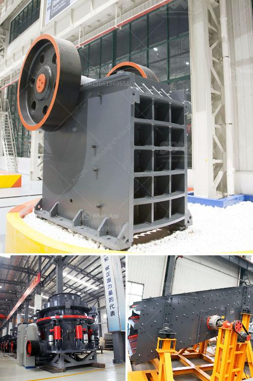

<h3>How to install a stone crusher plant?</h3>
A stone crushing plant is one-stop crushing installation, typical materials like limestone, granite, river gravel, basalt, etc., the plant produces different sizes of gravels and sand which can be used for constructions. Stone crushing plants may require a deep foundation system as the machinery is usually placed underground.

To install a stone crusher plant, the first step is to make a proper foundation. The soil surface should be leveled, so that it would not cause any ground subsidence. Once the surface is ready, a stone crusher plant is usually positioned in a location where the aggregate stone material can be crushed into smaller sizes, which can then be used for various construction purposes.

To install a stone crusher plant, the necessary equipment is required to have a good workability and technology-based machines that can reduce the size of building stones to even medium-grained sizes. An efficient stone crusher plant can be successfully completed with the right tools, experience, and skills.

To install a stone crusher plant, it is necessary to invest a considerable amount of money. This is because the equipment required for stone crushing is expensive, and large-scale crushing is costly, which would require a substantial budget. Stone crushing plants tend to be mainly operated in large labor-intensive operations. Therefore, it is important to purchase machines that are capable of handling the expected workload and have the necessary qualifications.

To install a stone crusher plant, one needs to commit a lot of time and manpower. The installation and commissioning time of a stone crusher plant generally takes several weeks, during which time personnel must be available to continuously monitor the progress of the installation and make adjustments if necessary. Additionally, stone crusher plants require regular inspection and frequent maintenance to ensure its smooth operation and longevity.

It is also important to consider the location of the stone crusher plant. A suitable location should allow easy access for vehicular movement to transport both raw and crushed materials. The area should have adequate space to accommodate the machinery and allow for convenient loading and unloading of materials.

Lastly, it is important to seek expert advice and guidance when installing a stone crusher plant. The selection of the appropriate machinery, the sizing and arrangement of the plant components, and the overall planning and execution of the project should all be done by professionals experienced in this field. Consulting with experts will help ensure that the stone crusher plant is installed properly and operates efficiently, resulting in higher productivity and reduced downtime.

In conclusion, installing a stone crusher plant is not an easy task. However, with careful planning and proper execution, it can be successfully accomplished. It is essential to consider various factors such as foundation preparation, proper machinery selection, and maintenance requirements. Seeking advice from experts in the field is highly recommended to ensure a smooth installation process and the successful operation of the plant.
<h3>Contact us</h3><ul><li><strong>Whatsapp:&nbsp;<a href="https://wa.me/8613661969651">+8613661969651</a></strong></li><li><a href="https://swt.shibang-china.com/?git&amp;zhl&amp;How to install a stone crusher plant"><strong>Online Service(chat now)</strong></a></li></ul><h3>Related</h3><ul><li><a href='how to calculate the production capacity of cone crusher .md'>how to calculate the production capacity of cone crusher ?</a></li><li><a href='How to build a ball mill.md'>How to build a ball mill?</a></li><li><a href='How is quartz mined and processed.md'>How is quartz mined and processed?</a></li><li><a href='How to work jaw crusher and impact crusher .md'>How to work jaw crusher and impact crusher ?</a></li><li><a href='How to start gold ball mill unit.md'>How to start gold ball mill unit?</a></li></ul>