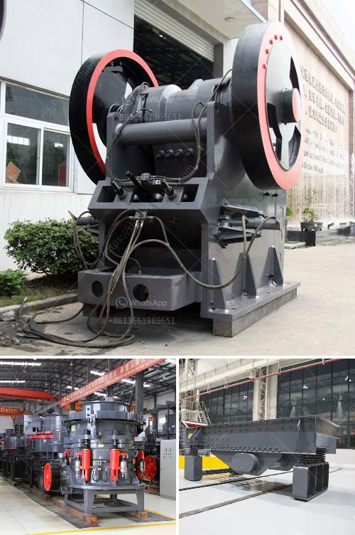

<h3>How to install a stone crusher production line ？</h3>
Installing a stone crusher production line is vital for contractors and project managers. The process involves a series of steps that ultimately determine the correct machinery placement and installation of the equipment. Incorporating a stone crusher into the workflow helps increase efficiency and productivity within the construction site. This article will provide a comprehensive guide on how to install a stone crusher production line.

The initial step is to ensure that the site is properly prepared for the installation process. This involves clearing any obstacles, debris, or existing structures that may hinder the installation. It is important to have a leveled surface with adequate space for the stone crusher machinery.

Before commencing the installation, contractors should carefully analyze the project requirements and select the appropriate stone crusher equipment. It is crucial to choose a machine that matches the project's scope and output requirements. Consider factors such as production capacity, material hardness, and final product size.

Creating a stable foundation is essential to ensure the machinery functions efficiently and smoothly. Consult a structural engineer to design a supportive foundation that complies with local building codes. The foundation should be constructed using high-quality materials and follow the engineer's specifications.

Once the foundation is ready, initiate the installation process by placing the stone crusher machinery in the designated spot. Lift the equipment using a crane or forklift and carefully position it on the foundation. Ensure that the machinery is leveled and aligned correctly to avoid operational issues.

Next, connect the stone crusher to the electrical supply. Consult an electrician or a professional technician to handle the wiring process. Make sure the power supply meets the electrical requirements of the machinery and adhere to all safety regulations. Test the electrical connections to verify their functionality and troubleshoot any issues.

The stone crusher production line often requires a conveyor system for efficient material transportation. Install the conveyor belts and loading systems according to the manufacturer's instructions. Verify that the belt tension is properly adjusted to prevent slippage or deviation during operation.

Before the production line is fully operational, it is crucial to perform commissioning and testing to ensure everything works correctly. Start the stone crusher and observe its operation. Test the various components, such as crushers, screens, and conveyor systems, to verify their functionality. Address any issues promptly to avoid future problems and optimize performance.

Safety should be a top priority throughout the installation process. Ensure all workers are equipped with appropriate personal protective equipment (PPE), such as helmets, gloves, and safety goggles. Provide clear instructions and training on the machinery's operation and potential hazards. Regularly inspect and maintain the equipment to ensure ongoing safety adherence.

In conclusion, installing a stone crusher production line requires careful planning, preparation, and execution. By following the aforementioned steps, contractors can ensure a smooth and successful installation process. Proper installation will result in improved productivity and efficiency, ultimately leading to successful project completion.
<h3>Contact us</h3><ul><li><strong>Whatsapp:&nbsp;<a href="https://wa.me/8613661969651">+8613661969651</a></strong></li><li><a href="https://swt.shibang-china.com/?git&amp;zhl&amp;How to install a stone crusher production line ？"><strong>Online Service(chat now)</strong></a></li></ul><h3>Related</h3><ul><li><a href='How to repair a crack in the trunnion of a ball mill.md'>How to repair a crack in the trunnion of a ball mill?</a></li><li><a href='How to achieve a smooth coal pulverizer.md'>How to achieve a smooth coal pulverizer?</a></li><li><a href='How is mill used in the copper ore mining process.md'>How is mill used in the copper ore mining process?</a></li><li><a href='How to improve coal crusher hammer life .md'>How to improve coal crusher hammer life ?</a></li><li><a href='how a cone crusher works .md'>how a cone crusher works ?</a></li></ul>