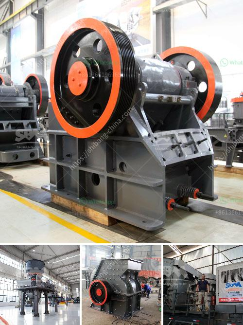

<h3>How to install cement mill liners ?</h3>
Cement mill liners play a key role in ensuring mill performance and optimizing productivity. They are subjected to constant wear due to the grinding process and require regular maintenance to ensure they are retained in optimum condition.

Installing cement mill liners is a time-consuming process that must be carefully executed to ensure their proper functioning. In this article, we will discuss the steps involved in the installation of cement mill liners.

Before the installation process begins, it is essential to prepare the mill for liner installation. This involves shutting down the mill and removing any remaining grinding media, as well as cleaning the mill surface to remove any dirt, debris, or rust.

The next step is to measure the inner surface of the mill to determine the size and shape of the liners required. This is crucial, as precise measurements will ensure a proper fit and prevent any gaps or misalignments. Once the measurements are taken, the liners can be cut accordingly using specialized cutting tools.

To ensure the liners stay in place, a high-strength adhesive is applied to the mill surface. This adhesive is typically a two-part epoxy compound that offers excellent bonding characteristics. The adhesive is evenly spread over the mill surface using a brush or trowel, ensuring all areas are adequately covered.

With the adhesive applied, the liners can now be installed. Care must be taken during this step to ensure proper alignment and prevent any air pockets. The liners are slowly and carefully placed onto the mill surface, ensuring they are pressed firmly to allow the adhesive to bond effectively.

To further enhance the bond between the liners and the mill surface, additional mechanical fasteners can be used. These may include bolts, screws, or clips, depending on the type of mill and liner design. The fasteners are strategically placed along the liner edges to provide secure attachment and prevent movement during operation.

After the installation is complete, it is crucial to allow the adhesive to cure properly. This typically involves leaving the mill idle for a specific period to ensure the adhesive reaches its full strength. The curing time will vary depending on the type of adhesive used, and manufacturer guidelines should be followed accordingly.

Once the curing is completed, it is essential to inspect the installed liners for any signs of damage, misalignment, or wear. Regular monitoring of the liner condition is crucial to identify any issues and take prompt action to prevent further damage or operational disruptions.

In conclusion, installing cement mill liners is a crucial task that should be carried out with precision and care. By following the steps outlined in this article, mill operators can ensure the proper installation and functioning of the liners, thereby optimizing mill performance and maintaining productivity.
<h3>Contact us</h3><ul><li><strong>Whatsapp:&nbsp;<a href="https://wa.me/8613661969651">+8613661969651</a></strong></li><li><a href="https://swt.shibang-china.com/?git&amp;zhl&amp;How to install cement mill liners "><strong>Online Service(chat now)</strong></a></li></ul><h3>Related</h3><ul><li><a href='How does a stone crusher work？.md'>How does a stone crusher work？</a></li><li><a href='How to increase the output of stone milling machine？.md'>How to increase the output of stone milling machine？</a></li><li><a href='How to use the sand making machine.md'>How to use the sand making machine?</a></li><li><a href='How to improve the performance of a coal crusher.md'>How to improve the performance of a coal crusher?</a></li><li><a href='How to remove pyrite stones from coal.md'>How to remove pyrite stones from coal?</a></li></ul>