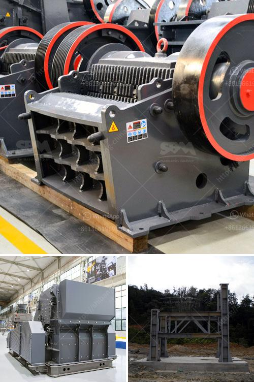

<h3>How to install crusher?</h3>
A crusher is a necessary machine for waste management and recycling. It can crush various materials such as concrete, bricks, asphalt, natural stones, and more. With the rapid development of technology, crushers are also becoming more advanced and efficient. If you are planning to install a crusher, here are some steps to guide you through the process.

Before installation, it is important to determine the type of crusher suitable for your needs. Consider factors such as the material you will be processing, required capacity, and final product size. There are different types of crushers available, including jaw crushers, cone crushers, impact crushers, and vertical shaft impactors. Each type has its own unique features, so choose the one that best fits your requirements.

Clear the installation site of any obstacles or debris that may hinder the installation process. Make sure the site is level, stable, and capable of supporting the weight of the crusher. Prepare the drainage system, if necessary, to prevent water accumulation. Adequate space should be provided for maintenance and operation.

The foundation is crucial for the stability of the crusher. It ensures that the crusher operates efficiently and minimizes vibration. Consult with a professional engineer to design and construct a solid foundation based on the specific requirements of your crusher. Typically, a concrete base is used to provide a stable and level surface.

Carefully follow the manufacturer's instructions for installation. Start by assembling the main components of the crusher, such as the frame, jaw plates, and conveyor belts. Make sure all connections are securely fastened. Lift the crusher unit onto the foundation and align it properly. Use leveling tools to ensure the crusher is correctly positioned horizontally and vertically.

Ensure that the crusher is properly connected to a reliable power source. Follow the electrical wiring diagram provided by the manufacturer. If necessary, consult an electrician to ensure proper electrical connections. Test the crusher to ensure that it is operating smoothly and all components are functioning correctly.

Before using the crusher for actual production, it is crucial to conduct commissioning and testing. Run a trial operation to check if the crusher is operating smoothly and efficiently. Test different materials to confirm the crusher's capacity and output. Adjust any settings as required to optimize performance.

Regular maintenance is essential to keep the crusher in good working condition. Follow the manufacturer's recommendations for routine maintenance, such as lubricating moving parts, checking belts, and inspecting wear parts. Additionally, implement necessary safety measures, such as installing safety guards and providing proper training for operators.

Installing a crusher requires careful planning, preparation, and adherence to safety guidelines. By following these steps, you can ensure a successful installation and enjoy the benefits of effective waste management and recycling. Remember to consult with professionals when necessary, and always prioritize safety throughout the entire process.
<h3>Contact us</h3><ul><li><strong>Whatsapp:&nbsp;<a href="https://wa.me/8613661969651">+8613661969651</a></strong></li><li><a href="https://swt.shibang-china.com/?git&amp;zhl&amp;How to install crusher"><strong>Online Service(chat now)</strong></a></li></ul><h3>Related</h3><ul><li><a href='How to Start a South African Manganese Ore Processing Plant ？.md'>How to Start a South African Manganese Ore Processing Plant ？</a></li><li><a href='How to design an iron ore conveyor.md'>How to design an iron ore conveyor?</a></li><li><a href='How to balance a cement mill separator.md'>How to balance a cement mill separator?</a></li><li><a href='How to concentrate gold in hard rock.md'>How to concentrate gold in hard rock?</a></li><li><a href='How to determine the capacity of impact crusher？.md'>How to determine the capacity of impact crusher？</a></li></ul>