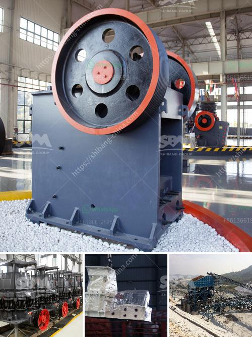

<h3>How to install impact crusher ?</h3>
An impact crusher is a useful machine used in producing aggregates for construction purposes, mining, and recycling industries. It can crush a variety of materials such as limestone, granite, concrete, and more. To ensure its smooth operation and long service life, proper installation is key. Here are the steps on how to install an impact crusher.

Before starting the installation process, it is essential to determine the ideal location for the impact crusher. This should be a flat surface, away from any obstructions, and easily accessible for maintenance purposes. Additionally, the location should be able to handle the weight and vibrations produced by the machine.

To ensure stability and prevent vibrations, a solid and leveled foundation is necessary. Start by excavating the area and removing any organic materials. Once the area is cleared, fill the hole with a layer of crushed stone or concrete. Use a compactor to ensure the foundation is evenly distributed and compacted.

After preparing the foundation, it is time to install the crusher frame. Start by placing the frame on top of the foundation, making sure it is level and properly aligned. Use shims to adjust the height if needed. Once the frame is in place, secure it to the foundation using anchor bolts.

The rotor is a crucial component of the impact crusher, responsible for the crushing process. Install it carefully, ensuring it is properly aligned and secured. Use a lifting device or crane to make the installation easier and safer.

The impact plates are wear-resistant components that protect the crusher's interior from impact and abrasion. Carefully install them, ensuring they are properly positioned and fastened. Regularly inspect and replace these plates to maintain the efficiency of the impact crusher.

After installing the essential components, it is time to connect the impact crusher to the power supply. Ensure you follow the manufacturer's instructions and local electrical codes. Use proper insulation techniques and protective materials, such as conduit and cable trays, to prevent accidents or damage.

Before putting the impact crusher into operation, thoroughly test its functionality and safety features. Check for any abnormal noises, vibrations, or leaks. Familiarize yourself with the controls and make sure they work correctly. Properly lubricate the machine as per the manufacturer's recommendations.

Regular maintenance is vital to ensure the long-term performance of the impact crusher. Follow the manufacturer's maintenance schedule to clean, inspect, and replace parts as needed. Lubricate all moving parts and check for any signs of wear or damage. Implement a maintenance routine and keep detailed records.

Installing an impact crusher requires careful planning and precise execution. By following these steps, you can ensure a successful installation and achieve optimal performance from your equipment. Remember to always prioritize safety during the installation and operation of the impact crusher.
<h3>Contact us</h3><ul><li><strong>Whatsapp:&nbsp;<a href="https://wa.me/8613661969651">+8613661969651</a></strong></li><li><a href="https://swt.shibang-china.com/?git&amp;zhl&amp;How to install impact crusher "><strong>Online Service(chat now)</strong></a></li></ul><h3>Related</h3><ul><li><a href='how does a limestone ball mill working .md'>how does a limestone ball mill working ?</a></li><li><a href='How to beneficiation tungsten ore.md'>How to beneficiation tungsten ore?</a></li><li><a href='How to Operate Calcite Crushing Plant ？.md'>How to Operate Calcite Crushing Plant ？</a></li><li><a href='How to get gold from ore crushing.md'>How to get gold from ore crushing?</a></li><li><a href='how to crush ore to 100 mesh grinding mill china？.md'>how to crush ore to 100 mesh grinding mill china？</a></li></ul>