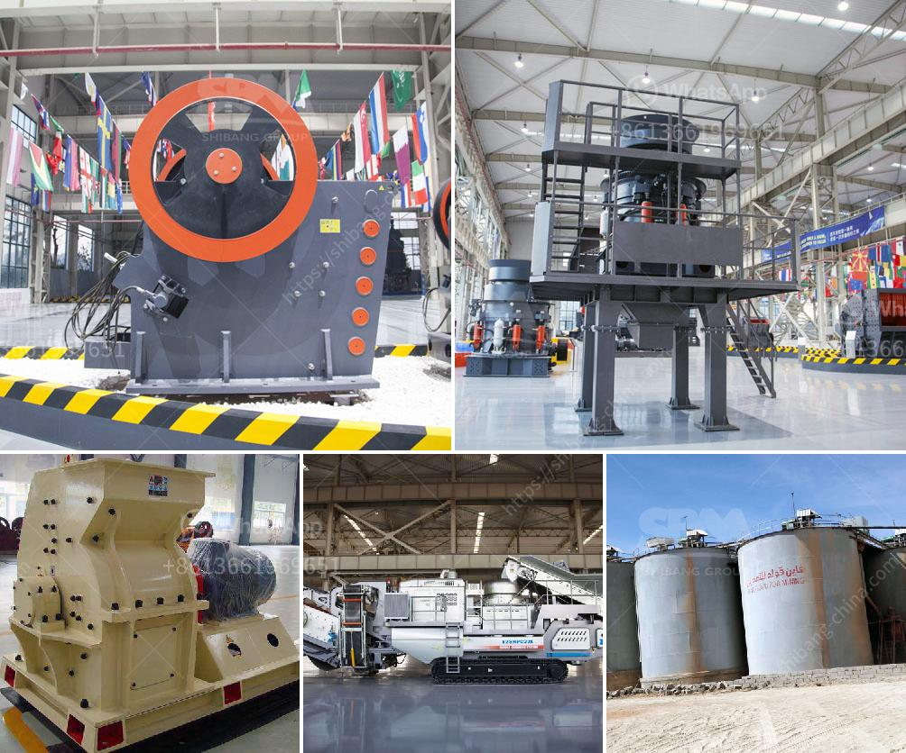

<h3>How to install limestone sand washing machine ？</h3>
Limestone sand is a kind of sandstone widely used in various industries such as construction, ceramics, metallurgy, chemistry, and glassmaking. With the rapid development of these industries, the demand for limestone sand has been increasing, and the use of limestone sand washing machines has become more widespread, especially in recent years.

Limestone sand washing machine is a high-efficiency sand washing and dewatering machine developed by combining advanced technology and experience. It is equipped with a versatile stone washing and dewatering screen, which has a wide range of applications in the sand and gravel industry. The working principle of the limestone sand washing machine is to stir the sand and gravel material through the screw device inside the equipment, and mix the mud and water together to achieve the purpose of cleaning the sand. At the same time, the stone washing and dewatering screen is used to dehydrate the sand and remove the impurities in the stone.

1. Prepare the installation site: Clear the installation site and make sure it is level and stable. Remove any obstacles that may hinder the installation or operation of the machine. It is recommended to install the limestone sand washing machine on a concrete foundation to ensure stability.

2. Connect the water source: The limestone sand washing machine requires a water source for operation. Connect the water source to the machine using a water hose. Make sure the water supply is sufficient and the water pressure is stable.

3. Connect the power supply: The limestone sand washing machine requires electricity to operate. Connect the power supply to the machine using a suitable power cable and socket. Ensure that the power supply is stable and meet the requirements of the machine.

4. Install the discharge pipe: The limestone sand washing machine needs a discharge pipe to drain the waste water. Connect the discharge pipe to the machine's drain port and make sure it is properly installed and aligned to avoid leakage or blockage.

5. Test the machine: After completing the installation, turn on the power supply and water source, and test the machine to ensure that it runs smoothly and all functions are working properly. Adjust the water flow and other settings according to the specific requirements of the material being processed.

6. Regular maintenance: To ensure the long-term and efficient operation of the limestone sand washing machine, regular maintenance is necessary. Clean the machine regularly, inspect the parts for any damage, and replace or repair as needed. It is also important to follow the manufacturer's guidelines for maintenance and servicing.

In conclusion, installing a limestone sand washing machine requires careful preparation and attention to detail. By following the above steps, you can successfully install a limestone sand washing machine and enjoy its benefits in cleaning and dewatering limestone sand materials.
<h3>Contact us</h3><ul><li><strong>Whatsapp:&nbsp;<a href="https://wa.me/8613661969651">+8613661969651</a></strong></li><li><a href="https://swt.shibang-china.com/?git&amp;zhl&amp;How to install limestone sand washing machine ？"><strong>Online Service(chat now)</strong></a></li></ul><h3>Related</h3><ul><li><a href='How does a jaw crusher crush limestone.md'>How does a jaw crusher crush limestone?</a></li><li><a href='How to install a stone crusher plant.md'>How to install a stone crusher plant?</a></li><li><a href='how does a grinding cement mill work？.md'>how does a grinding cement mill work？</a></li><li><a href='How to install a conveyor belt.md'>How to install a conveyor belt?</a></li><li><a href='How do you extract limestone from a quarry.md'>How do you extract limestone from a quarry?</a></li></ul>