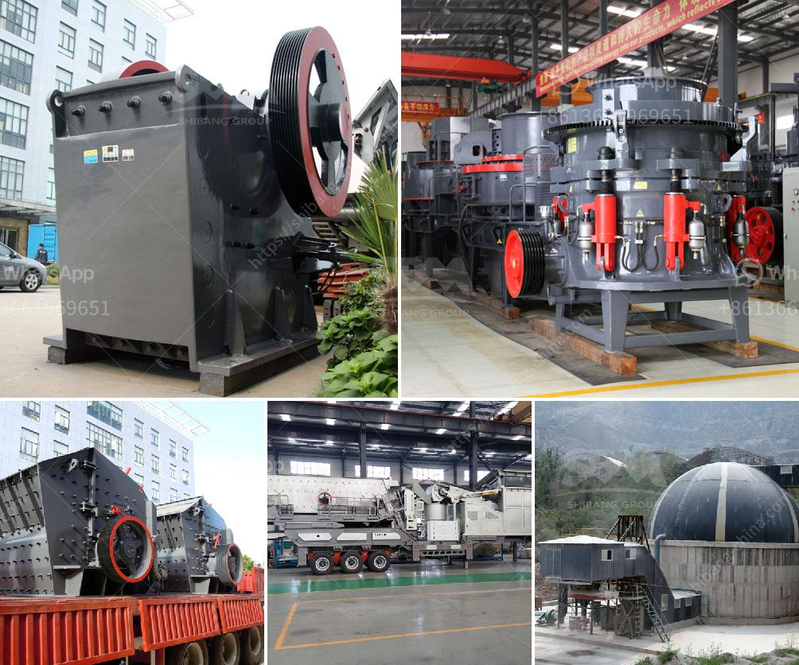

<h3>How to install ore jaw crusher?</h3>
The ore jaw crusher plays a crucial role in the crushing process of ore materials. As the leading mining machinery manufacturer in China, we have different types of ore jaw crushers for sale, including 4x6, 6x10, 8x12, 10x16, and more. Customers can choose any type according to their needs. We also provide ore jaw crusher installation and commissioning guidance, free of charge.

To ensure the ore jaw crusher works at its peak efficiency, the installation of the equipment is crucial. Here are five essential steps to follow when installing an ore jaw crusher.

Before installing the ore jaw crusher, the foundation should be checked and prepared. The foundation should have sufficient bearing capacity to support the weight of the ore jaw crusher. A concrete foundation is recommended, and the depth of the foundation should exceed the local frost line to avoid frost damage.

Place the mainframe of the ore jaw crusher on the foundation, and level it with wooden shims or concrete. Check the levelness of the mainframe using a spirit level. Once the mainframe is well-leveled, fix it firmly with anchor bolts.

After fixing the mainframe, install the flywheel and pulley. The flywheel acts as a balance wheel for the machine's inertia, while the pulley drives the eccentric shaft to rotate and move the ore materials. Ensure the flywheel and pulley are securely fastened to prevent unnecessary vibration during operation.

The movable jaw plate is the main component responsible for crushing the ore materials. It should be installed after the flywheel and pulley. Align the mounting holes of the movable jaw plate with the corresponding holes on the mainframe and secure them with bolts. Ensure the movable jaw plate is properly aligned and centered with the fixed jaw plate.

The ore jaw crusher requires a reliable power source to function. Install the motor and connect it with the drive components, including the V-belt, pulley, and the flywheel and pulley guard. Ensure all connections are tight and secure.

Once the ore jaw crusher is installed, it's important to perform a thorough inspection to ensure all components are in proper working order. Check the lubrication system to ensure sufficient oil is reaching all necessary parts. Inspect the electrical connections to avoid any potential hazards. Lastly, conduct a trial run to test the efficiency and functionality of the ore jaw crusher.

In conclusion, the installation of an ore jaw crusher should be a carefully planned and executed process. By following the five essential steps mentioned above, one can ensure a successful installation of the crusher. Remember to consult with professionals and refer to the manufacturer's instructions for a safe and efficient installation process.
<h3>Contact us</h3><ul><li><strong>Whatsapp:&nbsp;<a href="https://wa.me/8613661969651">+8613661969651</a></strong></li><li><a href="https://swt.shibang-china.com/?git&amp;zhl&amp;How to install ore jaw crusher"><strong>Online Service(chat now)</strong></a></li></ul><h3>Related</h3><ul><li><a href='How to buy rock crusher in Sri Lanka .md'>How to buy rock crusher in Sri Lanka ?</a></li><li><a href='How to build a gravel crusher.md'>How to build a gravel crusher?</a></li><li><a href='How to replace the belt on the crushing machinery ？.md'>How to replace the belt on the crushing machinery ？</a></li><li><a href='How much does a stone crusher of 150 tonnes cost.md'>How much does a stone crusher of 150 tonnes cost?</a></li><li><a href='How to construct a ramp for a granite crushing plant.md'>How to construct a ramp for a granite crushing plant?</a></li></ul>