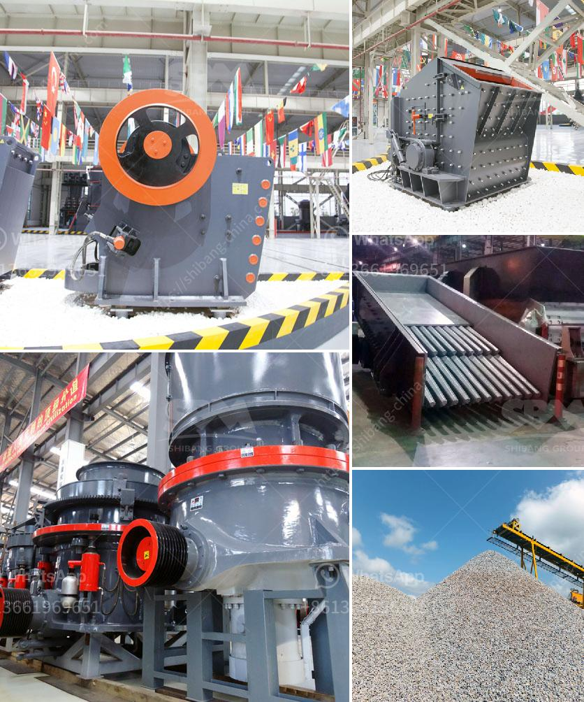

<h3>How to install quarry equipment?</h3>
Quarry equipment plays a crucial role in the production and efficiency of a mining or construction operation. Installing this equipment properly is essential to ensure its optimal functioning and longevity. Whether you are new to the industry or have prior experience, understanding the correct installation process is crucial to maximize the efficiency and safety of your quarry.

1. Planning: Before starting the installation process, it is important to have a detailed plan in place. This includes identifying the specific equipment to be installed, calculating the required space and infrastructure, and obtaining any necessary permits or approvals.

2. Site preparation: Once the planning phase is complete, prepare the site for equipment installation. Clear any obstacles, level the ground, and ensure proper drainage to minimize future issues. It is also crucial to assess the stability of the ground to guarantee the equipment's support and safety.

3. Equipment assembly: Carefully unpack and assemble the quarry equipment as per the manufacturer's instructions. Refer to the provided manuals, diagrams, or online resources, if available, to avoid any mistakes or safety hazards during assembly. Ensure that all parts are securely fastened and the equipment is structurally sound.

4. Foundation construction: Building a solid foundation is vital for the stability and longevity of the quarry equipment. Follow the manufacturer's guidelines when constructing the foundation, which may involve pouring concrete or using proper anchoring methods. Precise alignment and leveling are essential to prevent future issues or breakdowns.

5. Electrical connections: If the quarry equipment requires electrical power, engage a certified electrician to carry out the wiring and connections. Ensure compliance with local regulations and safety standards. Proper insulation, grounding, and installation of circuit breakers are necessary to prevent electrical accidents and equipment damage.

6. Lubrication and maintenance: After installation, familiarize yourself with the equipment's maintenance requirements. Regular lubrication and preventive maintenance should be performed to minimize wear and maximize efficiency. Adhere to the manufacturer's guidelines regarding recommended lubricants, maintenance intervals, and overall equipment care.

7. Testing and inspection: Before commencing full-scale operations, conduct thorough testing and inspections. Verify that all components and systems are functioning correctly, and address any deficiencies or malfunctions. Ensure that safety features, such as emergency stops or alarms, are fully operational.

8. Training and safety protocols: Once the quarry equipment is installed and verified, provide comprehensive training to the operators and maintenance personnel. They should have a clear understanding of the equipment's functioning, safety protocols, and emergency procedures. Regular training sessions and safety drills promote a safe work environment and minimize accidents.

It's important to note that larger quarry equipment may require professional assistance and specialized machinery for installation. In such cases, consider collaborating with the equipment manufacturer or hiring a qualified contractor who specializes in equipment installations.

In summary, proper installation of quarry equipment is essential to ensure its optimal function, longevity, and safety. Careful planning, site preparation, assembly, foundation construction, electrical connections, lubrication, maintenance, testing, and training are crucial steps to follow. By adhering to the manufacturer's guidelines and industry best practices, you can streamline the installation process and promote efficient quarry operations.
<h3>Contact us</h3><ul><li><strong>Whatsapp:&nbsp;<a href="https://wa.me/8613661969651">+8613661969651</a></strong></li><li><a href="https://swt.shibang-china.com/?git&amp;zhl&amp;How to install quarry equipment"><strong>Online Service(chat now)</strong></a></li></ul><h3>Related</h3><ul><li><a href='How to control the feed size of the ball mill.md'>How to control the feed size of the ball mill?</a></li><li><a href='How to Design a Copper Processing Plant.md'>How to Design a Copper Processing Plant?</a></li><li><a href='How to Build a Sand Screening Plant.md'>How to Build a Sand Screening Plant?</a></li><li><a href='How to use the sand making machine.md'>How to use the sand making machine?</a></li><li><a href='How does a work of impact crusher.md'>How does a work of impact crusher?</a></li></ul>