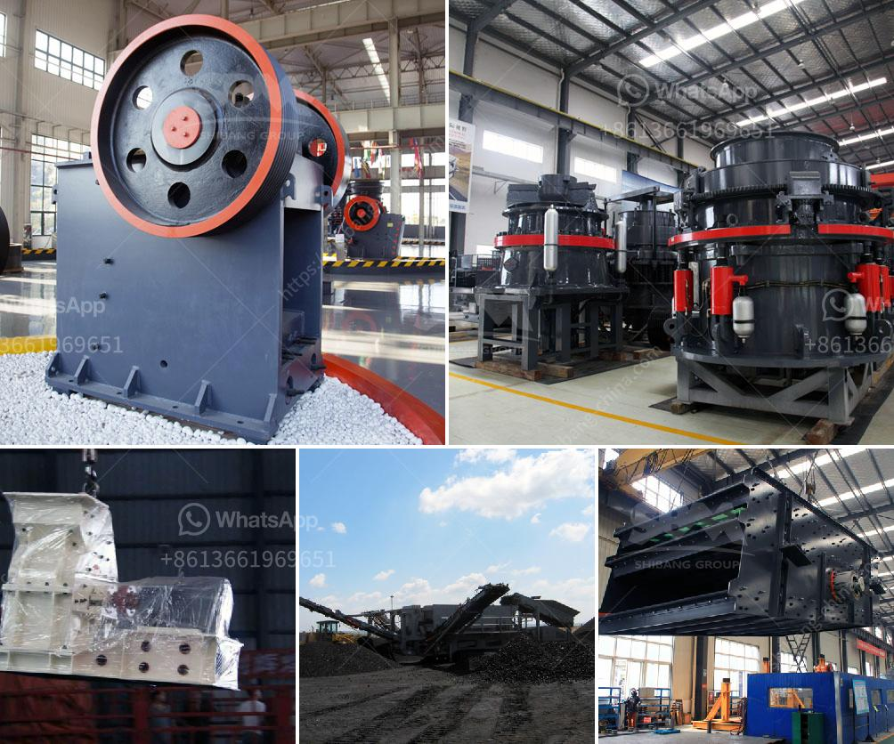

<h3>How to install the impact crusher ?</h3>
Impact crusher is a new type of high-efficiency crushing equipment with advanced technology. Its installation and commissioning work plays an important role in the whole production line. So, how to install and operate the impact crusher properly?

1. Before installation, you should carefully check the foundation of the impact crusher. It should be completely level, firm, and able to bear the weight of the whole machine. At the same time, you should also check whether the rubber pad or other cushioning material on the foundation is in good condition to ensure the stability of the equipment during operation.

2. In the installation process, you need to adjust the horizontal and vertical directions of the impact crusher. The horizontal direction can be adjusted by adjusting the position of the anchor bolts or the welding of the steel plate. The vertical direction can be adjusted by adjusting the height of the suspension bolts on both sides of the frame.

3. After adjusting the position, you should use a level gauge to check the levelness of the equipment in all directions. If it is not level, you can use thin plates to adjust until it reaches the required levelness.

4. After the horizontal and vertical adjustment, you need to fix the anchor bolts, which can provide strong fixation to prevent the equipment from moving during operation. The fixing method can be welding or tightening the nuts. Both methods need to ensure the stability of the equipment.

5. After fixing the anchor bolts, you should check all parts of the impact crusher to ensure that they are intact and not loose. Pay attention to the tightness of the V-belts, the fastening of the screws, and the correct positioning of the parts.

6. Finally, you need to connect the power supply and check whether the motor rotation direction is correct. It should be consistent with the direction indicated by the arrow on the equipment. If the rotation direction is incorrect, you can adjust the wiring of the motor to ensure the correct rotation.

Once the installation is complete, you should carefully observe the operation of the impact crusher. Check whether there is abnormal vibration, noise, or other problems. If any abnormal situation occurs, you should immediately stop the machine for inspection and maintenance to avoid causing greater damage.

In conclusion, the correct installation of the impact crusher is an important factor to ensure the normal operation of the equipment. It requires careful inspection of the foundation, accurate adjustment of the horizontal and vertical directions, firm fixation, and thorough inspection of all parts. After installation, regular maintenance and inspection are necessary to ensure long-term stable operation of the impact crusher.
<h3>Contact us</h3><ul><li><strong>Whatsapp:&nbsp;<a href="https://wa.me/8613661969651">+8613661969651</a></strong></li><li><a href="https://swt.shibang-china.com/?git&amp;zhl&amp;How to install the impact crusher "><strong>Online Service(chat now)</strong></a></li></ul><h3>Related</h3><ul><li><a href='How to select a crusher to crush different minerals.md'>How to select a crusher to crush different minerals?</a></li><li><a href='How to make talcum powder.md'>How to make talcum powder?</a></li><li><a href='How to improve the crushing capacity of ball mill.md'>How to improve the crushing capacity of ball mill?</a></li><li><a href='How to crush the California sandstone .md'>How to crush the California sandstone ?</a></li><li><a href='How can we prevent rocks from coming out of the impact crushers work.md'>How can we prevent rocks from coming out of the impact crusher's work?</a></li></ul>