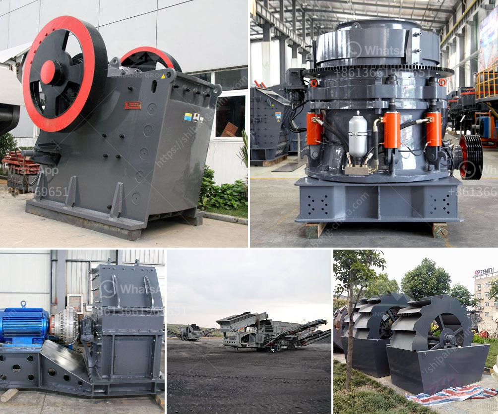

<h3>How to install tunnel feeders in a crushing plant?</h3>
When setting up a crushing plant, ensuring a continuous supply of material is crucial to maximizing productivity. The use of tunnel feeders can help achieve this goal by providing a controlled and consistent flow of material to the crushers. In this article, we will discuss the steps involved in installing tunnel feeders in a crushing plant.

Before installing tunnel feeders, it is essential to assess the specific requirements of the crushing plant. Consider factors such as the type and size of the crushers, the capacity of the plant, and the characteristics of the material being processed. This evaluation will help determine the number and size of tunnel feeders needed.

Once the requirements are identified, it is crucial to select the appropriate tunnel feeders for the crushing plant. Consider the capacity, width, and length of the feeders, as well as any special features required. Consult with manufacturers or industry experts to ensure that the chosen tunnel feeders align with the plant's needs.

Prepare the site where the tunnel feeders will be installed. Ensure that the area is flat and free of any obstructions that could hinder the installation process. Clear any debris or vegetation that may interfere with the operation or maintenance of the feeders. Take necessary safety precautions and obtain any required permits or clearances.

Begin by positioning the tunnel feeders in the desired location, ensuring that they align properly with the flow of material. Use appropriate lifting equipment or machinery to safely maneuver and position the feeders. Follow the manufacturer's instructions for the specific model being installed.

Secure the tunnel feeders in place, ensuring stability and resistance to any potential movement or vibration during operation. Ensure that they are properly leveled and aligned with the plant's conveyor system to allow for seamless material transfer.

Connect the tunnel feeders to the crushing plant's power supply, control systems, and conveyor belts. Follow the electrical and mechanical connection guidelines provided by the manufacturer. Perform thorough testing to ensure that the tunnel feeders are functioning correctly, and all safety features are operational.

Regularly monitor the tunnel feeders to ensure their proper functioning and address any issues promptly. Periodically inspect and clean the feeders to prevent material build-up or blockages that could affect the flow. Follow the manufacturer's recommended maintenance procedures to prolong the life of the tunnel feeders and avoid any unexpected breakdowns.

In conclusion, installing tunnel feeders in a crushing plant can significantly enhance productivity by ensuring a continuous and controlled supply of material. By assessing the plant's requirements, selecting the right equipment, and following a step-by-step installation process, operators can successfully integrate tunnel feeders into their operations. Regular monitoring and maintenance are essential for optimal performance.
<h3>Contact us</h3><ul><li><strong>Whatsapp:&nbsp;<a href="https://wa.me/8613661969651">+8613661969651</a></strong></li><li><a href="https://swt.shibang-china.com/?git&amp;zhl&amp;How to install tunnel feeders in a crushing plant"><strong>Online Service(chat now)</strong></a></li></ul><h3>Related</h3><ul><li><a href='how to increase life of shaft in jaw crusher？.md'>how to increase life of shaft in jaw crusher？</a></li><li><a href='How to improve grinding efficiency of a mill.md'>How to improve grinding efficiency of a mill?</a></li><li><a href='How can I get more production out of my impact crusher.md'>How can I get more production out of my impact crusher?</a></li><li><a href='How to get a sandmaking mini machine.md'>How to get a sand-making mini machine?</a></li><li><a href='How to build granite crusher machine Australia.md'>How to build granite crusher machine Australia?</a></li></ul>