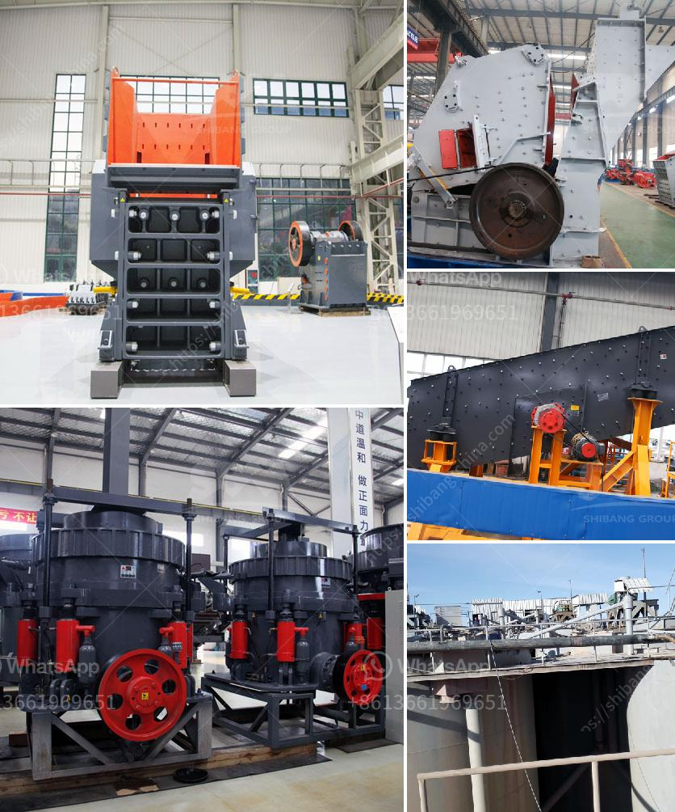

<h3>How to install your own jaw crusher？</h3>
Installing a jaw crusher can be a challenging task, especially for first-time users. Following a few simple steps can help you get started and ensure that the crusher is installed correctly, ensuring efficient operation and longevity. Below, we will guide you through the process of installing your own jaw crusher.

Before starting the installation process, make sure you have the necessary tools and equipment. These may include a lifting crane, level, torque wrench, hammer, pry bar, and a measuring tape. It is also vital to have the manufacturer's installation manual or guidelines provided with the crusher. Familiarize yourself with these instructions as they will provide specific details about your model.

   - Follow the manufacturer's instructions to assemble the crusher parts, including the flywheel, eccentric shaft, and toggle plate.

   - Identify the correct power source for your crusher and ensure it meets the specifications suggested by the manufacturer.

   - Test the crusher to ensure it is running smoothly and there are no electrical or mechanical issues.

   - Once the crusher is installed, double-check all the connections and parts to ensure they are secure.

   - Test the jaw crusher by running it empty and observe if any abnormal noises or vibrations are present.

   - If there are any issues, consult the manufacturer's troubleshooting guide or contact their support team for assistance.

Remember, proper installation is crucial for the successful operation and longevity of your jaw crusher. If you are unsure about any step or encounter any difficulties during the installation process, it is recommended to consult the manufacturer or seek professional assistance. By following the manufacturer's instructions and guidelines, you can ensure that your jaw crusher is installed correctly and performs optimally.
<h3>Contact us</h3><ul><li><strong>Whatsapp:&nbsp;<a href="https://wa.me/8613661969651">+8613661969651</a></strong></li><li><a href="https://swt.shibang-china.com/?git&amp;zhl&amp;How to install your own jaw crusher？"><strong>Online Service(chat now)</strong></a></li></ul><h3>Related</h3><ul><li><a href='How to choose a supplier of stone crushers.md'>How to choose a supplier of stone crushers?</a></li><li><a href='How to Make Plaster of Phosphogypsum.md'>How to Make Plaster of Phosphogypsum</a></li><li><a href='How to Build a Limestone Crusher ？.md'>How to Build a Limestone Crusher ？</a></li><li><a href='How to Adjust a Cone Crusher ？.md'>How to Adjust a Cone Crusher ？</a></li><li><a href='how to increase life of shaft in jaw crusher？.md'>how to increase life of shaft in jaw crusher？</a></li></ul>