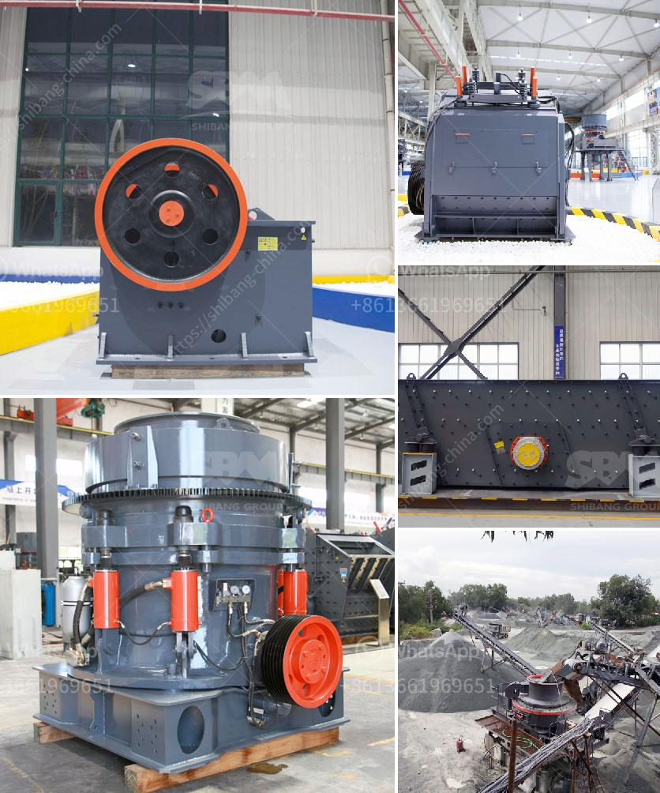

<h3>How to invest in crushing machines？</h3>
Investing in crushing machines can be a lucrative business opportunity. The demand for construction materials, such as aggregates, sand, and gravel, is continually growing worldwide. Investing in a crushing machine allows you to produce and sell these materials, ensuring a steady revenue stream. However, investing in such machinery requires thorough research and careful decision-making. In this article, we will guide you through the steps of investing in crushing machines and maximizing your return on investment.

1. Conduct Market Research: Before investing in crushing machines, understand the local market demand for construction materials. Identify the target market size, key competitors, and pricing strategies. Collect data on construction projects, both existing and upcoming, to gauge the current and future demand for crushed materials.

2. Choose the Right Equipment: There are various types of crushing machines available, such as jaw crushers, impact crushers, cone crushers, and VSI (vertical shaft impact) crushers. Each machine has unique features and functions. Consider factors such as the type of material you plan to crush, production capacity requirements, and desired final product size. Consult with experts or industry professionals to assist you in selecting the most suitable equipment for your investment.

3. Calculate Costs and ROI: Determine the initial investment required to purchase the crushing machine, including installation, transportation, and any other additional costs. Analyze the expected return on investment (ROI) by estimating the production capacity, pricing, and operational costs. Carefully evaluate the expected payback period and whether it aligns with your financial goals and expectations.

4. Explore Financing Options: Investing in crushing machines can be capital-intensive. Consider exploring financing options such as bank loans, equipment leasing, or partnerships with investors to reduce the financial burden. Consult financial institutions or leasing companies to understand the terms and conditions, interest rates, and repayment options available to you.

5. Evaluate Maintenance and Operation: Assess the maintenance and operational requirements of the crushing machine you plan to invest in. Regular maintenance is vital to ensure the machine's optimal performance and prevent unexpected breakdowns. Determine if you have the necessary resources, skills, and access to spare parts and technical support. Understand the operating costs associated with the machine, including fuel consumption, electricity, and labor.

6. Develop a Marketing Strategy: Once you have invested in crushing machines, develop a comprehensive marketing strategy to promote your business to potential customers. Build relationships with contractors, construction companies, and other relevant stakeholders. Utilize online platforms, social media, and other marketing channels to showcase your products and services. Offer competitive pricing, quality products, and excellent customer service to differentiate yourself from competitors.

7. Consider Expansion Opportunities: As your business grows, consider expanding your crushing capacity by investing in additional machines or upgrading existing ones. Keep a close eye on market trends, technological advancements, and potential growth opportunities in the construction industry to maximize your return on investment.

Investing in crushing machines has the potential to be a profitable venture in the construction materials industry. However, thorough research, careful decision-making, and strategic planning are essential to ensure success. By following the steps outlined above, you can make informed investment decisions and position yourself for long-term profitability in this sector.
<h3>Contact us</h3><ul><li><strong>Whatsapp:&nbsp;<a href="https://wa.me/8613661969651">+8613661969651</a></strong></li><li><a href="https://swt.shibang-china.com/?git&amp;zhl&amp;How to invest in crushing machines？"><strong>Online Service(chat now)</strong></a></li></ul><h3>Related</h3><ul><li><a href='How to extract manganese from ore.md'>How to extract manganese from ore?</a></li><li><a href='how to run an impact jaw crusher.md'>how to run an impact jaw crusher?</a></li><li><a href='how vibrating screen works .md'>how vibrating screen works ?</a></li><li><a href='How to set up stone crushing business in kenya .md'>How to set up stone crushing business in kenya ?</a></li><li><a href='How does the sand washing machine work.md'>How does the sand washing machine work?</a></li></ul>