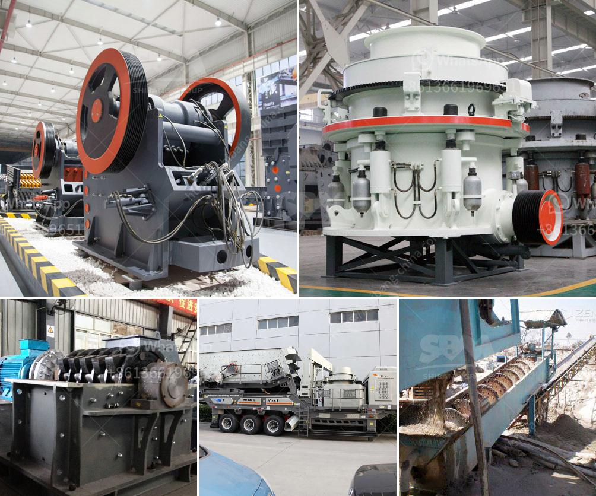

<h3>How to judge how much power the jaw crusher needs？</h3>
When it comes to choosing a jaw crusher, there are several factors that you need to consider to ensure its efficiency and effectiveness. One of the most critical aspects is determining the amount of power the jaw crusher needs to perform its function adequately. Many factors come into play when assessing the power requirements of a jaw crusher, such as feed size, capacity, and material characteristics. In this article, we will explore how to judge, with accuracy, the power needs of a jaw crusher.

The first step in determining the power requirements of a jaw crusher is to consider the size of the raw materials that will be fed into the crusher. The size of the feed material will significantly impact the power needed to crush it. Smaller feed sizes may require less power, while larger feed sizes will necessitate a more substantial motor to handle the increased workload.

The capacity of the jaw crusher refers to the maximum amount of material the machine can process in a given period. To determine the power requirements, you need to know the desired capacity of the jaw crusher. Higher capacity crushers will require more substantial motors to accommodate the increased production. It is essential to strike a balance between the desired capacity and the available power to ensure optimal performance.

The nature of the material being crushed also plays a significant role in determining the power requirements of a jaw crusher. Harder and more abrasive materials, such as granite or basalt, will require higher power due to their increased compressive strength. On the other hand, softer materials like limestone or gypsum might require less power. It is crucial to evaluate the specific characteristics of your material to gauge its power needs accurately.

Once you have gathered all the relevant information about the feed size, capacity, and material characteristics, you can proceed to calculate the motor size needed for the jaw crusher. The motor should be capable of delivering enough power to overcome the crushing forces exerted on the material and ensure effective fragmentation. Several formulas and calculations can assist in determining the appropriate motor size based on these factors.

If you are unsure about calculating the power needs of the jaw crusher or if your application has unique requirements, it is always advisable to consult with industry experts or manufacturers. They have extensive knowledge and experience in crusher design and can provide valuable insights into accurately judging the power requirements of a jaw crusher.

In conclusion, accurately assessing the power requirements of a jaw crusher is crucial to ensure its efficiency and productivity. By considering factors such as feed size, capacity, and material characteristics, you can estimate the power needs of the crusher. It is essential to strike a balance between the desired capacity and available power to optimize performance. If in doubt, consult with industry experts for expert guidance in choosing the appropriate power for your jaw crusher.
<h3>Contact us</h3><ul><li><strong>Whatsapp:&nbsp;<a href="https://wa.me/8613661969651">+8613661969651</a></strong></li><li><a href="https://swt.shibang-china.com/?git&amp;zhl&amp;How to judge how much power the jaw crusher needs？"><strong>Online Service(chat now)</strong></a></li></ul><h3>Related</h3><ul><li><a href='How to build a small limestone mill production line？.md'>How to build a small limestone mill production line？</a></li><li><a href='How to improve the performance of a coal crusher.md'>How to improve the performance of a coal crusher?</a></li><li><a href='How to adjust marble crushers.md'>How to adjust marble crushers?</a></li><li><a href='How to Calculate the Amount of Dust generated by a stone crusher.md'>How to Calculate the Amount of Dust generated by a stone crusher</a></li><li><a href='How to build a rock crusher for gold mining.md'>How to build a rock crusher for gold mining?</a></li></ul>