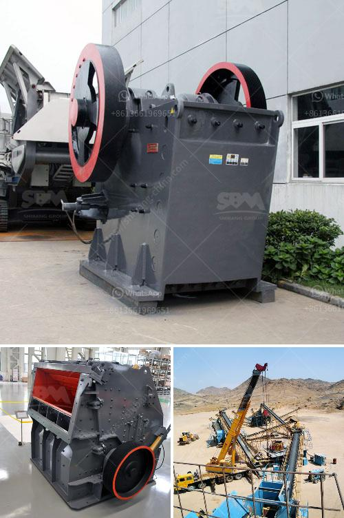

<h3>How to maintain a coal crusher?</h3>
Coal crushers play a vital role in coal processing and power generation. However, the maintenance of these machines is often overlooked, and they are not maintained as effectively as they should be. This lack of care can result in costly repairs and downtime. To avoid these issues, it is crucial to ensure that the coal crusher is maintained regularly and properly. Here are some tips to help you maintain your coal crusher effectively.

Firstly, it is essential to conduct regular inspections of the coal crusher's internal components and external parts such as hammers, rotor, and liners. These inspections should be conducted by experienced professionals to identify any abnormalities or signs of wear. Improperly maintained components can lead to poor performance, reduced efficiency, and increased wear and tear, which can ultimately affect the crusher's productivity and lifespan.

Secondly, cleanliness is crucial when it comes to maintaining a coal crusher. Regular cleaning of the machine helps prevent the build-up of coal dust and other contaminants, which can cause blockages or even fires. Clean the entire crusher thoroughly, including the rotor, hammers, screens, and housing, using the appropriate cleaning tools and materials. Be sure to follow the manufacturer's recommendations for cleaning methods and materials to avoid causing damage to the crusher.

Lubrication is another essential aspect of maintaining a coal crusher. Proper lubrication of all moving parts ensures smooth operations and minimizes the risk of wear and tear. Regularly inspect and lubricate the crusher's bearings, gears, and other lubrication points using lubricants recommended by the manufacturer. Over-lubrication should also be avoided as it can lead to excess grease build-up, which can attract dust and debris, causing damage to the machine.

In addition to regular inspections, cleaning, and lubrication, it is also important to monitor the coal crusher's operation. Pay close attention to any unusual noises, vibrations, or changes in performance. These could be early warning signs of potential issues or wear that needs immediate attention. Addressing these problems promptly can prevent further damage and costly repairs.

Lastly, proper training and education of the operators are vital for the effective maintenance of a coal crusher. Operators should be trained on how to operate the machine correctly and safely, as well as how to conduct basic maintenance tasks. They should be aware of the importance of regular inspections, cleaning, and lubrication, and be encouraged to report any concerns or issues promptly.

In conclusion, maintaining a coal crusher is crucial for ensuring its optimal performance and longevity. Regular inspections, cleaning, lubrication, and monitoring are essential tasks that should be carried out by experienced professionals. By following these maintenance practices, you can reduce the risk of unexpected breakdowns, costly repairs, and downtime, thus ensuring the efficient and safe operation of your coal crusher.
<h3>Contact us</h3><ul><li><strong>Whatsapp:&nbsp;<a href="https://wa.me/8613661969651">+8613661969651</a></strong></li><li><a href="https://swt.shibang-china.com/?git&amp;zhl&amp;How to maintain a coal crusher"><strong>Online Service(chat now)</strong></a></li></ul><h3>Related</h3><ul><li><a href='How much is the quarry machinery .md'>How much is the quarry machinery ?</a></li><li><a href='How to wash clay out of bauxite.md'>How to wash clay out of bauxite?</a></li><li><a href='How does a Raymond mill work.md'>How does a Raymond mill work?</a></li><li><a href='how to grinder calcium carbonate stone crusher machine.md'>how to grinder calcium carbonate stone crusher machine?</a></li><li><a href='how much is an iron ore crushr machine？.md'>how much is an iron ore crushr machine？</a></li></ul>