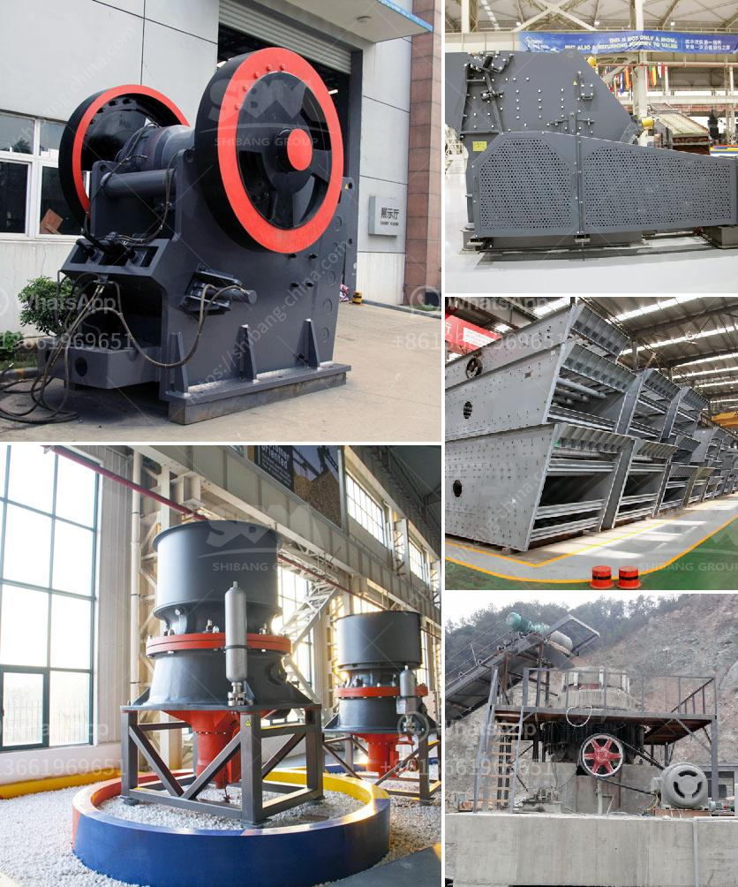

<h3>How to maintain a stone crusher machine?</h3>
Stone crusher machines are used for crushing stones in various industries such as mining, construction, highway, and more. The growing popularity of stone crushers is due to their ability to crush hard and abrasive materials efficiently. To ensure optimal productivity and efficiency, stone crusher machines must be maintained regularly.

Regular maintenance is entirely crucial for the stone crusher machine to run smoothly. Moreover, a good maintenance schedule will not only preserve the machinery, but also increase its lifespan. So, how to maintain a stone crusher machine? Here are a few tips:

The first thing to consider when looking at how to maintain a stone crusher machine is its lubrication. Firstly, regularly and properly clean or lubricate the bearings, especially those bearings used in the central lubrication system. The machine must be properly lubricated so it can function well, reducing the risk of breakdowns.

Secondly, the machine's parts must be inspected regularly, including the wear and tear of its alternative parts. It is advisable to replace the parts once they are worn out to avoid major damages and costly repairs. Checking the tension of belts, checking their wear and tear, and replacing them when necessary is also crucial for prolonging the machine's lifespan.

Furthermore, cleaning the internal portion of the machine is also important. Dust and dirt can accumulate, leading to the machine's failure. Therefore, regularly clean the machine's external and internal parts to prevent any clogging or build-up.

Moreover, the stone crusher machine should be operated by well-trained operators using proper safety equipment. Accidents are inevitable, and maintenance is key to diminish these incidents. Proper training and regular safety meetings should be conducted to educate employees on best practices and safety measures to follow.

In addition to regular maintenance, it is essential to create a repair and maintenance budget for the stone crusher machine. Regular monitoring of maintenance budgets ensures that the machine is kept in optimal condition and ready to tackle any unexpected breakdowns.

Last but not least, consulting with experts or the manufacturer of the stone crusher machine can guide you on how to properly maintain the machine. They can provide valuable insights and tips specific to the particular model and make, helping you optimize its performance and extend its lifespan.

In conclusion, regular maintenance is essential to ensure a stone crusher machine's reliability, efficiency, and longevity. Proper maintenance minimizes the risk of breakdowns and accidents, and it also enhances productivity. By following the tips mentioned above, you can keep your machine in excellent condition, allowing it to consistently deliver high-quality crushed stones.
<h3>Contact us</h3><ul><li><strong>Whatsapp:&nbsp;<a href="https://wa.me/8613661969651">+8613661969651</a></strong></li><li><a href="https://swt.shibang-china.com/?git&amp;zhl&amp;How to maintain a stone crusher machine"><strong>Online Service(chat now)</strong></a></li></ul><h3>Related</h3><ul><li><a href='How does a stone crusher work？.md'>How does a stone crusher work？</a></li><li><a href='How to replace a broken bearing in a jaw crusher.md'>How to replace a broken bearing in a jaw crusher?</a></li><li><a href='How to maintain the longterm advantages of the impact crusher.md'>How to maintain the long-term advantages of the impact crusher</a></li><li><a href='How does a jaw crusher crush limestone.md'>How does a jaw crusher crush limestone?</a></li><li><a href='How to Build a Granite Jaw Crusher in South Africa ？.md'>How to Build a Granite Jaw Crusher in South Africa ？</a></li></ul>